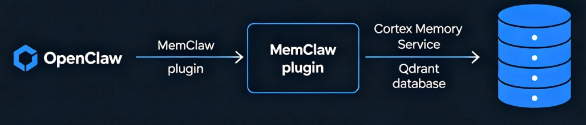
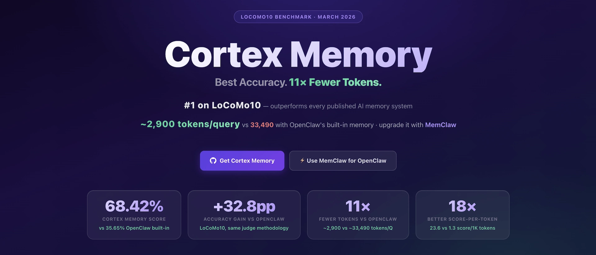
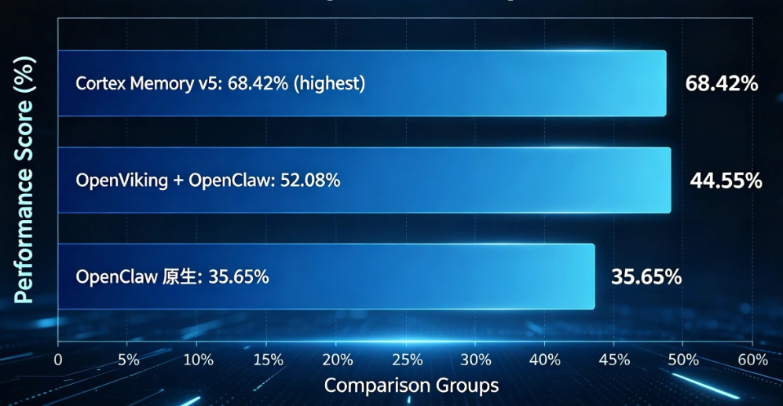

<p align="center">
    
</p>
<h1 align="center">MemClaw</h1>

<p align="center">
    <a href="./README.md">English</a>
    |
    <a href="./README_zh.md">中文</a>
</p>

<p align="center">
    <a href="https://github.com/openclaw/openclaw"></a>
    <a href="https://raw.githubusercontent.com/sopaco/cortex-mem/refs/heads/main/assets/benchmark/cortex_mem_vs_openclaw_3.png?raw=true"></a>
    <a href="https://github.com/sopaco/cortex-mem/tree/main/litho.docs/en"></a>
    <a href="https://github.com/sopaco/cortex-mem/tree/main/litho.docs/zh"></a>
</p>

> **MemClaw** — A [Cortex Memory](https://github.com/sopaco/cortex-mem) enhancement suite for OpenClaw, providing production-grade L0/L1/L2 layered semantic memory with native Context Engine integration.

---

## TL;DR

MemClaw seamlessly integrates [Cortex Memory](https://github.com/sopaco/cortex-mem)'s three-tier memory architecture into [OpenClaw](https://docs.openclaw.ai/zh-CN), enabling AI Agents to **automatically remember the past, proactively recall relevant memories, and browse the complete memory space on demand** — all while achieving **up to 95% token savings** compared to OpenClaw's built-in memory solution.

| LoCoMo **#1** in memory recall capability | Slash token use by **90%** |
| :--- | :--- |
|  |  |

---

## Table of Contents

- [Why MemClaw](#why-memclaw)
- [Project Structure](#project-structure)
- [Core Features](#core-features)
- [Architecture Overview](#architecture-overview)
- [Three-Tier Memory Architecture](#three-tier-memory-architecture)
- [Quick Start](#quick-start)
  - [Install Memory Plugin](#install-memory-plugin)
  - [Install Context Engine](#install-context-engine)
- [Configuration Guide](#configuration-guide)
- [Available Tools](#available-tools)
- [Memory Plugin vs Context Engine — Which Should I Choose](#memory-plugin-vs-context-engine--which-should-i-choose)
- [Relationship with Other Projects](#relationship-with-other-projects)
- [Performance Benchmarks](#performance-benchmarks)
- [Troubleshooting](#troubleshooting)
- [FAQ](#faq)
- [License](#license)

---

## Why MemClaw

OpenClaw is a powerful AI Agent gateway, but its built-in memory solution has the following limitations:

| Issue | OpenClaw Built-in Memory | MemClaw Solution |
|-------|--------------------------|------------------|
| Token Consumption | Loads complete history every time, ~15,982 tokens/query | Layered loading, ~2,900 tokens/query |
| Memory Accuracy | 35.65% (LoCoMo10) | **68.42%** |
| Multi-hop Reasoning | Weak | **84.29%** (Cat 4) |
| Memory Organization | Flat list | L0/L1/L2 structured hierarchy |
| Context Management | Built-in fixed strategy | Pluggable Context Engine |

MemClaw solves these problems — transforming stateless Agents into intelligent assistants that can **remember user preferences, learn across sessions, and provide personalized interactions**.

---

## Project Structure

MemClaw consists of two independently installable OpenClaw plugins. Users can choose one or install both:

```
memclaw/
├── plugin/              # @memclaw/memclaw — Memory Plugin (passive memory storage)
│   ├── dist/            #   Build artifacts
│   ├── skills/          #   Agent skill files (tool usage guides, best practices)
│   ├── src/             #   Source code
│   ├── openclaw.plugin.json
│   └── README.md        #   Plugin detailed documentation
│
├── context-engine/      # @memclaw/memclaw-context-engine — Context Engine (active context management)
│   ├── dist/            #   Build artifacts
│   ├── index.ts         #   Plugin entry point
│   ├── context-engine.ts #  Context Engine lifecycle implementation
│   ├── client.ts        #   Cortex Memory client
│   ├── tools.ts         #   Tool definitions
│   ├── config.ts        #   Configuration management
│   ├── binaries.ts      #   Binary service management
│   └── TECH_DESIGN.md   #   Technical design document
│
├── bin-darwin-arm64/    # macOS Apple Silicon pre-compiled binary package
│   └── bin/
│       ├── qdrant              # Qdrant vector database
│       └── cortex-mem-service  # Cortex Memory REST API service
│
├── bin-linux-x64/       # Linux x64 pre-compiled binary package (same structure)
├── bin-win-x64/         # Windows x64 pre-compiled binary package (same structure)
│
└── LICENSE
```

### What Does Each Directory Do?

| Directory | NPM Package Name | Type | Purpose |
|-----------|------------------|------|---------|
| `plugin/` | `@memclaw/memclaw` | Memory Plugin (`kind: "memory"`) | Provides memory tools, requires Agent to actively call them |
| `context-engine/` | `@memclaw/memclaw-context-engine` | Context Engine (`kind: "context-engine"`) | Automatically manages context, lifecycle hook driven |
| `bin-*/` | `@memclaw/bin-*` | Pre-compiled binary distribution | Qdrant + cortex-mem-service ready to use out of the box |

---

## Core Features

### Provided by Both Plugins

- **Three-Tier Memory Architecture** — L0 abstract (~100 tokens) / L1 overview (~2000 tokens) / L2 full content, progressive disclosure
- **Semantic Vector Search** — Vector similarity retrieval based on Qdrant, supports multi-layer weighted scoring
- **Automatic Service Management** — Automatically starts Qdrant and cortex-mem-service when plugin launches, no manual ops required
- **One-Click Migration** — Seamlessly migrate from OpenClaw native memory to MemClaw
- **Cross-Platform** — Full coverage for Windows x64, macOS Apple Silicon, Linux x64
- **Zero External Dependency Installation** — Qdrant and cortex-mem-service are pre-compiled and packaged, works with `npm install`

### Memory Plugin (`plugin/`) Exclusive

- **Manual Tool-Driven** — Agent operates memory by calling tools like `cortex_search`, `cortex_add_memory`, `cortex_commit_session`, etc.
- **Fine-Grained Layer Control** — Each search can specify which layers (L0/L1/L2) to return
- **Memory Filesystem Browsing** — `cortex_ls` to browse `cortex://` URI space

### Context Engine (`context-engine/`) Exclusive

- **Fully Automatic Context Management** — No need for Agent to call tools, automatically recalls relevant memories before each model run
- **Automatic Message Capture** — Automatically writes each conversation turn to memory, triggers commit when threshold is reached
- **Smart Compression Takeover** — `ownsCompaction: true`, fully controls context compression strategy
- **Archive Expansion** — `cortex_archive_expand` tool to backtrack original conversations from compressed summaries
- **Bypass Mode** — Configure `bypassSessionPatterns` to disable engine for specific sessions

---

## Architecture Overview

```
┌─────────────────────────────────────────────────────────────┐
│  OpenClaw Gateway                                            │
│                                                              │
│  ┌──────────────────┐    ┌──────────────────────────────┐   │
│  │  Memory Plugin   │    │   Context Engine             │   │
│  │  (@memclaw/      │    │   (@memclaw/                 │   │
│  │   memclaw)       │    │    context-engine)           │   │
│  │                  │    │                              │   │
│  │  • cortex_search │    │   • ingest()  ← message recv │   │
│  │  • cortex_recall │    │   • assemble() ← ctx assemble│   │
│  │  • cortex_add_*  │    │   • afterTurn() ← write+commit   │
│  │  • cortex_commit │    │   • compact() ← compress+extract  │
│  │  • cortex_ls     │    │                              │   │
│  │  • cortex_migrate│   │   + full toolset             │   │
│  └───────┬──────────┘    └──────────┬─────────────────┘   │
│          │                          │                      │
│          └──────────┬───────────────┘                      │
│                     ▼                                      │
│  ┌────────────────────────────────────────────────────┐    │
│  │  cortex-mem-service (HTTP REST API, port 8085)     │    │
│  │                                                     │    │
│  │  POST /api/v2/sessions           create session    │    │
│  │  POST /.../sessions/{id}/messages write message    │    │
│  │  POST /.../sessions/{id}/commit   commit+extract   │    │
│  │  GET  /.../sessions/{id}/context  get context      │    │
│  │  POST /api/v2/search              semantic search  │    │
│  │  GET  /api/v2/filesystem/*        virtual filesystem│   │
│  └──────────────────────┬─────────────────────────────┘    │
│                         │                                  │
│          ┌──────────────┴──────────────┐                   │
│          ▼                             ▼                   │
│  ┌───────────────┐          ┌────────────────────┐        │
│  │ Local FS      │          │  Qdrant Vector DB  │        │
│  │               │          │  (port 6333/6334)   │        │
│  │  session/     │          │                     │        │
│  │  user/        │          │  Vector index +     │        │
│  │  agent/       │          │  semantic retrieval │        │
│  │  resources/   │          │                     │        │
│  └───────────────┘          └────────────────────┘        │
│                                                            │
└────────────────────────────────────────────────────────────┘
```

---

## Three-Tier Memory Architecture

MemClaw's core innovation is the L0/L1/L2 three-tier memory system, mimicking the progressive process of human memory from "vague impression" to "clear recollection":

| Layer | Filename | Size | Content | Search Weight | When to Use |
|-------|----------|------|---------|---------------|-------------|
| **L0 Abstract** | `*.abstract.md` | ~100 tokens | One-sentence summary | 20% | Quickly judge relevance |
| **L1 Overview** | `*.overview.md` | ~500-2000 tokens | Structured summary: key points, entities, decisions | 30% | Get more context |
| **L2 Full** | `*.md` | Original size | Complete conversation/content | 50% | Need precise details |

**Search Flow**: Query vectorization → Qdrant vector search → Three-layer weighted scoring → Return most relevant memories

**Token Efficiency**: Compared to loading complete history, the three-tier architecture achieves up to **95%** token savings.

---

## Quick Start

### Requirements

| Requirement | Details |
|-------------|---------|
| **Platform** | Windows x64 / macOS Apple Silicon / Linux x64 |
| **Node.js** | ≥ 20.0.0 |
| **OpenClaw** | Installed and configured (≥ 2026.3.8 recommended) |
| **LLM API** | OpenAI-compatible API (for memory extraction and summarization) |
| **Embedding API** | OpenAI-compatible Embedding API (for vector search) |

### Install Memory Plugin

For scenarios where you want **manual control over memory operations**:

```bash
# Install from npm
openclaw plugins install @memclaw/memclaw
```

Then configure in `openclaw.json`:

```jsonc
{
  "plugins": {
    "entries": {
      "memclaw": {
        "enabled": true,
        "config": {
          "tenantId": "tenant_claw",
          "autoStartServices": true,
          "llmApiKey": "your-llm-api-key",
          "llmModel": "gpt-5-mini",
          "embeddingApiKey": "your-embedding-api-key",
          "embeddingModel": "text-embedding-3-small"
        }
      }
    },
    "slots": {
      // Optional: if you want to use Context Engine instead
      // "contextEngine": "memclaw-context-engine"
    }
  },
  "agents": {
    "defaults": {
      "memorySearch": { "enabled": false }  // Disable OpenClaw built-in memory
    }
  }
}
```

Restart OpenClaw to use. The plugin will automatically start Qdrant and cortex-mem-service.

### Install Context Engine

For scenarios where you want **fully automatic context management**:

```bash
# Install from npm (package name pending release)
openclaw plugins install @memclaw/memclaw-context-engine
```

Configure as Context Engine in `openclaw.json`:

```jsonc
{
  "plugins": {
    "entries": {
      "memclaw-context-engine": {
        "enabled": true,
        "config": {
          "tenantId": "tenant_claw",
          "autoStartServices": true,
          "llmApiKey": "your-llm-api-key",
          "embeddingApiKey": "your-embedding-api-key",
          "autoRecall": true,
          "autoCapture": true
        }
      }
    },
    "slots": {
      "contextEngine": "memclaw-context-engine"  // Activate as context engine
    }
  }
}
```

Configuration file will be created automatically on first startup. Fill in API keys and restart OpenClaw.

### Local Development Installation

```bash
git clone https://github.com/sopaco/memclaw.git
cd memclaw

# Install plugin
cd plugin && bun install && bun run build

# Or install context-engine
cd ../context-engine && bun install && bun run build
```

Then load via `plugins.load.paths` or symbolic link. See [plugin/README.md](plugin/README.md) for details.

---

## Configuration Guide

### Common Configuration Options

| Option | Type | Default | Description |
|--------|------|---------|-------------|
| `serviceUrl` | string | `http://localhost:8085` | cortex-mem-service address |
| `tenantId` | string | `tenant_claw` | Tenant ID for multi-user data isolation |
| `autoStartServices` | boolean | `true` | Automatically start Qdrant and cortex-mem-service |
| `llmApiBaseUrl` | string | `https://api.openai.com/v1` | LLM API endpoint |
| `llmApiKey` | string | - | LLM API key (**required**) |
| `llmModel` | string | `gpt-5-mini` | LLM model name |
| `embeddingApiBaseUrl` | string | `https://api.openai.com/v1` | Embedding API endpoint |
| `embeddingApiKey` | string | - | Embedding API key (**required**) |
| `embeddingModel` | string | `text-embedding-3-small` | Embedding model name |

### Context Engine Exclusive Configuration

| Option | Type | Default | Description |
|--------|------|---------|-------------|
| `autoRecall` | boolean | `true` | Automatically recall relevant memories before each model call |
| `recallWindow` | number | `5` | Use last N user messages to construct search query |
| `recallLimit` | number | `10` | Number of recall results |
| `recallMinScore` | number | `0.65` | Recall score threshold |
| `autoCapture` | boolean | `true` | Automatically capture each conversation turn to memory |
| `commitTokenThreshold` | number | `50000` | Token threshold to trigger auto-commit |
| `commitTurnThreshold` | number | `20` | Turn threshold to trigger auto-commit |
| `bypassSessionPatterns` | string[] | `[]` | Session regex patterns to bypass engine |

---

## Available Tools

### Shared by Memory Plugin & Context Engine

| Tool | Purpose | Typical Scenario |
|------|---------|------------------|
| `cortex_search` | Layered semantic search | "Find previous discussions about database architecture" |
| `cortex_recall` | Recall memory (with full context) | "What did I say about code style preferences before" |
| `cortex_add_memory` | Proactively store memory | "Please remember: I prefer Tabs=2" |
| `cortex_commit_session` | Commit session, trigger memory extraction | Manual commit after task completion |
| `cortex_ls` | Browse memory virtual filesystem | Explore memory structure |
| `cortex_get_abstract` | Get L0 abstract (~100 tokens) | Quick preview to judge relevance |
| `cortex_get_overview` | Get L1 overview (~2000 tokens) | Get structured summary |
| `cortex_get_content` | Get L2 full content | Need original precise information |
| `cortex_explore` | Smart explore (search + browse) | Purposefully discover relevant memories |
| `cortex_migrate` | Migrate from OpenClaw native memory | Run once on first installation |
| `cortex_maintenance` | Periodic maintenance (cleanup/rebuild index) | Auto every 3h, or manual |

### Context Engine Exclusive

| Tool | Purpose |
|------|---------|
| `cortex_archive_expand` | Restore original conversation content from compressed archive |
| `cortex_forget` | Delete incorrect or outdated memories |

---

## Memory Plugin vs Context Engine — Which Should I Choose

| Dimension | Memory Plugin | Context Engine |
|-----------|---------------|----------------|
| **Type** | `kind: "memory"` | `kind: "context-engine"` |
| **Working Mode** | Passive — Agent needs to actively call tools | Active — Lifecycle hooks automatically trigger |
| **Memory Write** | Manual call to `cortex_add_memory` / `cortex_commit_session` | `afterTurn()` auto capture |
| **Memory Recall** | Manual call to `cortex_search` / `cortex_recall` | `assemble()` auto recall |
| **Context Compression** | OpenClaw built-in | Full takeover (`ownsCompaction: true`) |
| **Target Users** | Users who want fine-grained control | Users who want "out-of-the-box" automatic memory |
| **Can Coexist** | ✅ Can install both, tools complement each other | ✅ Can install both |

**Recommendation**: If you're unsure, **start with Context Engine** — it's more automated and provides a smoother experience. If you want complete control over memory operations, choose Memory Plugin.

---

## Relationship with Other Projects

```
┌──────────────────────────────────────────────────────────┐
│                     You Are Here (memclaw)               │
│                                                          │
│  memclaw ──────────────────────────────────────────────► │
│  Memory enhancement plugin for OpenClaw                  │
│                                                          │
│  Underlying dependencies:                                │
│  ├── Cortex Memory (cortex-mem)                          │
│  │   ├── cortex-mem-core    (core memory engine)         │
│  │   ├── cortex-mem-service (REST API service)           │
│  │   └── cortex-mem-cli     (command line tool)          │
│  │                                                       │
│  ├── Qdrant (vector database)                            │
│  │   └── Vector storage backend for semantic search      │
│  │                                                       │
│  └── OpenClaw (Agent gateway)                            │
│      ├── Context Engine interface (lifecycle hooks)      │
│      └── Plugin system (Memory + Context Engine slots)   │
│                                                          │
│  Pre-compiled binaries:                                  │
│  ├── bin-darwin-arm64/  → Qdrant + cortex-mem-service    │
│  ├── bin-linux-x64/     → Qdrant + cortex-mem-service    │
│  └── bin-win-x64/       → Qdrant + cortex-mem-service    │
│                                                          │
│  Note: All underlying dependencies are integrated into    │
│  npm packages via pre-compiled binaries. Users don't     │
│  need to install Qdrant or Cortex Memory separately.     │
└──────────────────────────────────────────────────────────┘
```

**Key Notes**:

- MemClaw originated from the `examples/@memclaw/` directory in the [Cortex Memory](https://github.com/sopaco/cortex-mem) project
- Because it proved useful enough, it was extracted into a standalone Git repository for independent release and usage
- The underlying dependencies `cortex-mem-service`, `cortex-mem-cli`, and `qdrant` are **pre-compiled** and packaged into `bin-darwin-arm64/`, `bin-linux-x64/`, `bin-win-x64/` npm packages
- **Users don't need to install these components separately** — `npm install @memclaw/memclaw` includes all required binaries

---

## Performance Benchmarks

Evaluated on the [LoCoMo10](https://github.com/sopaco/cortex-mem) dataset:

| System | Accuracy | Avg Tokens/Query |
|--------|:--------:|:----------------:|
| **MemClaw (Intent ON)** | **68.42%** | **~2,900** |
| OpenViking + OpenClaw | 52.08% | ~2,769 |
| OpenClaw (Built-in Memory) | 35.65% | ~15,982 |

Multi-hop reasoning (Cat 4): **84.29%** accuracy.

---

## Troubleshooting

### Plugin Not Working

1. Run `openclaw skills` to check plugin loading status
2. Check if `openclaw.json` configuration is correct, confirm `enabled: true`
3. Check OpenClaw logs for `[memclaw]` or `[memclaw-context-engine]` related errors

### Service Cannot Start

1. Check if ports **6333** (Qdrant HTTP), **6334** (Qdrant gRPC), **8085** (cortex-mem-service) are occupied
2. Confirm LLM and Embedding API keys are correctly configured
3. Set `autoStartServices: false` to disable auto-start and manually manage external services

### Search Results Incomplete or Outdated

1. Manually run `cortex_maintenance` to trigger index rebuild
2. Confirm `cortex_commit_session` was called after session completion
3. Check cortex-mem-service health: `curl http://localhost:8085/health`

### Migration Failed

1. Ensure OpenClaw workspace exists: `~/.openclaw/workspace`
2. Confirm memory files exist: `~/.openclaw/workspace/memory/`
3. Migration is idempotent and can be safely run multiple times

---

## FAQ

### What's the relationship between MemClaw and Cortex Memory?

MemClaw is a **dedicated distribution** of Cortex Memory for the OpenClaw ecosystem. Cortex Memory is a general-purpose Rust memory framework, while MemClaw packages it as an OpenClaw plugin (TypeScript) with all dependency binaries pre-compiled for out-of-the-box usage.

### Do I need to install Qdrant separately?

**No**. Qdrant and cortex-mem-service are pre-compiled and packaged into `@memclaw/bin-*` npm packages. Installing the MemClaw plugin automatically pulls the binaries for your platform.

### Can both plugins be installed simultaneously?

Yes. Memory Plugin provides tools for Agent to call, while Context Engine automatically manages context at the lifecycle level. They share the same cortex-mem-service backend and don't conflict.

### Can I use my own LLM/Embedding service?

Yes. As long as the API is OpenAI-compatible (e.g., Azure OpenAI, Ollama, vLLM, etc.), just configure the corresponding `*ApiBaseUrl` and `*ApiKey`.

### Where is memory data stored?

Memory is stored as Markdown files on the local filesystem (accessible via `cortex://` URIs), with vector indices stored in Qdrant. Data is completely localized and not uploaded to any external service.

### Which platforms are supported?

- **macOS Apple Silicon** (darwin-arm64)
- **Linux x64** (linux-x64)
- **Windows x64** (win32-x64)

---

## Documentation Index

- **[Memory Plugin Documentation](plugin/README.md)** — Installation, configuration, tool reference, best practices
- **[Memory Plugin Chinese Documentation](plugin/README_zh.md)** — Chinese version of plugin documentation
- **[Context Engine Technical Design](context-engine/TECH_DESIGN.md)** — Detailed technical design document for Context Engine
- **[Agent Skill Documentation](plugin/skills/memclaw/SKILL.md)** — How Agents use MemClaw tools
- **[Best Practices](plugin/skills/memclaw/references/best-practices.md)** — Tool selection, session lifecycle, search strategies

---

## License

[MIT](LICENSE)
