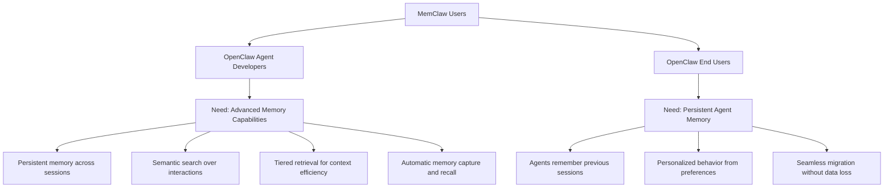
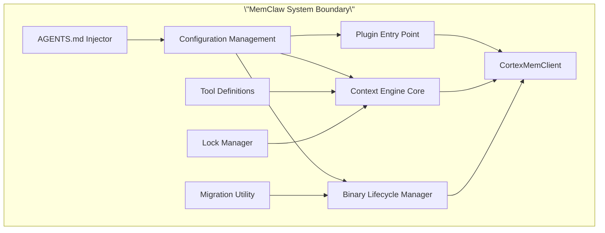
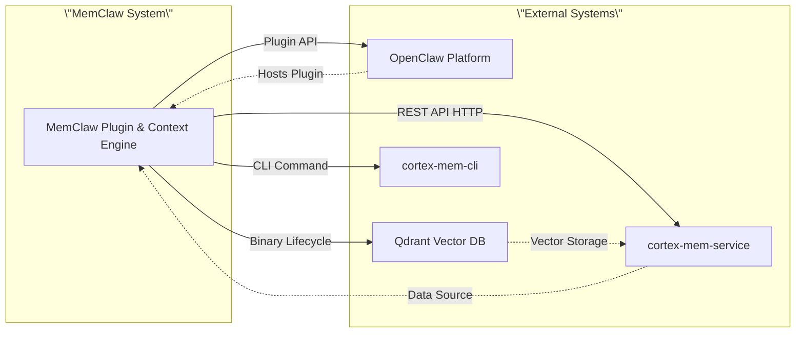
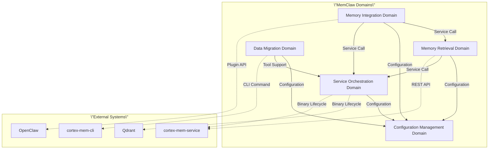
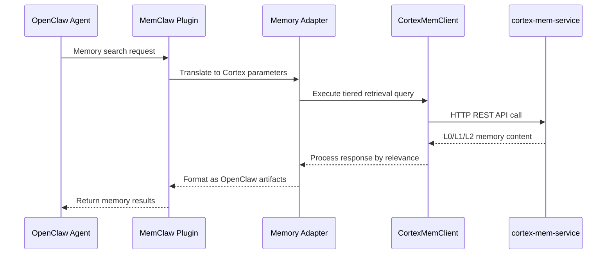
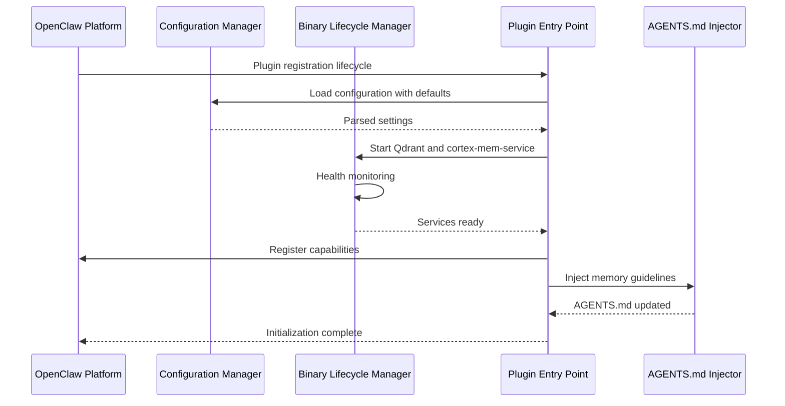
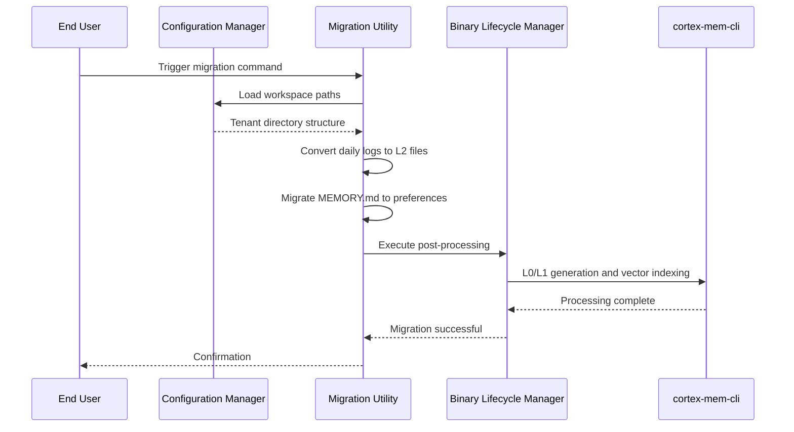

# MemClaw C4 SystemContext Architecture Document

**Document Version:** 1.0  
**Generation Time:** 2025-09-27T11:16:00Z  
**Classification:** Internal Architecture Documentation

---

# System Context Overview

## 1. Project Introduction

### 1.1 Project Name and Description

**Project Name:** MemClaw

**Project Type:** Component Library / Plugin System

**Description:** MemClaw is a plugin-based architecture system that provides layered semantic memory capabilities for the OpenClaw AI agent ecosystem. It implements a three-tier memory structure (L0 abstracts, L1 overviews, L2 full content) to enable persistent, searchable memory across agent sessions while optimizing context window usage.

### 1.2 Core Functionality and Value

| Functionality | Business Value |
|--------------|----------------|
| **Tiered Memory Retrieval** | Improves recall accuracy while reducing context window waste through abstract/overview/content tiers |
| **Semantic Search** | Enables AI agents to maintain persistent, searchable memory across sessions |
| **Session Timeline Management** | Replaces flat file-based memory with structured layered retrieval |
| **Automatic Migration** | Seamless transition from OpenClaw's native memory format without data loss |
| **Tenant Isolation** | Multi-agent scenarios with isolated memory contexts |

### 1.3 Technical Characteristics Overview

- **Architecture Pattern:** Plugin-based with layered semantic memory
- **Deployment Units:** Two primary units (plugin and context-engine)
- **Integration Model:** Adapter pattern bridging OpenClaw plugin API with Cortex memory services
- **Service Management:** Binary lifecycle orchestration with health monitoring
- **Configuration:** Central dependency hub using TOML format with platform-specific path resolution

---

## 2. Target Users

### 2.1 User Role Definitions



### 2.2 Usage Scenario Descriptions

| User Type | Primary Scenario | Expected Outcome |
|-----------|-----------------|------------------|
| **Agent Developers** | Building AI agents requiring long-term memory | Access to MemoryPluginCapability API with tiered retrieval |
| **Agent Developers** | Implementing context-aware agents | Context engine integration with auto-recall/auto-capture |
| **End Users** | Running agents with conversation history | Agents remember preferences and past interactions |
| **End Users** | Migrating from legacy memory systems | Automatic data conversion with zero data loss |

### 2.3 User Requirement Analysis

**Priority Requirements:**

1. **Memory Persistence** (Importance: 9.5/10)
   - Cross-session memory retention
   - Tenant-isolated storage structure
   - Automatic backup and recovery

2. **Retrieval Efficiency** (Importance: 9.0/10)
   - Tiered access (L0/L1/L2) based on relevance
   - Semantic search capabilities
   - Context window optimization

3. **Integration Simplicity** (Importance: 8.5/10)
   - Native OpenClaw plugin API compatibility
   - Automatic configuration management
   - AGENTS.md guideline injection

4. **Migration Support** (Importance: 7.5/10)
   - Legacy format conversion
   - Post-processing automation
   - Data validation and verification

---

## 3. System Boundaries

### 3.1 System Scope Definition

MemClaw operates as a middleware layer between OpenClaw's plugin ecosystem and Cortex memory services. The system boundary encompasses all code and components developed and maintained as part of the MemClaw project, while explicitly excluding external dependencies that are managed but not owned by the project.

### 3.2 Included Core Components



**Component Details:**

| Component | Responsibility | Location |
|-----------|---------------|----------|
| **Plugin Entry Point** | Plugin metadata, configuration schema, OpenClaw registration | `plugin/index.ts`, `plugin/plugin-impl.ts` |
| **Context Engine Core** | Lifecycle orchestration, tool registration, maintenance scheduling | `context-engine/index.ts`, `context-engine/context-engine.ts` |
| **CortexMemClient** | HTTP client for cortex-mem-service REST API, tiered retrieval | `plugin/src/client.ts`, `context-engine/client.ts` |
| **Configuration Management** | TOML parsing, defaults, validation, platform path resolution | `plugin/src/config.ts`, `context-engine/config.ts` |
| **Binary Lifecycle Manager** | Qdrant/cortex-mem-service startup, health monitoring | `plugin/src/binaries.ts`, `context-engine/binaries.ts` |
| **Migration Utility** | Legacy format conversion, post-processing orchestration | `plugin/src/migrate.ts` |
| **AGENTS.md Injector** | Idempotent memory guideline injection | `plugin/src/agents-md-injector.ts` |
| **Tool Definitions** | OpenClaw context engine and memory tool APIs | `context-engine/tools.ts` |
| **Lock Manager** | Concurrent access control for shared resources | `context-engine/lock.ts` |

### 3.3 Excluded External Dependencies

| External System | Reason for Exclusion | Management Approach |
|----------------|---------------------|---------------------|
| **OpenClaw Core Platform** | Third-party host system | Plugin API integration only |
| **Qdrant Vector Database** | External binary dependency | Lifecycle managed via Binary Lifecycle Manager |
| **cortex-mem-service** | External REST API service | HTTP client wrapper only |
| **cortex-mem-cli** | External CLI tool | Command execution with timeout handling |
| **Platform Binaries** | Pre-built npm packages | Path resolution and execution only |

---

## 4. External System Interactions

### 4.1 External System List



### 4.2 Interaction Method Descriptions

#### 4.2.1 OpenClaw Platform

| Aspect | Details |
|--------|---------|
| **Interaction Type** | Plugin Integration |
| **API Surface** | MemoryPluginCapability, Context Engine Slot |
| **Communication** | TypeScript/JavaScript API calls |
| **Direction** | Bidirectional (registration + capability invocation) |
| **Criticality** | High (9.5/10) - Core host platform |

**Key Integration Points:**
- Plugin registration lifecycle
- Memory search manager interface
- Context engine tool registration
- Built-in memory system replacement

#### 4.2.2 Qdrant Vector Database

| Aspect | Details |
|--------|---------|
| **Interaction Type** | Binary Dependency |
| **Management** | Lifecycle orchestration (startup, health monitoring, configuration) |
| **Communication** | Process execution with port binding |
| **Direction** | Outbound (MemClaw manages Qdrant) |
| **Criticality** | High (8.5/10) - Required for semantic search |

**Key Management Functions:**
- Platform-specific binary path resolution
- Service startup with readiness verification
- Health monitoring before exposing capabilities
- Graceful shutdown handling

#### 4.2.3 cortex-mem-service

| Aspect | Details |
|--------|---------|
| **Interaction Type** | HTTP Client (REST API) |
| **Wrapper** | CortexMemClient class |
| **Communication** | HTTP/REST with typed interface |
| **Direction** | Outbound (MemClaw consumes service) |
| **Criticality** | Critical (10/10) - Core memory functionality |

**API Capabilities:**
- Layered memory retrieval (L0/L1/L2)
- Semantic search over memory content
- Filesystem-like browsing of memory structure
- Session timeline management
- Tenant context switching for isolation

#### 4.2.4 cortex-mem-cli

| Aspect | Details |
|--------|---------|
| **Interaction Type** | Command Execution |
| **Usage** | Migration post-processing |
| **Communication** | CLI invocation with timeout handling |
| **Direction** | Outbound (MemClaw invokes CLI) |
| **Criticality** | Medium (6.5/10) - Migration and maintenance |

**Command Functions:**
- L0/L1 layer generation
- Vector index creation
- Post-processing orchestration
- Timeout and error handling

### 4.3 Dependency Relationship Analysis



**Dependency Strength Matrix:**

| From Domain | To Domain | Strength | Type |
|-------------|-----------|----------|------|
| Memory Integration | Memory Retrieval | 9.0 | Service Call |
| Memory Integration | Configuration | 8.0 | Configuration |
| Memory Integration | Service Orchestration | 7.0 | Service Call |
| Memory Retrieval | Configuration | 8.5 | Configuration |
| Memory Retrieval | Service Orchestration | 8.0 | Service Call |
| Service Orchestration | Configuration | 7.5 | Configuration |
| Data Migration | Configuration | 7.0 | Configuration |
| Data Migration | Service Orchestration | 6.5 | Tool Support |

---

## 5. System Context Diagram

### 5.1 C4 SystemContext Diagram

```mermaid
C4Context
    title MemClaw System Context Diagram

    Person(developer, \"OpenClaw Agent Developer\", \"Builds AI agents requiring advanced memory capabilities\")
    Person(enduser, \"OpenClaw End User\", \"Runs agents with persistent memory requirements\")

    System_Boundary(memclaw, \"MemClaw System\") {
        System(plugin, \"MemClaw Plugin\", \"OpenClaw plugin providing MemoryPluginCapability\", \"plugin/\")
        System(context_engine, \"Context Engine\", \"Lifecycle orchestration and maintenance\", \"context-engine/\")
        
        Container(adapter, \"Memory Adapter\", \"Translates Cortex API to OpenClaw interface\", \"TypeScript\")
        Container(client, \"CortexMemClient\", \"HTTP client for cortex-mem-service\", \"TypeScript\")
        Container(config, \"Configuration Manager\", \"TOML parsing and platform path resolution\", \"TypeScript\")
        Container(binaries, \"Binary Lifecycle Manager\", \"Qdrant and service orchestration\", \"TypeScript\")
        Container(migration, \"Migration Utility\", \"Legacy format conversion\", \"TypeScript\")
    }

    System(openclaw, \"OpenClaw Platform\", \"Host AI agent ecosystem\", \"External\")
    System(qdrant, \"Qdrant\", \"Vector database for semantic search\", \"External Binary\")
    System(cortex_svc, \"cortex-mem-service\", \"REST API for layered memory\", \"External Service\")
    System(cortex_cli, \"cortex-mem-cli\", \"CLI for post-processing\", \"External Tool\")

    Rel(developer, plugin, \"Develops agents using\", \"Plugin API\")
    Rel(enduser, plugin, \"Runs agents with\", \"Memory capabilities\")
    Rel(plugin, openclaw, \"Registers as\", \"MemoryPluginCapability\")
    Rel(plugin, adapter, \"Uses\", \"Memory search translation\")
    Rel(adapter, client, \"Calls\", \"Tiered retrieval API\")
    Rel(client, cortex_svc, \"HTTP REST\", \"L0/L1/L2 retrieval\")
    Rel(plugin, config, \"Loads\", \"Configuration settings\")
    Rel(plugin, binaries, \"Starts\", \"Qdrant and services\")
    Rel(binaries, qdrant, \"Manages lifecycle\", \"Startup/health monitoring\")
    Rel(binaries, cortex_svc, \"Manages lifecycle\", \"Startup/health monitoring\")
    Rel(migration, cortex_cli, \"Executes\", \"Post-processing commands\")
    Rel(migration, config, \"Reads\", \"Workspace paths\")
    Rel(context_engine, client, \"Orchestrates\", \"Memory tools\")
    Rel(context_engine, binaries, \"Depends on\", \"Service availability\")

    UpdateRelStyle(developer, plugin, $offsetY=\"-40\")
    UpdateRelStyle(enduser, plugin, $offsetY=\"40\")
    UpdateRelStyle(plugin, openclaw, $offsetX=\"-60\")
    UpdateRelStyle(client, cortex_svc, $offsetX=\"60\")
    UpdateRelStyle(binaries, qdrant, $offsetY=\"-30\")
    UpdateRelStyle(binaries, cortex_svc, $offsetY=\"30\")
```

### 5.2 Key Interaction Flows

#### 5.2.1 Memory Retrieval Flow



**Flow Characteristics:**
- **Entry Point:** OpenClaw MemoryPluginCapability search invocation
- **Importance:** 9.5/10
- **Involved Domains:** Memory Integration, Memory Retrieval
- **Latency Target:** <500ms for L0/L1 retrieval

#### 5.2.2 Plugin Initialization Flow



**Flow Characteristics:**
- **Entry Point:** OpenClaw plugin registration lifecycle
- **Importance:** 8.5/10
- **Involved Domains:** Configuration, Service Orchestration, Memory Integration, Data Migration
- **Critical Path:** Service health verification before capability registration

#### 5.2.3 Data Migration Flow



**Flow Characteristics:**
- **Entry Point:** User-triggered migration command
- **Importance:** 7.5/10
- **Involved Domains:** Configuration, Data Migration, Service Orchestration
- **Data Transformations:** Daily logs → Session timelines, MEMORY.md → User preferences

#### 5.2.4 Context Engine Lifecycle Flow

```mermaid
stateDiagram-v2
    [*] --> Initializing: Plugin Registration
    Initializing --> LoadingConfig: Load Configuration
    LoadingConfig --> StartingServices: Start Dependencies
    StartingServices --> RegisteringTools: Register with OpenClaw
    RegisteringTools --> Operating: Periodic Maintenance
    Operating
