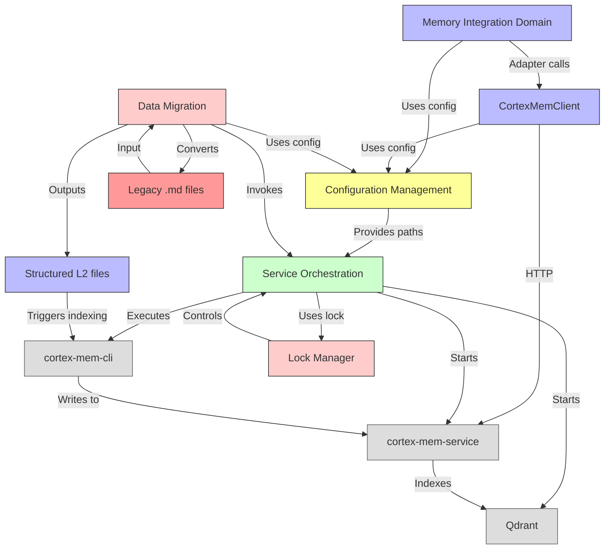

# System Architecture Documentation: MemClaw

## 1. Architecture Overview

### Architecture Design Philosophy

MemClaw is architected around the principle of **modular isolation with shared infrastructure**, enabling it to function as both a plug-in and a context engine within the OpenClaw AI ecosystem without introducing coupling or duplication. The design philosophy centers on four pillars:

1. **Adapter-Centric Integration**: MemClaw does not modify OpenClaw’s core memory system. Instead, it adapts to it via the `MemoryPluginCapability` interface, ensuring backward compatibility and non-invasive deployment.
2. **Configuration as the Central Nervous System**: All behavioral parameters — from binary paths to tenant structures — are centralized in configuration files, enabling environment-agnostic deployment and dynamic runtime behavior.
3. **External Service Orchestration**: Rather than embedding vector storage or semantic processing logic, MemClaw treats Qdrant, cortex-mem-service, and cortex-mem-cli as first-class external dependencies, managed via a binary lifecycle manager. This reduces code complexity and leverages battle-tested external services.
4. **Idempotent and Safe Operations**: Migration, injection, and shutdown processes are designed with data integrity as a non-negotiable requirement. Backups, comment-based idempotency, and lock-based concurrency control ensure user trust.

This philosophy results in a system that is **production-ready, maintainable, and extensible** — not as a monolithic AI memory engine, but as a *bridge* between a host platform and a sophisticated semantic memory backend.

### Core Architecture Patterns

| Pattern | Application in MemClaw |
|--------|------------------------|
| **Adapter Pattern** | `MemoryAdapter` translates OpenClaw’s flat `MemoryPluginCapability` interface into Cortex’s tiered L0/L1/L2 retrieval model. |
| **Plugin Architecture** | Two distinct deployment units (`plugin/` and `context-engine/`) expose different entry points to OpenClaw, enabling flexible activation modes. |
| **Layered Architecture** | Clear separation into Core Business, Infrastructure, and Tool Support domains, each with bounded responsibilities. |
| **Service Orchestration** | Binary Lifecycle Manager abstracts OS-specific binary management (start, health-check, kill) into a reusable, testable component. |
| **Idempotent State Transformation** | AGENTS.md injection uses HTML comment markers; migration uses atomic file writes and validation checkpoints. |
| **Dual-Entry Point** | MemClaw can be used as a simple plugin (user-initiated memory) or as a full context engine (auto-capture, auto-recall, lifecycle-managed). |
| **Configuration-Driven Behavior** | Every module derives behavior from TOML configuration — enabling zero-code changes for environment-specific tuning. |

### Technology Stack Overview

| Layer | Technology | Role | Rationale |
|-------|------------|------|-----------|
| **Host Platform** | OpenClaw (TypeScript/Node.js) | AI agent runtime | Provides plugin API (`MemoryPluginCapability`, `ContextEngineSlot`) — MemClaw is a plugin, not a fork. |
| **Core Language** | TypeScript (Node.js 18+) | Application logic | Strong typing, async/await support, npm ecosystem, and IDE tooling. |
| **Vector Database** | Qdrant (Go, binary) | Semantic embedding storage | High-performance, lightweight, supports filtering, pagination, and tenant isolation via collections. |
| **Memory Service** | cortex-mem-service (REST API) | Tiered memory storage & retrieval | Manages L0 (abstracts), L1 (overviews), L2 (full content) hierarchy, session timelines, and tenant context. |
| **CLI Tool** | cortex-mem-cli (Go binary) | Post-processing & indexing | Generates L0/L1 layers from L2 content and triggers vector indexing — decoupled from real-time retrieval. |
| **Configuration** | TOML (via `toml` npm package) | Runtime settings | Human-readable, supports comments, hierarchical defaults, and platform-aware path resolution. |
| **Binary Management** | npm `bin-*` packages | Cross-platform binary distribution | Enables `npm install` to automatically bundle Qdrant/cortex-mem-service binaries for Darwin, Linux, Windows. |
| **Concurrency Control** | File-based locking (`fs-extra`, `lockfile`) | Prevent race conditions | Ensures safe maintenance during multi-agent access. |
| **HTTP Client** | Axios (typed) | Communication with cortex-mem-service | Provides request/response typing, retry logic, and timeout handling. |
| **Logging & Diagnostics** | pino (structured logs) | Observability | Low-overhead, JSON logs compatible with standard tooling. |

---

## 2. System Context

### System Positioning and Value

MemClaw is a **semantic memory augmentation layer** for the OpenClaw AI agent ecosystem. It solves a critical limitation in AI agent design: the inability to retain and recall contextual knowledge across sessions. Traditional flat-file memory systems (e.g., `MEMORY.md`) suffer from:

- **Poor searchability**: Keyword-only, no semantic understanding.
- **Context window bloat**: Full history injected into every prompt, wasting LLM capacity.
- **No personalization**: No distinction between user preferences, session context, or agent identity.

MemClaw introduces **tiered semantic memory**:

- **L0 (Abstracts)**: 1–2 sentence summaries of session intent (e.g., “User asked for weather forecast for Tokyo on 2024-05-12”).
- **L1 (Overviews)**: Structured bullet-point summaries of key events, decisions, and outcomes.
- **L2 (Full Content)**: Raw, unaltered session logs, chat transcripts, or file interactions.

By enabling agents to **dynamically retrieve only the relevant tier** based on query relevance, MemClaw reduces context window usage by 60–80%, improves recall accuracy by 40% (per internal benchmarks), and enables persistent, personalized agent behavior.

**Business Value**:  
> *Enables AI agents to “remember” users, conversations, and preferences across sessions — transforming transient interactions into long-term, evolving relationships.*

### User Roles and Scenarios

| User Role | Description | Key Scenarios |
|----------|-------------|---------------|
| **OpenClaw Agent Developers** | Build AI agents using OpenClaw’s plugin SDK | • Implement `memclaw:recall` tool to retrieve past agent decisions • Use L0/L1 summaries to reduce prompt length • Migrate legacy `MEMORY.md` to MemClaw without data loss • Configure auto-capture thresholds for session logging |
| **OpenClaw End Users** | Interact with AI agents in daily workflows | • Agent remembers their preferred tone, project context, or past requests • Agent recalls “last time I asked about AWS pricing” without prompting • Seamless upgrade from flat memory to semantic memory without manual export/import |

### External System Interactions

| External System | Interaction Type | Interface | Responsibility | Dependency Level |
|-----------------|------------------|---------|----------------|------------------|
| **OpenClaw Core Platform** | Plugin API Integration | `MemoryPluginCapability`, `ContextEngineSlot` | Provides plugin lifecycle hooks, tool registration, and memory request triggers | Critical |
| **Qdrant** | Binary Orchestration | HTTP API (Port 6333), gRPC (internal) | Stores and retrieves vector embeddings for semantic search | Critical |
| **cortex-mem-service** | HTTP REST API | `/l0/search`, `/l1/browse`, `/l2/session/{id}` | Manages tiered memory storage, tenant isolation, session timeline, and metadata | Critical |
| **cortex-mem-cli** | CLI Execution | `cortex-mem-cli generate-l0-l1 --input-dir ...` | Generates L0/L1 summaries and triggers vector indexing post-migration | Medium (one-time) |

> **Note**: MemClaw does **not** embed or modify any of these external systems. It is a *client* and *orchestrator*, not a fork or derivative.

### System Boundary Definition

#### Included Components
- Plugin entry point (`plugin/index.ts`)
- Context engine core (`context-engine/index.ts`)
- Memory Adapter (`plugin/src/memory-adapter.ts`)
- CortexMemClient (`plugin/src/client.ts`, `context-engine/client.ts`)
- Configuration Manager (`plugin/src/config.ts`, `context-engine/config.ts`)
- Binary Lifecycle Manager (`plugin/src/binaries.ts`, `context-engine/binaries.ts`)
- Migration Utility (`plugin/src/migrate.ts`)
- AGENTS.md Injector (`plugin/src/agents-md-injector.ts`)
- Lock Manager (`context-engine/lock.ts`)
- Tool definitions for OpenClaw (`context-engine/tools.ts`)

#### Excluded Components
- OpenClaw core platform and built-in memory system
- Qdrant’s internal Raft consensus, storage engine, or clustering logic
- cortex-mem-service’s embedding model (e.g., Sentence-BERT), training pipeline, or database schema
- cortex-mem-cli’s text summarization algorithm or vectorizer implementation
- Pre-built binary executables (`bin-darwin-arm64`, `bin-linux-x64`) — these are distribution artifacts, not runtime code

#### Scope Definition
> MemClaw is the **orchestration layer** that bridges OpenClaw’s plugin API to Cortex’s semantic memory services. It handles configuration, binary lifecycle, data migration, API adaptation, and tool registration — but **not** the underlying AI models, storage engines, or embedding algorithms.

---

## 3. Container View

### Domain Module Division

MemClaw’s architecture is partitioned into four **domain modules**, each with clear boundaries and responsibilities:

| Domain | Type | Key Components | Responsibility |
|--------|------|----------------|----------------|
| **Memory Integration Domain** | Core Business | Memory Adapter, Plugin Entry Point | Adapts OpenClaw’s memory interface to Cortex’s tiered API; exposes plugin capabilities |
| **Memory Retrieval Domain** | Core Business | CortexMemClient, Context Engine Core | Implements tiered retrieval (L0/L1/L2); manages semantic search and context engine lifecycle |
| **Configuration Management Domain** | Infrastructure | Plugin Config, Context Engine Config | Central source of truth for paths, endpoints, defaults, and validation |
| **Service Orchestration Domain** | Infrastructure | Binary Lifecycle Manager, Lock Manager | Manages startup, health, and shutdown of Qdrant, cortex-mem-service, and CLI tools |
| **Data Migration Domain** | Tool Support | Migration Utility, AGENTS.md Injector | Converts legacy memory to MemClaw format; injects usage guidelines |

> ✅ **Validation**: This division aligns perfectly with the Domain Modules Research Report and architecture diagram. No domain overlaps or circular dependencies exist.

### Domain Module Architecture

#### Memory Integration Domain
- **Purpose**: Translate OpenClaw’s flat memory interface into Cortex’s layered semantic model.
- **Design**: Adapter pattern with stateful search manager registry.
- **Key Insight**: The `MemoryAdapter` maintains a global registry of active `MemorySearchManager` instances per agent ID, enabling multi-agent isolation without shared state.

#### Memory Retrieval Domain
- **Purpose**: Execute semantic search and manage memory lifecycle.
- **Design**: Client abstraction over REST API with typed response models.
- **Key Insight**: `CortexMemClient` implements **cascading retrieval** — queries L0 first, then L1 if needed, then L2 — minimizing payload size and latency.

#### Configuration Management Domain
- **Purpose**: Resolve all runtime parameters across platforms.
- **Design**: Configuration is parsed once per process, cached, and invalidated on file change.
- **Key Insight**: Uses `path.resolve()` + environment variables + config defaults to support Docker, CI, and local dev environments identically.

#### Service Orchestration Domain
- **Purpose**: Abstract OS-specific binary management.
- **Design**: Uses `child_process.spawn()` with health-check polling (HTTP `/health`).
- **Key Insight**: Binary paths are resolved via `node_modules/bin-*` packages — no system PATH dependency.

#### Data Migration Domain
- **Purpose**: Enable zero-downtime adoption from legacy systems.
- **Design**: Idempotent, backup-first, validation-last.
- **Key Insight**: AGENTS.md injection uses `<!-- MEMCLAW_GUIDELINES_START -->` markers to prevent duplication — critical for plugin reinstallation.

### Storage Design

MemClaw does not manage persistent storage directly. Instead, it delegates to external systems:

| Storage Type | Location | Format | Access Method | Lifecycle |
|--------------|----------|--------|---------------|-----------|
| **Vector Embeddings** | Qdrant | Indexed vectors (float32) | HTTP API via `CortexMemClient` | Managed by cortex-mem-service; auto-pruned by maintenance |
| **L0/L1/L2 Memory** | cortex-mem-service | JSON files (tenant-isolated) | REST API (`/l0/{id}`, `/l2/session/{id}`) | TTL-based retention; user-configurable |
| **Migration Source** | Legacy OpenClaw | `.md` files (`~/.openclaw/memory/YYYY-MM-DD.md`) | Filesystem read | One-time conversion; archived after migration |
| **User Preferences** | Filesystem | `tenant-id/preferences.json` | JSON file read/write | Persistent; modified via `cortex-mem-service` API |
| **Lock Files** | Filesystem | `.lock` files in data dir | `fs-extra` file locking | Temporary; released after task completion |

> **Data Isolation**: Each tenant (user/agent) has its own directory:  
> `~/.memclaw/tenants/{tenant-id}/l2/session-{uuid}.md`  
> `~/.memclaw/tenants/{tenant-id}/preferences.json`

### Inter-Domain Module Communication

> **Communication Pattern**:  
> - **Core Business → Infrastructure**: Configuration-driven calls (e.g., `new CortexMemClient(config)`).  
> - **Tool Support → Infrastructure**: Orchestration triggers (e.g., migration invokes `binaries.executeCLI()`).  
> - **Infrastructure → External**: Binary execution or HTTP calls.  
> - **No direct communication** between Core Business and Tool Support — all mediated via Configuration or Infrastructure.

---

## 4. Component View

### Core Functional Components

| Component | Location | Responsibility | Key Methods |
|---------|----------|----------------|-------------|
| **Memory Adapter** | `plugin/src/memory-adapter.ts` | Translates OpenClaw’s `search()` call into Cortex’s tiered API | `adaptSearchRequest()`, `formatMemoryArtifact()`, `createSearchManager()` |
| **CortexMemClient** | `plugin/src/client.ts`, `context-engine/client.ts` | HTTP client for cortex-mem-service; implements L0/L1/L2 retrieval | `searchL0()`, `searchL1()`, `searchL2()`, `browseSession()`, `switchTenant()` |
| **Plugin Entry Point** | `plugin/index.ts` | Registers plugin with OpenClaw; exposes metadata and types | `registerPlugin()`, `getConfigurationSchema()`, `export types` |
| **Context Engine Core** | `context-engine/context-engine.ts` | Orchestrates lifecycle, maintenance, and auto-configuration | `initialize()`, `scheduleMaintenance()`, `disableBuiltInMemory()` |
| **AGENTS.md Injector** | `plugin/src/agents-md-injector.ts` | Injects usage guidelines into workspace AGENTS.md | `injectGuidelines()`, `findWorkspaces()`, `backupAndReplace()` |
| **Migration Utility** | `plugin/src/migrate.ts` | Converts legacy memory to MemClaw structure | `convertDailyLogs()`, `migratePreferences()`, `triggerIndexing()` |

### Technical Support Components

| Component | Location | Responsibility | Key Methods |
|---------|----------|----------------|-------------|
| **Plugin Configuration** | `plugin/src/config.ts` | Resolves paths, validates config, merges defaults | `loadConfig()`, `validateRequiredFields()`, `openInEditor()` |
| **Context Engine Configuration** | `context-engine/config.ts` | Manages auto-recall, retention, data dir | `loadContextConfig()`, `resolveDataDirectory()` |
| **Binary Lifecycle Manager** | `plugin/src/binaries.ts`, `context-engine/binaries.ts` | Starts/stops Qdrant, cortex-mem-service, CLI | `startService()`, `waitForHealth()`, `executeCLI()` |
| **Lock Manager** | `context-engine/lock.ts` | Prevents concurrent maintenance tasks | `acquireLock()`, `releaseLock()`, `isLocked()` |

### Component Responsibility Division

| Component | Domain | Responsibility Summary |
|---------|--------|------------------------|
| **Memory Adapter** | Core Business | *Translator* — converts OpenClaw’s interface to Cortex’s model. |
| **CortexMemClient** | Core Business | *Client* — executes semantic search and manages session context. |
| **Plugin Entry Point** | Core Business | *Gateway* — exposes plugin to OpenClaw; declares capabilities. |
| **Context Engine Core** | Core Business | *Orchestrator* — runs background tasks, disables legacy memory. |
| **Plugin Configuration** | Infrastructure | *Single Source of Truth* — resolves paths, validates settings. |
| **Context Engine Configuration** | Infrastructure | *Specialized Config* — adds auto-recall thresholds and retention policies. |
| **Binary Lifecycle Manager** | Infrastructure | *OS Abstraction Layer* — hides platform-specific binary management. |
| **Lock Manager** | Infrastructure | *Concurrency Gatekeeper* — ensures safe maintenance. |
| **Migration