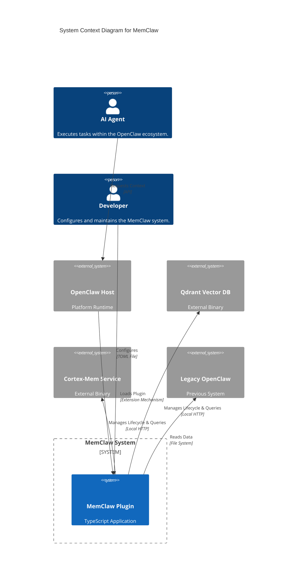
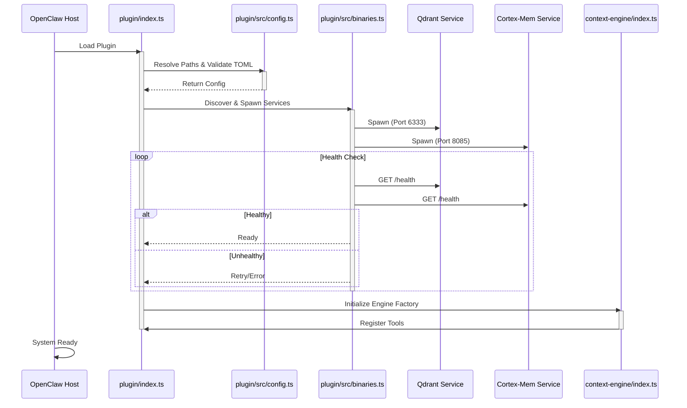
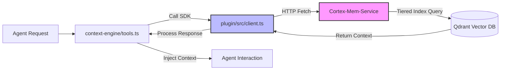
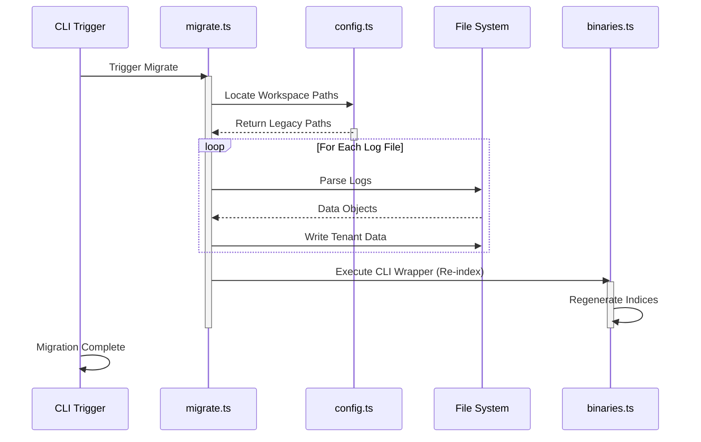

# System Architecture Documentation

**Project Name:** MemClaw  
**Document Version:** 1.0  
**Generation Time:** 2026-04-05 06:06:52 (UTC)  
**Timestamp:** 1775369212  

---

## 1. Architecture Overview

### 1.1 Architecture Design Philosophy
The MemClaw system is designed around the principle of **Infrastructure-as-a-Plugin**. It operates as a modular extension within the broader OpenClaw ecosystem, providing persistent memory and semantic context capabilities to AI agents. The architecture prioritizes **type safety**, **cross-platform compatibility**, and **operational autonomy**. By embedding backend microservice management directly into the plugin logic, MemClaw ensures that agents have immediate access to memory infrastructure without complex external deployment dependencies.

### 1.2 Core Architecture Patterns
*   **Dual-Entry Point Strategy:** The system utilizes two distinct entry points (`plugin/index.ts` and `context-engine/index.ts`) to separate API exposure from internal engine logic. This allows flexibility across different host environments while maintaining encapsulation.
*   **Facade Pattern:** Used extensively in `binaries.ts` and `client.ts` to abstract complex native process management and HTTP interactions behind clean TypeScript interfaces.
*   **Local Microservices:** Instead of relying on remote APIs, MemClaw orchestrates local native binaries (Qdrant, Cortex-Mem), treating them as first-class citizens managed by the application lifecycle.
*   **Layered Context Processing:** Implements a tiered indexing strategy (L0/L1/L2) for memory retrieval, balancing recall precision with query performance.

### 1.3 Technology Stack Overview
| Layer | Technology | Purpose |
| :--- | :--- | :--- |
| **Runtime** | Node.js / TypeScript | Primary execution environment for orchestration logic. |
| **Configuration** | TOML (`smol-toml`) | Human-readable configuration for paths and settings. |
| **Communication** | HTTP/REST (Localhost) | Internal communication between Plugin and Managed Services. |
| **Vector Storage** | Qdrant (Native Binary) | High-performance vector database for semantic memory. |
| **Memory Service** | Cortex-Mem (Native Binary) | Business logic layer for memory indexing and retrieval. |
| **File System** | Node `fs` / Streams | Local storage for logs, configs, and tenant isolation. |

---

## 2. System Context

### 2.1 System Positioning and Value
MemClaw acts as the **Memory Subsystem** for the OpenClaw platform. Its primary business value lies in enabling stateful interactions for AI agents by storing, retrieving, and contextualizing conversation history and knowledge bases. Without MemClaw, agents would operate in a stateless manner, lacking long-term memory retention.

### 2.2 User Roles and Scenarios
| Role | Description | Scenario |
| :--- | :--- | :--- |
| **AI Agent** | Automated software entity running within OpenClaw. | Requests context about previous conversations or user preferences to answer questions accurately. |
| **Developer** | Maintainer of the MemClaw/OpenClaw codebase. | Configures paths, updates binaries, or troubleshoots service health. |
| **End User** | Human interacting with the Agent. | Indirectly benefits from improved agent responses due to better memory retrieval. |

### 2.3 External System Interactions
*   **OpenClaw Runtime:** The host environment that loads the MemClaw plugin and exposes its tools to agents.
*   **Operating System:** Provides file system access and process management (spawn/exec) for native binaries.
*   **Legacy OpenClaw System:** Source of historical data during migration scenarios.

### 2.4 System Boundary Definition
*   **Included:** TypeScript orchestration logic, configuration management, binary lifecycle control, HTTP client wrappers, and migration utilities.
*   **Excluded:** The OpenClaw core runtime logic, the internal implementation of Qdrant/Cortex-Mem binaries (treated as black boxes), and external cloud databases.



---

## 3. Container View

### 3.1 Domain Module Division
The system is decomposed into four primary domains based on responsibility:
1.  **System Orchestration:** Manages the lifecycle of native binaries.
2.  **Core Context Engine:** Handles semantic search and agent context processing.
3.  **Configuration Management:** Centralizes settings, paths, and validation.
4.  **Migration & Compliance:** Handles data transitions and guideline enforcement.

### 3.2 Domain Module Architecture
The architecture follows a **Client-Server** model locally, where the TypeScript plugin acts as the client/orchestrator and the native binaries act as servers.

```mermaid
C4Container
    title Container Diagram for MemClaw

    Person(agent, "AI Agent", "Consumes memory tools.")
    System_Boundary(host, "Host Environment (OpenClaw)") {
        System(plugin_container, "MemClaw Plugin", "Node.js Application", "Main entry point and facade.")
    }

    ContainerBin(container_engine, "Context Engine Module", "TypeScript Library", "Core logic for context processing and tool registration.")
    ContainerBin(bin_manager, "Binary Manager", "TypeScript Module", "Spawns and monitors Qdrant/Cortex-Mem.")
    ContainerBin(config_mgr, "Config Manager", "TypeScript Module", "Resolves paths and parses TOML.")
    ContainerBin(migrator, "Migration Utility", "TypeScript Module", "Handles legacy data transition.")

    ContainerDb(qdrant, "Qdrant", "Vector Database", "Stores L0/L1/L2 memory indices.", "Port 6333")
    Container(cortex, "Cortex-Mem", "Microservice", "Memory retrieval logic.", "Port 8085")

    Rel(agent, plugin_container, "Calls Tools", "API")
    Rel(plugin_container, container_engine, "Initializes", "Import")
    Rel(plugin_container, bin_manager, "Calls", "Spawn/Health Check")
    Rel(plugin_container, config_mgr, "Reads", "Config File")
    Rel(plugin_container, migrator, "Triggers", "CLI Command")
    
    Rel(bin_manager, qdrant, "Spawns & Monitors", "Process")
    Rel(bin_manager, cortex, "Spawns & Monitors", "Process")
    Rel(container_engine, cortex, "Queries", "HTTP REST")
    Rel(migrator, bin_manager, "Invokes CLI", "Process")

    UpdateLayoutConfig($c4ShapeInRow="3", $c4BoundaryInRow="1")
```

### 3.3 Storage Design
*   **Configuration:** Stored in `config.toml` within the workspace directory. Supports platform-specific path overrides.
*   **Memory Indices:** Managed internally by Qdrant. MemClaw does not directly store vectors but manages the connection and schema.
*   **Tenant Isolation:** Data is segregated into tenant-specific directories to support multi-user or multi-project contexts securely.
*   **Logs:** Daily memory logs are parsed during migration; operational logs are streamed to the host environment.

### 3.4 Inter-Domain Module Communication
*   **Synchronous:** Configuration loading blocks initialization to ensure valid paths before service spawning.
*   **Asynchronous:** Service health checks and binary spawning utilize async/await patterns to prevent blocking the event loop during startup.
*   **IPC:** Communication between the TS Plugin and Native Binaries occurs via Localhost HTTP (Loopback interface).

---

## 4. Component View

### 4.1 Core Functional Components
This view details the internal components of the `plugin` and `context-engine` modules.

```mermaid
C4Component
    title Component Diagram for MemClaw Plugin & Engine

    Container(plugin, "MemClaw Plugin", "TypeScript", "Orchestration Layer") {
        Component(entry_plugin, "Entry Point Facade", "index.ts", "Defines API contracts and loads hooks.")
        Component(bin_ctrl, "Binary Controller", "binaries.ts", "Spawns Qdrant & Cortex-Mem.")
        Component(cfg_ctrl, "Config Resolver", "config.ts", "Parses TOML & resolves paths.")
        Component(client_http, "HTTP Client", "client.ts", "Wraps REST calls to Cortex-Mem.")
        Component(injector, "Compliance Enforcer", "agents-md-injector.ts", "Updates AGENTS.md guidelines.")
        Component(migrator, "Data Migrator", "migrate.ts", "Moves legacy data to tenants.")
    }

    Container(engine, "Context Engine", "TypeScript", "Business Logic Layer") {
        Component(entry_engine, "Engine Factory", "index.ts", "Registers context tools.")
        Component(proc_ctx, "Context Processor", "context-engine.ts", "Formats retrieved data.")
        Component(tool_reg, "Tool Registrar", "tools.ts", "Exposes functions to Host.")
        Component(cfg_ctx, "Context Config", "config.ts", "Engine-specific defaults.")
    }

    BiRel(entry_plugin, cfg_ctrl, "Loads")
    BiRel(entry_plugin, bin_ctrl, "Triggers")
    BiRel(bin_ctrl, client_http, "Validates Service")
    BiRel(entry_engine, proc_ctx, "Creates")
    BiRel(entry_engine, tool_reg, "Registers")
    BiRel(tool_reg, client_http, "Uses")
    BiRel(proc_ctx, client_http, "Fetches")
    BiRel(migrator, bin_ctrl, "Calls CLI")
    BiRel(injector, cfg_ctrl, "Reads Paths")
```

### 4.2 Technical Support Components
*   **HTTP Client Facade (`client.ts`):** Abstracts fetch logic, handles retry policies, and standardizes error handling for Cortex-Mem interactions.
*   **Health Check Monitor:** Embedded within `binaries.ts`, polls HTTP endpoints (`/health`) to verify service readiness before allowing queries.
*   **Path Resolver:** Uses `path` module with platform detection (`os.platform()`) to generate correct absolute paths for Windows/macOS/Linux.

### 4.3 Component Responsibility Division
| Component | Responsibility | Criticality |
| :--- | :--- | :--- |
| **Entry Point Facade** | Initializes lifecycle, defines public API. | High |
| **Binary Controller** | Ensures infrastructure availability. | Critical |
| **HTTP Client** | Network reliability and type safety. | High |
| **Config Resolver** | Environmental consistency. | Medium-High |
| **Data Migrator** | One-time upgrade path support. | Medium |

### 4.4 Component Interaction Relationships
*   **Dependency Injection:** The `Context Engine` depends on the `HTTP Client` provided by the `Plugin` module to avoid tight coupling to network specifics.
*   **Lifecycle Hooks:** `Entry Point Facade` registers hooks in the Host, which trigger `Binary Controller` on load and cleanup on unload.
*   **Error Propagation:** Errors from `Binary Controller` (e.g., port conflict) propagate up to `Entry Point Facade` to abort initialization gracefully.

---

## 5. Key Processes

### 5.1 Core Functional Processes

#### 5.1.1 Plugin Initialization & Service Startup
This workflow establishes the operational foundation. It ensures all infrastructure is healthy before exposing functionality.



#### 5.1.2 Context Retrieval & Semantic Search
Enables agents to perform semantic search across memory layers.



### 5.2 Technical Processing Workflows

#### 5.2.1 Legacy Data Migration
Facilitates transition from legacy OpenClaw architecture to tenant-isolated structures.



### 5.3 Data Flow Paths
1.  **Write Path:** Agent Interaction -> Cortex-Mem -> Qdrant (Embeddings).
2.  **Read Path:** Agent Query -> Cortex-Mem -> Qdrant (Similarity Search) -> Context Processor -> Agent.
3.  **Config Path:** User Edit TOML -> Config Resolver -> Plugin/Binaries.

### 5.4 Exception Handling Mechanisms
*   **Binary Failure:** If Qdrant/Cortex-Mem fails to spawn, the plugin halts initialization and logs the exit code.
*   **Network Timeout:** HTTP Client implements timeouts for Cortex-Mem requests to prevent agent hanging.
*   **Config Validation:** TOML parsing failures result in immediate startup rejection with clear error messages regarding schema violations.

---

## 6. Technical Implementation

### 6.1 Core Module Implementation

#### 6.1.1 Binary Orchestration (`plugin/src/binaries.ts`)
*   **Implementation:** Uses Node.js `child_process.spawn` to launch native executables.
*   **Pattern:** Observer Pattern implemented via health-check polling intervals.
*   **Code Detail:**
    ```typescript
    // Simplified Logic
    const service = spawn(binaryPath, args, { stdio: 'pipe' });
    await waitForHealth(serviceUrl, retries);
    // Ensures process stays alive during plugin lifecycle
    process.on('exit', () => service.kill());
    ```
*   **Optimization:** Currently synchronous config parsing blocks binary spawning. Recommendation: Move heavy IO to worker threads if startup latency becomes an issue.

#### 6.1.2 HTTP Client Facade (`plugin/src/client.ts`)
*   **Implementation:** Wraps native `fetch` with typed interfaces using TypeScript generics.
*   **Feature:** Centralized error handling middleware transforms raw HTTP errors into domain-specific exceptions.
*   **Security:** All requests target `localhost` only, mitigating SSRF risks associated with external network calls.

### 6.2 Key Algorithm Design
*   **Tiered Indexing (L0/L1/L2):**
    *   **L0:** Short-term conversation window (High priority, low latency).
    *   **L1:** Session-level summaries (Medium priority).
    *   **L2:** Long-term knowledge base (Low priority, high recall).
    *   *Mechanism:* Cortex-Mem routes queries based on time decay and importance scores before hitting Qdrant.

### 6.3