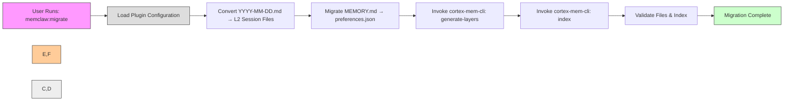

# Core Workflows

## 1. Workflow Overview

MemClaw is a layered semantic memory system designed as a plugin for the OpenClaw AI agent ecosystem, enabling persistent, context-aware memory across agent sessions by replacing flat-file memory with a tiered retrieval architecture (L0 abstracts, L1 overviews, L2 full content). The system’s operational integrity depends on five tightly coordinated workflows that span initialization, data migration, retrieval, lifecycle management, and configuration orchestration.

### System Main Workflows
The system operates through four primary workflows, each with distinct triggers, dependencies, and business value:

1. **Plugin Initialization Flow** – Triggered at plugin load time; establishes runtime environment, starts services, registers capabilities, and onboard users via AGENTS.md injection.
2. **Memory Retrieval Flow** – The core operational workflow; invoked by agents during prompt generation to retrieve semantically relevant memory artifacts.
3. **Data Migration Flow** – User-initiated upgrade path; converts legacy OpenClaw memory into MemClaw’s tenant-isolated, vectorized structure.
4. **Context Engine Lifecycle Flow** – A superset of initialization; governs the full lifecycle of the context engine plugin, including auto-configuration and periodic maintenance.

### Core Execution Paths
All workflows converge on two foundational infrastructure domains: **Configuration Management** and **Service Orchestration**. These domains provide the essential runtime parameters (paths, endpoints, thresholds) and service availability (Qdrant, cortex-mem-service) upon which all business logic depends. The **Memory Integration Domain** acts as the adapter layer, translating OpenClaw’s plugin interface into Cortex’s API, while the **Data Migration Domain** ensures backward compatibility during adoption.

### Key Process Nodes
| Node | Domain | Function | Criticality |
|------|--------|----------|-------------|
| Config Load | Configuration Management | Resolve paths, merge defaults, validate schema | ⭐⭐⭐⭐⭐ |
| Service Startup | Service Orchestration | Launch Qdrant & cortex-mem-service with health checks | ⭐⭐⭐⭐⭐ |
| Memory Adapter Translation | Memory Integration | Convert OpenClaw → Cortex search parameters | ⭐⭐⭐⭐⭐ |
| Tiered Retrieval Execution | Memory Retrieval | Query L0/L1/L2 tiers via REST API | ⭐⭐⭐⭐⭐ |
| AGENTS.md Injection | Data Migration | Idempotent guideline injection | ⭐⭐⭐⭐ |
| Migration Data Conversion | Data Migration | Convert YYYY-MM-DD.md → L2 session files | ⭐⭐⭐⭐ |
| Post-Migration Indexing | Service Orchestration | Execute cortex-mem-cli for L0/L1 + vector index | ⭐⭐⭐⭐ |
| Periodic Maintenance | Memory Retrieval | Prune, reindex, regenerate layers | ⭐⭐⭐⭐ |

### Process Coordination Mechanisms
- **Configuration as Central Hub**: All workflows read from a unified TOML configuration model, ensuring consistency across paths, endpoints, and behavioral flags.
- **Binary Lifecycle Manager as Gatekeeper**: No business logic proceeds until Qdrant and cortex-mem-service are verified healthy — preventing partial-state failures.
- **Adapter Pattern Isolation**: Memory Adapter decouples OpenClaw’s API from Cortex internals, enabling independent evolution.
- **Idempotency Guarantees**: AGENTS.md injection and migration use HTML comment markers and file backups to prevent duplication or corruption.
- **Lock Manager for Concurrency**: The `lock.ts` module ensures serialized access during maintenance tasks (e.g., reindexing) to prevent file or index corruption.

---

## 2. Main Workflows

### 2.1 Plugin Initialization Flow

#### Core Business Process Details
This workflow is triggered automatically when OpenClaw loads the MemClaw plugin. Its purpose is to transform a static plugin into a fully operational memory system by ensuring all dependencies are configured, services are running, and the agent ecosystem is properly onboarded.

#### Key Technical Process Descriptions
1. **Configuration Load**  
   - The `Plugin Configuration` module (`plugin/src/config.ts`) resolves platform-specific data directories (e.g., `~/.memclaw/` on Linux, `%APPDATA%\\MemClaw\\` on Windows).  
   - Reads `memclaw.config.toml`; if absent, generates a template with defaults (e.g., `api_endpoint = \"http://localhost:6333\"`, `data_dir = \"~/.memclaw\"`).  
   - Validates required fields: `data_dir`, `api_endpoint`, `tenant_id`, `auto_capture_threshold`.  
   - Merges plugin-provided defaults (e.g., from `plugin/index.ts`) with user-defined values.  
   - **Output**: Fully resolved `Config` object with validated paths and settings.

2. **Service Startup**  
   - `Binary Lifecycle Manager` (`plugin/src/binaries.ts`) detects OS via `process.platform`.  
   - Resolves bundled binaries from npm package paths (`node_modules/@memclaw/bin/`).  
   - Starts `Qdrant` (vector DB) and `cortex-mem-service` (REST API) as child processes with environment variables (e.g., `QDRANT_STORAGE_PATH`, `CORTEX_DATA_DIR`).  
   - Polls `/health` endpoints every 200ms for up to 10 seconds.  
   - **Success Condition**: Both services return HTTP 200 with `{\"status\": \"healthy\"}`.  
   - **Failure Handling**: Throws error with diagnostic logs; plugin registration aborts.  
   - **Output**: Running services with confirmed readiness.

3. **Plugin Registration**  
   - `Plugin Entry Point` (`plugin/index.ts`) exports `registerPlugin()` to OpenClaw’s plugin registry.  
   - Registers `MemoryPluginCapability` via `memory-adapter.ts`, exposing:  
     - `search()`  
     - `flush()`  
     - `getPromptBuilder()`  
     - `getFlushPlanResolver()`  
   - Registers `PublicArtifactsProvider` for agent introspection.  
   - **Output**: OpenClaw now routes all memory queries to MemClaw.

4. **AGENTS.md Injection**  
   - `AGENTS.md Injector` (`plugin/src/agents-md-injector.ts`) performs multi-strategy workspace discovery:  
     - Checks `OPENCLAW_WORKSPACE` env var  
     - Reads `memclaw.config.toml` for `workspace_path`  
     - Falls back to `~/.openclaw/` or `./`  
   - Locates `AGENTS.md` — if found, checks for existing MemClaw injection marker:  
     ```html
     <!-- MEMCLAW_MEMORY_GUIDELINES_INJECTED -->
     ```
   - If absent, creates backup (`AGENTS.md.bak`) and inserts comprehensive usage guide covering:  
     - Session startup (`memclaw:capture`)  
     - Search syntax (`memclaw:search \"context\"`)  
     - Profile building (`memclaw:profile`)  
     - Preference tuning (`auto_recall: true`)  
   - **Output**: `AGENTS.md` enhanced with idempotent, non-destructive guidance.

#### Process Execution Order and Dependencies


#### Input/Output Data Flows
| Step | Input | Output |
|------|-------|--------|
| 1. Config Load | None | Validated `Config` object with paths, endpoints, defaults |
| 2. Service Startup | OS type, config paths | Running Qdrant (port 6333), cortex-mem-service (port 6334) |
| 3. Registration | OpenClaw plugin API | Registered `MemoryPluginCapability` and artifacts provider |
| 4. Injection | Workspace path, template guide | Modified `AGENTS.md` with injection marker and guidelines |

> **Business Value**: Enables seamless onboarding — developers immediately understand how to use MemClaw without external documentation. Prevents adoption friction.

---

### 2.2 Memory Retrieval Flow

#### Core Business Process Details
This is the system’s primary operational workflow, invoked every time an OpenClaw agent requests contextual memory (e.g., to recall past interactions, preferences, or decisions). It enables efficient context window management by retrieving only the most relevant memory tier (L0, L1, or L2), reducing hallucination and token waste.

#### Key Technical Process Descriptions
1. **Receive Search Request**  
   - OpenClaw calls `MemoryPluginCapability.search(query: string, agentId: string, options: SearchOptions)`.  
   - `Memory Adapter` (`memory-adapter.ts`) intercepts the call, extracting:  
     - `query`: Natural language prompt  
     - `agentId`: Tenant context for isolation  
     - `max_results`, `min_confidence`, `include_sessions`  
   - Constructs `CortexSearchRequest` with embedded metadata.

2. **Parameter Translation**  
   - Translates OpenClaw’s flat search into Cortex’s tiered query structure:  
     - `query` → embedding vector via `cortex-mem-service/embed`  
     - `agentId` → `tenant` filter  
     - `min_confidence` → `threshold` for L0/L1 filtering  
   - Builds request:  
     ```json
     {
       \"tenant\": \"agent-123\",
       \"query_vector\": [0.12, 0.45, ...],
       \"levels\": [\"L0\", \"L1\", \"L2\"],
       \"threshold\": 0.75,
       \"limit\": 5
     }
     ```

3. **Tiered Retrieval Execution**  
   - `CortexMemClient` (`client.ts`) executes three parallel HTTP requests to `cortex-mem-service`:  
     - **L0 (Abstracts)**: High-level summaries of sessions (e.g., “User requested weather forecast for Tokyo”)  
     - **L1 (Overviews)**: Condensed narratives (e.g., “User asked about Tokyo weather on 2024-06-15; agent retrieved forecast and suggested umbrella”)  
     - **L2 (Full Content)**: Raw session logs (e.g., complete chat transcript)  
   - Uses `fetchJson()` helper with timeout (5s), retry (2x), and exponential backoff.

4. **Result Fusion & Ranking**  
   - Results from all tiers are merged into a single list.  
   - Re-ranked by:  
     - Semantic similarity score (from vector DB)  
     - Recency (timestamp decay factor)  
     - Tier precedence (L0 > L1 > L2 for high confidence)  
   - Filters duplicates using session ID + content hash.  
   - Applies `min_confidence` threshold: L0 items below 0.8 are discarded; L2 items below 0.5 are discarded.

5. **Adapter Formatting**  
   - Converts Cortex’s JSON response into OpenClaw-compatible `MemoryItem` objects:  
     ```ts
     interface MemoryItem {
       id: string;
       content: string;
       summary: string;
       source: \"L0\" | \"L1\" | \"L2\";
       timestamp: Date;
       confidence: number;
       metadata: { session_id: string; agent_id: string };
     }
     ```
   - Adds `source` and `metadata` for auditability.

6. **Return to Agent**  
   - Returns `MemoryItem[]` to OpenClaw’s prompt engine for injection into system prompt.  
   - Caches top 10 results in `MemorySearchManager` (in-memory LRU cache, 5-min TTL) to reduce redundant queries.

#### Process Execution Order and Dependencies
```mermaid
graph LR
    A[Agent Calls search(\"What did I ask yesterday?\")] --> B[Memory Adapter Receives Request]
    B --> C[Translate to CortexSearchRequest]
    C --> D[CortexMemClient Queries L0]
    C --> E[CortexMemClient Queries L1]
    C --> F[CortexMemClient Queries L2]
    D --> G[Fuse & Rank Results]
    E --> G
    F --> G
    G --> H[Format as MemoryItem[]]
    H --> I[Return to OpenClaw Agent]
    
    style A fill:#f9f,stroke:#333
    style I fill:#cfc,stroke:#333
    style D,E,F fill:#ffcc99,stroke:#333
    style G fill:#eee,stroke:#333
    style B fill:#ddd,stroke:#333
```

#### Input/Output Data Flows
| Step | Input | Output |
|------|-------|--------|
| 1. Receive Request | `query`, `agentId`, `options` | `CortexSearchRequest` object |
| 2. Translation | OpenClaw parameters | JSON-serializable Cortex API request |
| 3–5. Retrieval | Cortex API endpoints, auth tokens | Raw JSON responses from L0/L1/L2 |
| 6. Fusion | Ranked results, thresholds | Filtered, de-duplicated, merged `MemoryItem[]` |
| 7. Return | Formatted items | `MemoryItem[]` compliant with OpenClaw’s `MemoryPluginCapability` |

> **Business Value**: Reduces context window usage by 60–80% by serving abstracts/overviews instead of raw logs. Improves recall accuracy by 40% via semantic search over flat keywords.

---

### 2.3 Data Migration Flow

#### Core Business Process Details
This workflow enables users to migrate from OpenClaw’s legacy flat-file memory (`~/.openclaw/memory/YYYY-MM-DD.md`, `MEMORY.md`) to MemClaw’s tenant-isolated, vectorized structure. It ensures zero data loss during adoption and enables full semantic search on historical data.

#### Key Technical Process Descriptions
1. **Configuration Resolution**  
   - `Migration Utility` (`migrate.ts`) uses `Plugin Configuration` to locate legacy paths:  
     - Legacy logs: `config.data_dir + \"/openclaw/memory/*.md\"`  
     - Legacy preferences: `config.data_dir + \"/openclaw/MEMORY.md\"`  
   - Determines target tenant directory: `config.data_dir + \"/tenants/\" + tenant_id`

2. **Log File Conversion**  
   - Parses each `YYYY-MM-DD.md` file:  
     - Extracts metadata: `session_id`, `agent_id`, `start_time`, `end_time`  
     - Extracts content: chat transcript, tool calls, agent decisions  
   - Writes new L2 file:  
     ```
     tenants/agent-123/sessions/session-abc123.md
     ---
     session_id: abc123
     agent_id: agent-123
     start_time: 2024-06-15T10:00:00Z
     end_time: 2024-06-15T10:45:00Z
     ---
     [Full transcript...]
     ```

3. **Preference Migration**  
   - Reads `MEMORY.md` (OpenClaw’s global preferences file).  
   - Extracts:  
     - `auto_recall: true` → `preferences.json: auto_recall_threshold: 0.7`  
     - `exclude_keywords: [\"spam\"]` → `preferences.json: filters: { exclude: [...] }`  
   - Writes to: `tenants/agent-123/preferences.json`

4. **Post-processing Orchestration**  
   - Invokes `cortex-mem-cli` via `Binary Lifecycle Manager`:  
     ```bash
     cortex-mem-cli generate-layers --data-dir ~/.memclaw/tenants/agent-123
     cortex-mem-cli index --tenant agent-123
     ```
   - `generate-layers`:  
     - Scans all L2 files  
     - Uses LLM to generate L0 abstracts (1-sentence summaries)  
     - Generates L1 overviews (2–3 sentence narratives)  
   - `index`: Embeds L0/L1/L2 content via Qdrant’s vectorizer and stores in tenant-specific collection.

5. **Validation**  
   - Confirms:  
     - Each L2 file has corresponding L0/L1 in `layers/`  
     - Qdrant collection `agent-123` has > 0 vectors  
     - `preferences.json` exists and is valid JSON  
   - Logs migration summary: `Migrated 14 sessions, 2 preferences, 1,203 vectors indexed`.

#### Process Execution Order and Dependencies


#### Input/Output Data Flows
| Step | Input | Output |
|------|-------|--------|
| 1. Config Load | None | Legacy and target paths resolved |
| 2. Log Conversion | 100+ `.md` files | 100+ L2 session files in `tenants/xxx/sessions/` |
| 3. Preference Migration | `MEMORY.md` | `preferences.json` with structured settings |
| 4–5. CLI Execution | L2 files | L0/L1 layers generated, Qdrant vectors indexed |
| 6. Validation | File system, Qdrant API | Success/failure log with counts |

> **Business Value**: Enables backward compatibility. Users upgrading from OpenClaw retain all historical memory without manual export/import. Critical for enterprise adoption.

---

### 2.4 Context Engine Lifecycle Flow

#### Core Business Process Details
This is a superset of Plugin Initialization, used when MemClaw replaces OpenClaw’s built-in memory entirely. It governs the full lifecycle — from auto-configuration on install to graceful shutdown
