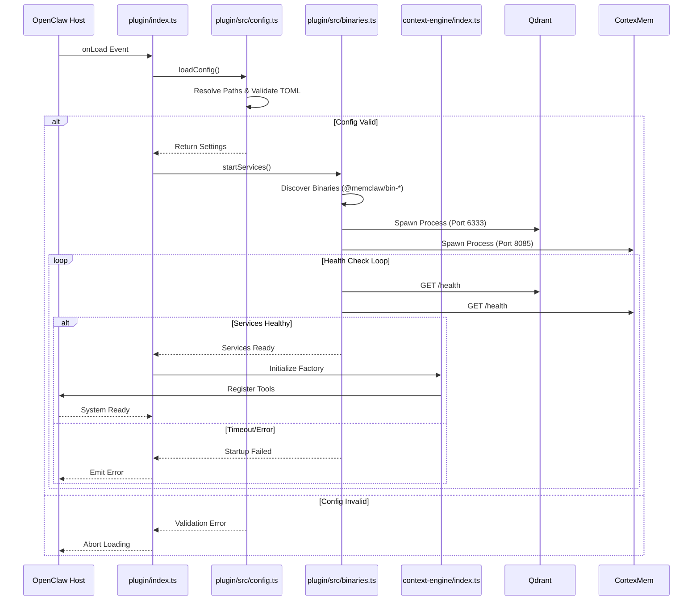
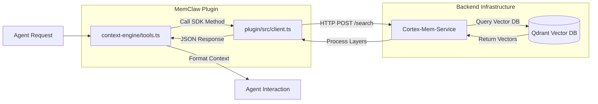
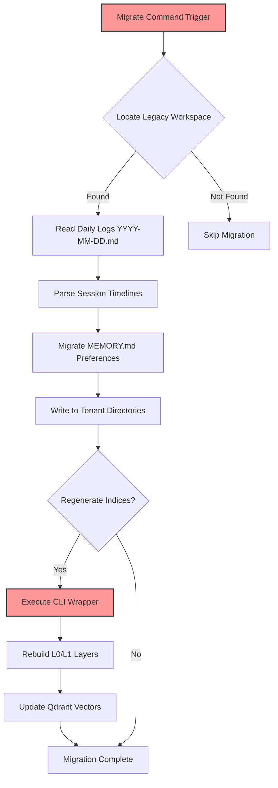

# Core Workflows

## 1. Workflow Overview

The MemClaw system operates as a modular plugin integrated within the OpenClaw host ecosystem. Its primary objective is to provide intelligent context retrieval and memory management capabilities for AI agents. The system architecture relies on a strict initialization sequence to ensure backend infrastructure stability before exposing functionality.

### System Main Workflows
1.  **Plugin Initialization & Service Startup**: The critical path that validates configuration, discovers platform-specific binaries, and orchestrates the lifecycle of backend microservices (Qdrant and Cortex-Mem).
2.  **Context Retrieval & Semantic Search**: The runtime operational flow where agents query the system for relevant memory layers (L0/L1/L2) via typed HTTP clients.
3.  **Legacy Data Migration**: A utility workflow responsible for transitioning data from the legacy OpenClaw architecture to the new tenant-isolated MemClaw structure.

### Core Execution Paths
*   **Bootstrapping**: Host Environment → Plugin Entry (`plugin/index.ts`) → Config Resolution → Binary Orchestration → Engine Registration.
*   **Runtime Query**: Agent Request → Context Tools → HTTP Client Facade → Cortex-Mem Service → Vector Database (Qdrant).
*   **Data Transition**: Migration Command → Workspace Discovery → Log Parsing → Tenant Directory Write → Index Regeneration.

### Key Process Nodes
*   **Configuration Validation**: Ensures `config.toml` integrity and platform path resolution before any service starts.
*   **Binary Lifecycle**: Spawning and monitoring child processes for Qdrant (Port 6333) and Cortex-Mem (Port 8085).
*   **Semantic Indexing**: Layered retrieval logic (Abstract, Overview, Full Content) managed by the Context Engine.

### Process Coordination Mechanisms
The system utilizes a **Dependency Injection** pattern where higher-level domains (Core Context Engine) depend on lower-level infrastructure (System Orchestration). Configuration acts as the single source of truth for paths and settings, decoupling business logic from environmental specifics.

---

## 2. Main Workflows

### 2.1 Plugin Initialization & Service Startup
This workflow establishes the operational foundation. It ensures that all infrastructure components are healthy and ready before exposing tools to the host environment.

**Process Execution Order:**
1.  **Plugin Registration**: `plugin/index.ts` defines API contracts and configuration schemas.
2.  **Configuration Resolution**: `plugin/src/config.ts` resolves OS-specific paths (Windows/macOS/Linux) and parses `config.toml`.
3.  **Binary Orchestration**: `plugin/src/binaries.ts` locates native binaries and spawns backend services.
4.  **Health Verification**: HTTP endpoints are polled to confirm service readiness.
5.  **Engine Initialization**: `context-engine/index.ts` creates the engine factory and registers tools.

**Mermaid Diagram: Initialization Flow**

**Input/Output Data Flows:**
*   **Input**: Host environment variables, `config.toml` file content.
*   **Output**: Active child processes, registered tool definitions, validated configuration object.
*   **State Transition**: `Stopped` → `Loading Config` → `Starting Services` → `Running` → `Failed`.

### 2.2 Context Retrieval & Semantic Search
This workflow handles the core intelligence of the system, enabling agents to perform semantic search and retrieve memory layers from the vector database.

**Process Execution Order:**
1.  **Agent Invocation**: Host triggers a context tool defined in the plugin.
2.  **Request Construction**: `context-engine/tools.ts` formats the query parameters.
3.  **HTTP Facade**: `plugin/src/client.ts` constructs typed HTTP requests to `cortex-mem-service`.
4.  **Tiered Search**: The service queries Qdrant using L0/L1/L2 indexing tiers.
5.  **Response Processing**: Retrieved context is processed and injected into the agent interaction.

**Mermaid Diagram: Context Retrieval Sequence**

**Key Technical Details:**
*   **Layered Indexing**: Implements L0 (Abstract), L1 (Overview), and L2 (Full Content) retrieval strategies.
*   **Session Management**: Supports session lifecycle management including message logging and session commitment via `sessionCommit`.
*   **Type Safety**: Uses TypeScript interfaces to enforce strict contracts between the client and the backend service.

### 2.3 Legacy Data Migration
This utility workflow facilitates the transition from the legacy OpenClaw architecture to the new MemClaw tenant-isolated structure.

**Process Execution Order:**
1.  **Trigger**: User initiates migration command or first-run detection.
2.  **Workspace Location**: `plugin/src/config.ts` identifies legacy workspace paths (~/.openclaw/workspace).
3.  **Data Parsing**: `plugin/src/migrate.ts` parses daily memory logs (YYYY-MM-DD.md).
4.  **Tenant Isolation**: Preferences and logs are migrated to tenant-specific directories.
5.  **Index Regeneration**: CLI commands trigger regeneration of L0/L1 layers and vector indices.

**Mermaid Diagram: Migration Flow**

---

## 3. Flow Coordination and Control

### Multi-Module Coordination Mechanisms
The system employs a **Facade Pattern** for entry points and a **Dependency Chain** for execution control.
*   **Entry Point Facade**: `plugin/index.ts` and `context-engine/index.ts` act as dual entry points, allowing flexibility in how the plugin is loaded while maintaining separation between API exposure and internal engine logic.
*   **Configuration Dependency**: The `System Orchestration` domain (`binaries.ts`) cannot start without valid configuration from `Configuration Management` (`config.ts`). This is enforced via explicit function calls where config objects are passed as arguments.
*   **Service Coupling**: The `Core Context Engine` depends entirely on `System Orchestration` to have active ports (6333, 8085). If binaries fail, the engine tools become non-functional.

### State Management and Synchronization
*   **Process Tracking**: `plugin/src/binaries.ts` maintains an in-memory registry of running child processes to manage lifecycle events (stop, restart).
*   **Configuration Sync**: Transient plugin settings are merged with persistent `config.toml` settings. The `validateConfig` function ensures consistency before state changes occur.
*   **Health State**: Services transition through states defined by HTTP health check responses (`Ready`, `Unhealthy`, `Timeout`).

### Data Passing and Sharing
*   **Shared Context**: Configuration objects containing paths and API keys are passed down from the Entry Point to Binaries and Engine modules.
*   **Tenant Isolation**: During migration, tenant IDs parameterize directory structures, ensuring data isolation between different users or workspaces.
*   **API Contracts**: `plugin/src/client.ts` uses shared TypeScript interfaces to ensure data structures passed between the plugin and `cortex-mem-service` remain consistent.

### Execution Control and Scheduling
*   **Asynchronous Startup**: Service spawning uses `child_process.spawn` with asynchronous waiting mechanisms to prevent blocking the host event loop during initialization.
*   **Synchronous Risks**: File I/O operations in `migrate.ts` currently utilize synchronous patterns (`fs.readFileSync`), which may block execution on large datasets. This is a controlled bottleneck managed by the migration utility scope.
*   **Retry Logic**: `binaries.ts` implements timeout-based retry mechanisms for service startup verification to handle transient network or resource contention issues.

---

## 4. Exception Handling and Recovery

### Error Detection and Handling
*   **Configuration Validation**: `plugin/src/config.ts` detects malformed TOML files or missing mandatory fields (e.g., API Keys). It throws specific errors preventing further startup.
*   **Binary Discovery**: `plugin/src/binaries.ts` checks for the existence of platform-specific packages (`@memclaw/bin-darwin-arm64`, etc.). Missing binaries trigger immediate failure.
*   **Network Failures**: `plugin/src/client.ts` catches HTTP fetch errors. Currently, error handling logic is duplicated across methods; centralization is recommended.

### Exception Recovery Mechanisms
*   **Health Check Retries**: If `cortex-mem-service` fails to respond immediately upon spawn, the system retries HTTP health checks within a defined timeout window before declaring the service dead.
*   **Idempotent Injection**: `plugin/src/agents-md-injector.ts` performs idempotent injection of guidelines into `AGENTS.md`. If run multiple times, it detects existing guidelines to prevent duplication or corruption.
*   **Graceful Degradation**: While not fully implemented, the architecture allows for the plugin to load even if backend services are offline (though functionality would be limited), provided the host does not enforce strict blocking.

### Fault Tolerance Strategy Design
*   **Process Isolation**: Backend services run as separate child processes. If Qdrant crashes, Cortex-Mem may continue running, allowing partial recovery or easier restart of individual components.
*   **Version Compatibility**: Binary packages are version-pinned via npm optional dependencies to ensure compatibility between the plugin logic and the native executables.

### Failure Retry and Degradation
*   **Startup Timeout**: `binaries.ts` includes a timeout mechanism. If services do not reach a healthy state within the limit, the initialization halts to prevent hanging the host application.
*   **CLI Fallback**: In migration workflows, if CLI commands fail, the process logs errors but may proceed depending on criticality (e.g., index regeneration vs. data copy).
*   **Recommendation**: Implement runtime validation (e.g., Zod) in `context-engine/config.ts` to replace unsafe type assertions, providing clearer error messages for configuration failures.

---

## 5. Key Process Implementation

### Core Algorithm Processes
*   **Tiered Semantic Search**:
    *   **L0 (Abstract)**: Retrieves high-level summaries for quick relevance checks.
    *   **L1 (Overview)**: Retrieves contextual overviews for moderate depth.
    *   **L2 (Full Content)**: Retrieves detailed content for deep analysis.
    *   **Implementation**: Managed in `plugin/src/client.ts` via `semanticSearch` method, which abstracts the underlying vector query complexity.
*   **Configuration Merging**:
    *   **Logic**: Combines persistent `config.toml` values with transient plugin-provided settings.
    *   **Priority**: Transient settings typically override persistent ones for runtime flexibility, but essential parameters (API Keys) prioritize persistence for security.
    *   **Complexity**: Current implementation has high cyclomatic complexity (22.0) due to nested conditional logic in update and merge functions.

### Data Processing Pipelines
*   **Log Parsing Pipeline**:
    *   **Input**: Daily markdown logs (`YYYY-MM-DD.md`).
    *   **Transformation**: Parsed into granular session timeline files with deterministic timestamps.
    *   **Output**: Tenant-isolated memory files.
    *   **Tool**: `plugin/src/migrate.ts`.
*   **Vector Indexing Pipeline**:
    *   **Trigger**: Post-migration or manual re-index command.
    *   **Execution**: Calls external CLI wrapper via `binaries.ts`.
    *   **Target**: Updates Qdrant collection with new embeddings.

### Business Rule Execution
*   **Tenant Isolation**: All user data must reside in directories derived from the Tenant ID configured in `config.toml`. This prevents cross-user data leakage.
*   **Guideline Enforcement**: `AGENTS.md` files must contain specific MemClaw guidelines. The system scans and injects these automatically to ensure compliance.
*   **Path Resolution**: Absolute paths are resolved differently per OS (Windows vs. macOS/Linux) using Node.js `os` and `path` modules within `config.ts`.

### Technical Implementation Details
*   **HTTP Client Architecture**:
    *   **Library**: Uses native Node.js `fetch` API (zero external dependencies).
    *   **Pattern**: Typed facade class (`CortexMemClient`).
    *   **Weakness**: Significant boilerplate duplication in error handling; lacks centralized interceptors for logging/auth.
    *   **Improvement**: Refactor private `fetchJson` method to include global interceptors.
*   **Binary Management**:
    *   **Discovery**: Relies on npm package resolution (`@memclaw/bin-*`).
    *   **Spawn**: Uses `child_process.spawn` with proper stdio handling.
    *   **Config Gen**: Dynamically generates `qdrant-config.yaml` during startup.
*   **Optimization Opportunities**:
    *   **Async Migration**: Adopt asynchronous file streams in `migrate.ts` instead of synchronous fs operations to improve scalability.
    *   **Regex Refactoring**: Refactor regular expressions in `agents-md-injector.ts` to reduce cyclomatic complexity.
    *   **Validation**: Implement runtime schema validation to replace unsafe type assertions in config parsing.

---
*Document Generation Time: 2026-04-05 06:06:52 (UTC)*
*Timestamp: 1775369212*
