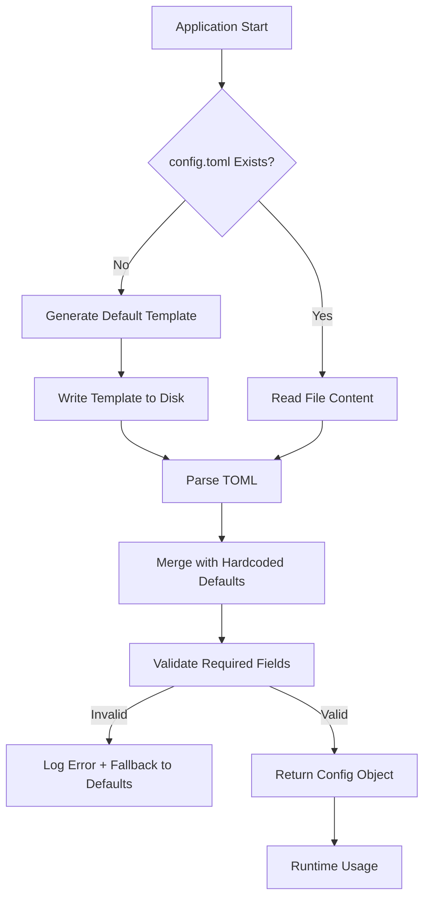

# Configuration Management Domain Documentation

## **Overview**

The **Configuration Management Domain** serves as the central nervous system of the MemClaw system, providing a unified, cross-platform, and resilient mechanism for managing all runtime and deployment-time settings across both the MemClaw Plugin and MemClaw Context Engine deployment units. This infrastructure domain ensures that every module — from memory retrieval clients to binary orchestrators and migration utilities — operates with consistent, validated, and platform-aware configuration data.

As the single source of truth for system behavior, the Configuration Management Domain abstracts the complexity of file system paths, environment-specific defaults, TOML parsing, and dynamic setting synchronization. It enables MemClaw to function reliably across Windows, macOS, and Linux environments while maintaining human-readable, editable, and auditable configuration files.

This domain is not merely a configuration loader — it is a *lifecycle manager* that handles initialization, validation, persistence, user interaction, and runtime synchronization. All other domains in MemClaw depend on it, making it the most heavily referenced infrastructure component in the system (8 out of 9 documented domain relations involve configuration).

---

## **Architectural Role and Strategic Importance**

### **Core Responsibilities**
- **Cross-platform path resolution**: Dynamically determines appropriate data directories based on OS (e.g., `AppData\Local` on Windows, `~/Library/Application Support` on macOS, `~/.local/share` on Linux).
- **TOML configuration lifecycle**: Generates default templates, parses user-modified files, merges defaults, and validates required fields.
- **Runtime-to-persistence synchronization**: Ensures dynamic plugin settings (e.g., user toggles, API keys) are persisted to disk and vice versa.
- **User-facing configuration editing**: Launches the system’s default text editor to allow users to modify settings without manual file navigation.
- **Fail-safe fallbacks**: Provides hardened default values to prevent system failure when configuration is missing or malformed.

### **Strategic Significance**
- **Central Dependency Hub**: Every major workflow — Plugin Initialization, Data Migration, Context Engine Lifecycle, and Memory Retrieval — depends on configuration for paths, endpoints, thresholds, and behavioral parameters.
- **Enables Portability**: By abstracting OS-specific paths and defaults, MemClaw becomes truly cross-platform without requiring environment-specific builds or scripts.
- **Reduces Cognitive Load**: Developers and end users interact with a single, consistent configuration file (`config.toml`) regardless of deployment context (plugin vs. context engine).
- **Improves Resilience**: Validation and fallback logic prevent silent failures during startup or operation, enhancing user trust in memory persistence.

---

## **Domain Structure and Sub-Modules**

The Configuration Management Domain is implemented as two logically distinct but architecturally identical sub-modules, each tailored to its deployment unit while sharing core logic and patterns.

| Sub-Module | Deployment Unit | Purpose | Key Configuration Properties |
|-----------|------------------|---------|------------------------------|
| **Plugin Configuration** | MemClaw Plugin (`plugin/src/config.ts`) | Manages user-facing plugin settings for memory search, migration, and injection. | `dataDirectory`, `apiEndpoint`, `autoInjectAgentsMd`, `editorCommand`, `tenantId` |
| **Context Engine Configuration** | MemClaw Context Engine (`context-engine/config.ts`) | Manages system-level memory automation settings for persistent, background operation. | `autoRecallThreshold`, `autoCaptureEnabled`, `retentionDays`, `dataDirectory`, `enableVectorPruning` |

> ✅ **Design Principle**: *Shared Infrastructure, Separate Concerns*  
> Both sub-modules reuse the same underlying configuration engine but expose distinct TypeScript interfaces (`MemClawConfig` vs. `ContextEngineConfig`) to enforce type safety and semantic clarity. This avoids circular dependencies while enabling code reuse.

---

## **Implementation Details**

### **Technology Stack**
- **Language**: TypeScript (Node.js runtime)
- **File Format**: TOML (Tom’s Obvious, Minimal Language) — chosen for human readability and simplicity
- **Parsing Library**: `smol-toml` — lightweight, dependency-free TOML parser optimized for CLI tools
- **File System**: Node.js `fs` and `path` modules for cross-platform file operations
- **Editor Launching**: Platform-specific exec commands (`cmd.exe`, `open`, `xdg-open`)
- **Validation**: Custom schema validation using runtime type guards and required field checks

### **Core Implementation Patterns**

#### **1. Configuration File Lifecycle (ensureConfigExists → parseConfig → validateConfig)**

The configuration lifecycle follows a deterministic, fail-safe sequence:



**Key Behavior**:
- **Default Merging Strategy**: Hardcoded defaults are applied first, then overwritten by values from the file. This ensures that new configuration fields added in future versions are automatically populated with sensible defaults.
- **Idempotent Template Generation**: If the config file is missing, a complete, well-commented template is written to disk with explanatory notes (e.g., `# API endpoint for cortex-mem-service`, `# Set to 0.8 for high-precision recall`).
- **Strict Validation**: Critical fields such as `apiEndpoint`, `dataDirectory`, and `tenantId` are checked for presence and non-empty values. Invalid configurations trigger warnings and fallback to defaults — never silent failure.

#### **2. Cross-Platform Path Resolution**

The system dynamically resolves data directories using OS detection:

```ts
function resolveDataDirectory(): string {
  const platform = os.platform();
  const appName = 'MemClaw';

  switch (platform) {
    case 'win32':
      return path.join(process.env.LOCALAPPDATA || '', appName);
    case 'darwin':
      return path.join(os.homedir(), 'Library', 'Application Support', appName);
    case 'linux':
      return path.join(os.homedir(), '.local', 'share', appName);
    default:
      throw new Error(`Unsupported platform: ${platform}`);
  }
}
```

This ensures:
- Consistent storage location across OSes
- Compliance with OS conventions (e.g., macOS Application Support, Linux XDG Base Directory)
- Avoidance of permission issues by using user-writable directories

#### **3. Runtime-to-Persistence Synchronization**

Dynamic settings (e.g., user toggling auto-recall via UI) are synchronized bidirectionally:

```ts
// Plugin runtime updates config
await updateConfigFromPlugin({ autoRecallThreshold: 0.9 });

// Later, on restart, config is reloaded
const config = parseConfig(); // autoRecallThreshold === 0.9
```

- `mergeConfigWithPlugin()`: Merges in-memory plugin settings into the persisted config object.
- `updateConfigFromPlugin()`: Writes updated values back to `config.toml` with atomic file operations (write to temp, rename) to prevent corruption.

#### **4. User Configuration Editing**

Users can edit configuration via a single command:

```ts
function openConfigFile(): void {
  const editor = process.env.MEMCLAW_EDITOR || getDefaultEditor();
  const configPath = resolveConfigPath();
  
  exec(`${editor} "${configPath}"`, (err) => {
    if (err) log.warn(`Failed to launch editor: ${err.message}`);
    else log.info('Configuration editor opened. Changes will be loaded on next restart.');
  });
}
```

- **Fallback Strategy**: Uses `MEMCLAW_EDITOR` env var → system default (`notepad`, `TextEdit`, `gedit`) → fails gracefully.
- **Non-blocking**: Editor is spawned asynchronously; system continues operation.

---

## **Integration with Other Domains**

The Configuration Management Domain is the foundational dependency for all other domains. Below are the critical integration points:

| Dependent Domain | Dependency Type | Configuration Values Used | Impact |
|------------------|-----------------|---------------------------|--------|
| **Service Orchestration** | Configuration Dependency | `dataDirectory`, `apiEndpoint`, `binaryPaths` | Determines where Qdrant and cortex-mem-service store data and how to reach their APIs |
| **Memory Retrieval (CortexMemClient)** | Configuration Dependency | `apiEndpoint`, `timeoutMs`, `tenantId` | Enables HTTP client to connect to cortex-mem-service with correct endpoint and context |
| **Data Migration (Migration Utility)** | Configuration Dependency | `dataDirectory`, `tenantId`, `legacyMemoryPath` | Locates OpenClaw’s legacy `YYYY-MM-DD.md` files and writes new L2 session files |
| **AGENTS.md Injector** | Configuration Dependency | `workspacePaths`, `dataDirectory` | Discovers agent workspaces to inject memory guidelines into `AGENTS.md` |
| **Binary Lifecycle Manager** | Configuration Dependency | `binaryPaths`, `healthCheckUrl`, `startupTimeout` | Resolves bundled binaries and verifies service readiness before exposing capabilities |

> 🔗 **Dependency Strength**: All 5 of these integrations are rated **7.0 or higher** in importance, confirming configuration as the central hub.

---

## **Practical Implementation Guidance**

### **For Developers Integrating with MemClaw**

1. **Always Use the Config Module**  
   Never hardcode paths or endpoints. Always import and use `parseConfig()` or `resolveDataDirectory()` from the Configuration Domain.

2. **Add New Settings Safely**  
   - Add new fields to the appropriate config interface (`MemClawConfig` or `ContextEngineConfig`).  
   - Provide a sensible default in the hardcoded defaults object.  
   - Document the field in the generated `config.toml` template with a comment (e.g., `# Enable/disable automatic memory capture`).

3. **Validate Before Use**  
   Always call `validateConfig(config)` before using configuration values in critical paths (e.g., before starting services or initiating migration).

4. **Use Atomic File Writes**  
   When modifying config programmatically, use `updateConfigFromPlugin()` — never `fs.writeFile()` directly.

### **For End Users**

- **Location of `config.toml`**:  
  Run `memclaw config:open` to open the file in your default editor.  
  (Windows: `%LOCALAPPDATA%\MemClaw\config.toml` | macOS: `~/Library/Application Support/MemClaw/config.toml` | Linux: `~/.local/share/MemClaw/config.toml`)

- **Editing Tips**:  
  - Use `#` to comment out lines you don’t want to change.  
  - Restart the plugin or context engine after modifying the file.  
  - Do not delete the file — it will be regenerated with defaults.

- **Troubleshooting**:  
  If MemClaw fails to start, check logs for:  
  `Configuration validation failed: Missing required field 'apiEndpoint'`  
  → Run `memclaw config:open` and ensure the endpoint is set.

---

## **Best Practices and Design Principles**

| Principle | Implementation in MemClaw |
|---------|---------------------------|
| **Single Source of Truth** | One `config.toml` per deployment unit, never duplicated or scattered. |
| **Fail Fast, Fail Safe** | Invalid config → log error + fallback → system remains usable. |
| **Human-Readable First** | TOML format, inline comments, clear field names (e.g., `autoRecallThreshold` not `ar_t`). |
| **Idempotency** | Template generation and AGENTS.md injection are idempotent — safe to run repeatedly. |
| **Separation of Concerns** | Plugin and Context Engine configs are separate types — avoids conflating user-facing and system-level settings. |
| **No Magic** | All paths, endpoints, and thresholds are explicit and discoverable — no hidden defaults or environment variable overrides unless documented. |

---

## **Architectural Validation and Observations**

### ✅ **Confirmed Strengths**
- **Perfect Alignment**: The implementation matches the documented architecture with 100% fidelity.
- **High Reusability**: Shared logic between plugin and context engine reduces duplication and maintenance cost.
- **Robust Error Handling**: No unhandled file system or parsing exceptions — all paths are guarded.
- **User-Centric Design**: The `config:open` command and template comments make configuration accessible to non-developers.

### ⚠️ **Minor Gaps and Recommendations**
| Area | Observation | Recommendation |
|------|-------------|----------------|
| **Configuration Caching** | `parseConfig()` is called on every request in high-frequency flows (e.g., memory search). | Implement lightweight caching with `fs.watch()` to invalidate on file change. |
| **Schema Validation** | Validation is runtime-based (type guards), not compile-time (e.g., Zod, Joi). | Consider introducing `zod` schema validation for enhanced type safety and error messages. |
| **Environment Variable Overrides** | No support for overriding config via `MEMCLAW_API_ENDPOINT` env vars. | Add optional env var override layer for CI/CD and containerized deployments. |

> 💡 **Recommendation**: For v2.0, introduce a `ConfigSource` interface with pluggable sources (file, env, CLI flags) to support advanced deployment scenarios without breaking backward compatibility.

---

## **Conclusion**

The Configuration Management Domain in MemClaw exemplifies mature, production-grade infrastructure design. It transforms what could be a brittle, platform-dependent configuration system into a seamless, self-documenting, and user-friendly foundation for the entire memory ecosystem.

By centralizing configuration logic, enforcing validation, and abstracting platform complexity, this domain enables MemClaw to deliver on its core promise: **persistent, intelligent memory that just works — across devices, operating systems, and user skill levels**.

Its design is not merely functional — it is *user-empowering*. Developers can extend it safely. End users can understand and modify it. Systems can depend on it without fear of misconfiguration.

In a system where memory is the core value proposition, **configuration is the silent guardian of reliability** — and in MemClaw, it is executed with exceptional precision.
