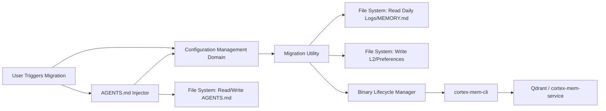

# Data Migration Domain Documentation

**Generation Time**: 2026-04-16 02:48:51 (UTC)  
**Timestamp**: 1776307731

---

## **Overview**

The **Data Migration Domain** in MemClaw is a critical tool support subsystem responsible for enabling seamless, safe, and automated transition of memory data from OpenClaw’s legacy flat-file memory system to MemClaw’s modern, tenant-isolated, layered semantic memory architecture. This domain ensures backward compatibility, prevents data loss during adoption, and transforms unstructured daily logs and preferences into a structured, searchable, and scalable memory format compatible with L0/L1/L2 tiered retrieval and vector-based semantic search.

As a **Tool Support Domain**, it does not participate in runtime memory operations but plays a foundational role in onboarding users and ensuring continuity of experience during system upgrades. It is composed of two tightly coupled, independently testable modules: the **Migration Utility** and the **AGENTS.md Injector**, both of which rely on the Configuration Management Domain for path resolution and operational parameters.

---

## **Core Objectives**

1. **Preserve User Memory**: Migrate all historical interaction logs and preferences from OpenClaw’s native storage without loss or corruption.
2. **Transform Data Structure**: Convert flat, timestamped `.md` files into a hierarchical, tenant-isolated L2 timeline structure with enriched metadata.
3. **Enable Semantic Search**: Trigger post-processing pipelines to generate L0 abstracts and L1 overviews, and index content in Qdrant for high-accuracy semantic recall.
4. **Onboard Developers**: Automatically inject clear, comprehensive usage guidelines into `AGENTS.md` to guide AI agent developers on leveraging MemClaw’s capabilities.
5. **Ensure Idempotency and Safety**: Guarantee that migration and injection operations can be safely re-run without duplication, corruption, or unintended side effects.

---

## **Domain Architecture**

The Data Migration Domain is implemented as a lightweight, file-system-centric module with minimal external dependencies. It operates entirely within the user’s local environment and does not require network connectivity during execution.

### **Sub-Modules**

| Sub-Module | Code Path | Responsibility | Key Design Principle |
|-----------|-----------|----------------|----------------------|
| **Migration Utility** | `plugin/src/migrate.ts` | Converts OpenClaw’s daily logs and MEMORY.md into MemClaw’s structured L2 and preference files | **Structured Transformation + Orchestration** |
| **AGENTS.md Injector** | `plugin/src/agents-md-injector.ts` | Safely enhances AGENTS.md with MemClaw usage guidelines using idempotent injection | **Safety-First Modification** |

> **Architectural Note**: Both sub-modules are decoupled from runtime services (e.g., CortexMemClient, Qdrant) and only interact with the filesystem and the Binary Lifecycle Manager for CLI invocation. This ensures they remain functional even if external services are offline.

---

## **Migration Utility: Data Transformation Engine**

### **Purpose**

The Migration Utility transforms OpenClaw’s flat, session-based memory files into MemClaw’s hierarchical, tenant-isolated, and semantically indexed memory structure. This enables future retrieval via L0/L1/L2 tiers and vector search.

### **Input Sources**

- **Daily Logs**: Located at `~/.openclaw/workspace/daily/` (default), named `YYYY-MM-DD.md`
- **Preferences**: Located at `~/.openclaw/workspace/MEMORY.md`

### **Output Structure**

After migration, data is organized under MemClaw’s tenant-aware directory structure:

```
~/.memclaw/data/
├── tenants/
│   ├── tenant-123/
│   │   ├── sessions/
│   │   │   ├── session-001.md
│   │   │   ├── session-002.md
│   │   │   └── ...
│   │   ├── preferences.json
│   │   └── metadata.yaml
│   └── tenant-456/
│       └── ...
└── cache/
```

- **L2 Files**: Each `YYYY-MM-DD.md` becomes a `session-<id>.md` file with YAML frontmatter containing:
  ```yaml
  ---
  tenant_id: tenant-123
  session_id: session-001
  timestamp: 2024-06-15T10:30:00Z
  agent_id: ai-assistant-v2
  tags: ["meeting", "project-planning"]
  ---
  ## Session Content
  User: What's the status of the Q2 roadmap?
  Agent: Here's the current draft...
  ```

- **Preferences**: `MEMORY.md` is parsed into `preferences.json` with structured schema:
  ```json
  {
    "tenant_id": "tenant-123",
    "recall_enabled": true,
    "auto_capture": true,
    "retention_days": 90,
    "preferred_context_depth": "L1",
    "annotations": {
      "favorite_agents": ["research-bot", "writing-assistant"]
    }
  }
  ```

### **Implementation Details**

- **File Discovery**: Uses `glob` and `path` Node.js modules to locate legacy files via configuration-resolved paths.
- **Parsing Logic**:
  - Daily logs are split into semantic paragraphs using line-break and heading detection.
  - Metadata (agent ID, timestamp, session boundaries) is inferred from filename and content patterns.
  - Invalid or malformed files are logged and skipped, preserving overall migration integrity.
- **Tenant Isolation**: Tenant ID is derived from OpenClaw’s active agent profile or default fallback (`tenant-default`).
- **Validation**: Ensures output files are non-empty and conform to expected YAML/JSON schema before proceeding.

### **Post-Processing Orchestration**

After file transformation, the utility triggers **cortex-mem-cli** via the Binary Lifecycle Manager to generate higher-order memory layers:

```bash
cortex-mem-cli layers ensure-all --data-dir ~/.memclaw/data
cortex-mem-cli vector reindex --tenant-id tenant-123
```

- **L0 Generation**: Abstracts each session into a 1–3 sentence summary (e.g., “Discussed Q2 roadmap with product team”).
- **L1 Generation**: Aggregates related sessions into thematic overviews (e.g., “Q2 Planning Sessions – June 10–17”).
- **Vector Indexing**: Embeds L2 content via OpenAI or local embedding model and stores vectors in Qdrant.

> **Note**: These steps are executed synchronously with timeout handling (default: 60s) to prevent hangs. Success is confirmed via CLI exit code and file existence checks.

### **Error Handling & Resilience**

- **Partial Failures**: If one file fails to convert, the utility logs the error and continues with others.
- **Atomic Writes**: Files are written to temporary paths and renamed atomically to prevent corruption during interruptions.
- **Logging**: All operations are logged to `~/.memclaw/logs/migration.log` with timestamps and severity levels.

---

## **AGENTS.md Injector: Onboarding & Guidance Engine**

### **Purpose**

The AGENTS.md Injector automatically enhances the `AGENTS.md` configuration file — commonly used by OpenClaw developers to document agent behavior — with comprehensive, structured guidelines for using MemClaw’s memory system. This reduces onboarding friction and ensures developers leverage advanced features (e.g., semantic search, auto-capture, L1 summaries).

### **Target File**

- **Location**: Resolved via multi-strategy discovery:
  1. Environment variable: `OPENCLAW_AGENTS_MD_PATH`
  2. Config file: `~/.memclaw/config.toml` → `agents_md_path`
  3. Default: `~/.openclaw/workspace/AGENTS.md`

- **Format**: Markdown file with optional sections (e.g., `## Memory`, `## Usage`).

### **Injection Strategy**

The injector employs **idempotent, marker-based modification** to ensure safe, repeatable updates:

1. **Legacy Pattern Detection**: Searches for existing MemClaw-related sections using regex:
   ```regex
   /<!-- MEMCLAW_START -->.*<!-- MEMCLAW_END -->/s
   ```

2. **Backup Creation**: If file exists, creates a backup: `AGENTS.md.bak.<timestamp>`

3. **Safe Injection**:
   - If no marker exists → inserts full guideline section between `<!-- MEMCLAW_START -->` and `<!-- MEMCLAW_END -->`
   - If marker exists → replaces content between markers with latest version
   - If file does not exist → creates new `AGENTS.md` with full content

4. **Content Structure**:
   ```markdown
   <!-- MEMCLAW_START -->
   ## MemClaw Memory Integration Guide

   ### How to Enable Memory
   MemClaw automatically captures and indexes all agent interactions. To enable:
   ```bash
   # Ensure MemClaw plugin is loaded
   openclaw plugins install memclaw
   ```

   ### Search Examples
   Use semantic search in prompts:
   > "What did I discuss about Q2 roadmap last week?"

   MemClaw returns L0/L1/L2 context from past sessions.

   ### Preferences
   Configure retention and recall in `~/.memclaw/data/tenants/<id>/preferences.json`

   ### Advanced: Auto-Capture
   Set `"auto_capture": true` to record all agent responses automatically.

   <!-- MEMCLAW_END -->
   ```

### **Key Implementation Features**

- **Multi-Strategy Discovery**: Falls back gracefully from env → config → default paths.
- **Idempotency**: Re-running the injector never duplicates content or breaks formatting.
- **Markdown Preservation**: Maintains existing content outside the marker region.
- **Validation**: Checks file permissions and encoding before writing.

### **Why This Matters**

Without this injector, developers may:
- Miss MemClaw’s advanced features
- Use inefficient flat-text prompts
- Fail to leverage L0/L1 abstractions, leading to context window waste

The injector acts as **silent onboarding**, ensuring best practices are adopted without user intervention.

---

## **Workflow Integration**

### **Trigger Points**

| Trigger | Context | Module Involved |
|--------|---------|-----------------|
| User runs `openclaw migrate-memory` | Manual migration command | Migration Utility |
| Plugin loads for first time | Initial plugin installation | AGENTS.md Injector |
| Context Engine activates | System-wide memory takeover | AGENTS.md Injector |
| Plugin reinstalled or updated | Configuration reset | Both modules |

> **Note**: The Migration Utility is **not** auto-triggered on every startup — it requires explicit user invocation to avoid unintended data transformation. The AGENTS.md Injector, however, runs on every plugin load to ensure guidelines are always current.

### **Dependency Flow**



> **Critical Dependency**: Both modules depend on **Configuration Management Domain** for:
> - Workspace paths (`~/.openclaw/workspace`)
> - Tenant structure (`tenants/{id}`)
> - Binary paths (`cortex-mem-cli`)
> - Logging directory

---

## **Technical Implementation Deep Dive**

### **Migration Utility (`migrate.ts`) — Key Code Patterns**

```ts
// Pseudo-code excerpt from migrate.ts
export async function migrateFromOpenClaw(config: PluginConfig) {
  const workspacePath = config.resolveOpenClawWorkspace();
  const dailyLogs = await glob(`${workspacePath}/daily/*.md`);
  const tenantId = config.getTenantId() || 'tenant-default';

  for (const logFile of dailyLogs) {
    const content = await fs.readFile(logFile, 'utf8');
    const sessionMetadata = extractSessionMetadata(logFile, content);
    
    const sessionDir = path.join(config.dataDir, 'tenants', tenantId, 'sessions');
    await fs.mkdir(sessionDir, { recursive: true });
    
    const outputFile = path.join(sessionDir, `session-${uuid.v4()}.md`);
    const yamlFrontmatter = yaml.dump({
      tenant_id: tenantId,
      session_id: `session-${uuid.v4()}`,
      ...sessionMetadata
    });

    await fs.writeFile(outputFile, `---\n${yamlFrontmatter}---\n\n${content}`);
  }

  // Migrate MEMORY.md
  const memoryFile = path.join(workspacePath, 'MEMORY.md');
  if (await fs.pathExists(memoryFile)) {
    const prefs = parseMemoryMdToPreferences(await fs.readFile(memoryFile, 'utf8'));
    await fs.writeFile(
      path.join(config.dataDir, 'tenants', tenantId, 'preferences.json'),
      JSON.stringify(prefs, null, 2)
    );
  }

  // Trigger post-processing
  await BinaryLifecycleManager.executeCli('layers ensure-all', { dataDir: config.dataDir });
  await BinaryLifecycleManager.executeCli(`vector reindex --tenant-id ${tenantId}`);
}
```

### **AGENTS.md Injector (`agents-md-injector.ts`) — Key Code Patterns**

```ts
// Pseudo-code excerpt from agents-md-injector.ts
export async function ensureAgentsMdEnhanced(config: PluginConfig) {
  const filePath = findAgentsMdPath(config); // multi-strategy lookup
  if (!filePath) {
    logger.warn('AGENTS.md not found; skipping injection.');
    return;
  }

  const backupPath = `${filePath}.bak.${Date.now()}`;
  await fs.copyFile(filePath, backupPath);

  const content = await fs.readFile(filePath, 'utf8');
  const markerStart = '<!-- MEMCLAW_START -->';
  const markerEnd = '<!-- MEMCLAW_END -->';
  const injectionContent = generateMemClawGuidelines();

  let updatedContent: string;
  if (content.includes(markerStart) && content.includes(markerEnd)) {
    // Replace existing section
    const regex = new RegExp(`\\s*${escapeRegExp(markerStart)}.*?${escapeRegExp(markerEnd)}\\s*`, 'gs');
    updatedContent = content.replace(regex, `\n${markerStart}\n${injectionContent}\n${markerEnd}\n`);
  } else {
    // Append new section
    updatedContent = `${content}\n\n${markerStart}\n${injectionContent}\n${markerEnd}\n`;
  }

  await fs.writeFile(filePath, updatedContent, 'utf8');
  logger.info('AGENTS.md successfully enhanced with MemClaw guidelines.');
}
```

### **Safety Mechanisms**

| Mechanism | Implementation |
|----------|----------------|
| **Idempotency** | Marker-based replacement ensures no duplication |
| **Atomic Writes** | Temporary file → rename prevents partial writes |
| **Backups** | Every modification creates `.bak.<timestamp>` |
| **Permission Checks** | Validates read/write access before any operation |
| **Validation Hooks** | YAML/JSON schema validation for output files |
| **Timeouts** | CLI execution capped at 60s to prevent hang |

---

## **Practical Usage Guide**

### **When to Run Migration**

| Scenario | Action |
|---------|--------|
| You’re upgrading from OpenClaw v1.x to MemClaw | ✅ Run `openclaw migrate-memory` once |
| You’ve manually copied OpenClaw data to a new machine | ✅ Run migration after installing MemClaw |
| You’re developing a new agent and want to reuse old logs | ✅ Run migration to import history |
| You’re troubleshooting memory issues | ❌ Do NOT run migration unless data is corrupted |

> **Tip**: Always backup `~/.openclaw/workspace/` before migration.

### **Verifying Migration Success**

After migration, verify:

1. **Files exist**:
   ```bash
   ls -la ~/.memclaw/data/tenants/*/sessions/
   ls -la ~/.memclaw/data/tenants/*/preferences.json
   ```

2. **CLI output**:
   ```
   ✔ 12 daily logs migrated
   ✔ MEMORY.md converted to preferences.json
   ✔ L0/L1 layers generated
   ✔ Vector index reindexed for tenant-default
   ```

3. **AGENTS.md contains**:
   ```markdown
   <!-- MEMCLAW_START -->
   ## MemClaw Memory Integration Guide
   ...
   <!-- MEMCLAW_END -->
   ```

### **Troubleshooting**

| Issue | Solution |
|-------|----------|
| `No such file or directory: ~/.openclaw/workspace/daily` | Ensure OpenClaw was previously used and logs exist |
| `cortex-mem-cli not found` | Reinstall MemClaw: `npm install memclaw-plugin` |
| AGENTS.md not updated | Check `OPENCLAW_AGENTS_MD_PATH` env var or run `openclaw config edit` |
| Migration hangs | Kill process and check `migration.log` for stuck CLI call |
| Duplicate guidelines in AGENTS.md | Manually delete old `<!-- MEMCLAW_START -->...<!-- MEMCLAW_END -->` block and re-run |

---

## **Architectural Validation & Best Practices**

### ✅ **Strengths**

- **Separation of Concerns**: Migration logic is cleanly isolated from runtime memory retrieval.
- **Idempotency**: Safe for repeated execution — critical for CI/CD and multi-user environments.
- **User-Centric Design**: Minimizes cognitive load — no manual file manipulation required.
- **Extensibility**: New file formats (e.g., JSON logs) can be added via plugin hooks.
- **Resilience**: Graceful degradation — partial failures don’t halt entire migration.

### ⚠️ **Known Limitations & Mitigations**

| Limitation | Mitigation |
|----------|------------|
| No progress bar during large migrations | Consider adding `ora` spinner in future versions |
| No rollback mechanism | Backups (`*.bak`) serve as de facto rollback |
| CLI invocation is synchronous | Async queueing could improve perceived performance (future optimization) |
| Assumes UTF-8 encoding | Add encoding detection (e.g., `iconv-lite`) for legacy systems |

### 🚀 **Future Enhancements**

- **Incremental Migration**: Detect and migrate only new logs since last run.
- **GUI Migration Wizard**: For non-technical users (Electron-based).
- **Cloud Sync**: Migrate to cloud-backed tenant storage (e.g., S3 + DynamoDB).
- **Schema Validation CLI**: Validate output structure before indexing.
- **Migration Status API**: Expose migration state via `cortex-mem-service`.

---

## **Conclusion**

The **Data Migration Domain** is a vital bridge between legacy and modern memory systems in the MemClaw ecosystem. By transforming unstructured logs into semantically rich, tenant-isolated, vector-indexed memory artifacts — and by proactively educating developers through safe, automated configuration injection — it ensures a frictionless, reliable, and future-proof adoption path.

Its design embodies core architectural principles: **idemp
