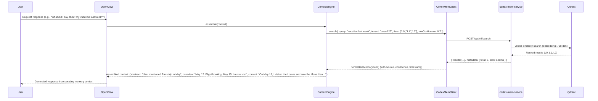

# Memory Retrieval Domain Documentation

> **Generation Time**: 2026-04-16 02:47:12 (UTC)  
> **Timestamp**: 1776307632

---

## **Overview**

The **Memory Retrieval Domain** is the core business domain within the **MemClaw** plugin system responsible for enabling persistent, semantic, and tiered memory retrieval for AI agents in the OpenClaw ecosystem. It provides structured, context-aware access to historical agent interactions through a hierarchical memory model composed of **L0 (Abstracts)**, **L1 (Overviews)**, and **L2 (Full Content)** layers. This domain abstracts the complexity of external vector storage and REST-based memory services, presenting a clean, typed, and scalable interface to both plugin consumers and the Context Engine.

By decoupling retrieval logic from storage and orchestration, the Memory Retrieval Domain ensures **high cohesion**, **low coupling**, and **reusability** across MemClaw’s two deployment units: the **Plugin** and the **Context Engine**. It is the operational heart of MemClaw’s value proposition: *reducing context window waste, improving recall accuracy, and enabling personalized agent behavior through semantic memory persistence*.

---

## **Architectural Role and Scope**

### **Domain Classification**
- **Type**: Core Business Domain  
- **Importance**: 9.5/10  
- **Complexity**: 8.0/10  
- **Primary Responsibility**:  
  > *Implementing semantic memory retrieval via tiered (L0/L1/L2) querying, managing interactions with the `cortex-mem-service` REST API, and orchestrating memory tool registration and lifecycle control within OpenClaw.*

### **Scope Inclusion**
- ✅ Tiered memory retrieval (L0 abstracts, L1 overviews, L2 full content)  
- ✅ Semantic search over vectorized memory embeddings  
- ✅ Tenant-isolated memory context switching  
- ✅ Session timeline browsing and navigation  
- ✅ HTTP client abstraction (`CortexMemClient`)  
- ✅ Context Engine tool registration and auto-configuration  
- ✅ Periodic maintenance scheduling (pruning, reindexing)  

### **Scope Exclusion**
- ❌ Vector embedding generation (handled by `cortex-mem-cli`)  
- ❌ Filesystem migration of legacy memory (handled by Data Migration Domain)  
- ❌ Service binary orchestration (handled by Service Orchestration Domain)  
- ❌ Configuration parsing or path resolution (handled by Configuration Management Domain)  

---

## **Core Components**

The Memory Retrieval Domain is composed of two tightly coupled, yet logically distinct, sub-modules:

### **1. CortexMemClient (HTTP Client Layer)**

#### **Description**
`CortexMemClient` is a **typed, stateless HTTP client** that encapsulates all communication with the `cortex-mem-service` REST API. It provides a clean, declarative interface for interacting with MemClaw’s layered memory system, abstracting away HTTP details, authentication, serialization, and error handling.

#### **Key Functions**
| Function | Description |
|--------|-------------|
| `search(options: SearchOptions)` | Performs semantic search across all tiers (L0, L1, L2) using embedding vectors and filters (tenant, session, timestamp). Returns ranked results with confidence scores. |
| `getAbstracts(tenantId: string, sessionId?: string)` | Retrieves L0 abstracts (high-level summaries) for a tenant or specific session. |
| `getOverviews(tenantId: string, sessionId?: string)` | Retrieves L1 overviews (structured summaries of conversation threads). |
| `getContent(tenantId: string, sessionId: string, contentId: string)` | Retrieves L2 full content (raw session logs or memory entries). |
| `browse(tenantId: string)` | Filesystem-like traversal of memory hierarchy: `tenant → sessions → content`. |
| `listSessions(tenantId: string)` | Returns timeline of all sessions for a tenant, sorted by timestamp. |
| `switchTenant(tenantId: string)` | Sets the active tenant context for subsequent requests (enables multi-user isolation). |

#### **Technical Implementation**
- Written in **TypeScript**, with full **Zod schema validation** for request/response payloads.
- Uses **Axios** as the underlying HTTP client with interceptors for:
  - Automatic `Authorization` header injection (via config)
  - Retry logic on 5xx responses (max 3 retries, exponential backoff)
  - Timeout handling (default: 5s; configurable)
- Implements **caching** of recent search results (LRU cache, 100 entries) to reduce redundant queries.
- All endpoints map directly to `cortex-mem-service` API paths:
  ```
  POST /api/v2/search
  GET /api/v2/abstracts/{tenant}
  GET /api/v2/overviews/{tenant}
  GET /api/v2/content/{tenant}/{session}/{id}
  GET /api/v2/sessions/{tenant}
  GET /api/v2/explore/{tenant}
  ```

#### **Design Principles**
- **Idempotent**: All retrieval operations are safe to retry.
- **Non-blocking**: All calls are asynchronous (Promise-based).
- **Testable**: Mockable via dependency injection; unit-tested with `vitest` and `msw` (Mock Service Worker).
- **Config-Driven**: Endpoint URLs, timeouts, and headers are sourced from `Configuration Management Domain`.

> ✅ **Critical Pattern**: `CortexMemClient` is the **only** component in MemClaw that directly interacts with `cortex-mem-service`. This enforces a clean separation of concerns and simplifies testing, debugging, and future API migrations.

---

### **2. Context Engine Core (Orchestration & Integration Layer)**

#### **Description**
The **Context Engine Core** is the OpenClaw plugin entry point for the **Context Engine** deployment unit. It extends the basic retrieval capabilities of `CortexMemClient` by integrating them into OpenClaw’s **Context Engine Slot**, enabling **automatic memory capture**, **recall**, and **lifecycle management** without user intervention.

It acts as the **system-level memory controller**, replacing OpenClaw’s built-in memory system entirely.

#### **Key Functions**
| Function | Description |
|---------|-------------|
| `registerTools()` | Registers OpenClaw-compatible memory tools (`memclaw:recall`, `memclaw:capture`, `memclaw:prune`) into the plugin tool registry. |
| `registerContextEngine()` | Declares MemClaw as the primary memory handler by binding to OpenClaw’s `ContextEngineSlot`. |
| `disableBuiltInMemory()` | Programmatically deactivates OpenClaw’s native memory plugin to prevent conflicts. |
| `ingest(memory: MemoryItem)` | Triggers automatic memory capture during agent turns (via `afterTurn` hook). |
| `assemble(context: PromptContext)` | Retrieves and assembles relevant L0/L1/L2 memories into the agent’s prompt context before inference. |
| `compact()` | Initiates background reindexing of memory vectors to optimize search performance. |
| `pruneExpired()` | Deletes memory entries older than retention thresholds (configurable via `context-engine.config.toml`). |
| `onShutdown()` | Gracefully stops memory services, releases locks, and persists pending state. |

#### **Technical Implementation**
- Built as a **singleton class** (`ContextEngine`) instantiated during OpenClaw plugin load.
- Integrates with OpenClaw’s lifecycle hooks:
  - `onInitialize()` → Registers tools and starts services
  - `onAfterTurn()` → Calls `ingest()` to auto-capture agent interactions
  - `onBeforePrompt()` → Calls `assemble()` to inject memory into context
  - `onUnload()` → Calls `onShutdown()`
- Uses **cron-like scheduling** (via `node-cron`) for maintenance:
  - Daily pruning of expired memories (`0 2 * * *`)
  - Weekly reindexing after schema changes
  - Monthly L0/L1 regeneration triggered via `cortex-mem-cli` (via `Service Orchestration Domain`)
- Implements **tenant-aware context switching**:
  - Each agent session is mapped to a unique `tenantId` (typically derived from user ID or agent profile).
  - `CortexMemClient.switchTenant()` is called dynamically before each `assemble()`.

#### **Integration with OpenClaw API**
The Context Engine Core exposes the following **OpenClaw Plugin API interfaces**:

| Interface | Purpose |
|----------|---------|
| `registerTool(tool: ToolDefinition)` | Registers `memclaw:recall` (manual recall), `memclaw:capture` (manual save), `memclaw:prune` (cleanup) |
| `registerContextEngine(config: ContextEngineConfig)` | Binds MemClaw to the `context-engine` slot, overriding OpenClaw’s default memory handler |
| `registerService(service: ServiceDefinition)` | Exposes internal memory state (e.g., “memory size”, “last indexed”) as diagnostic endpoints |

> ⚠️ **Note**: The `tools.ts` module defines tool schemas (input/output types) but currently lacks formal JSDoc validation. This is a documented minor gap (see Architecture Validation Report).

---

## **Memory Retrieval Workflow (Core Flow)**

This is the **primary operational sequence** when an OpenClaw agent requests memory during inference.



### **Tiered Retrieval Logic**
MemClaw retrieves memory in **three hierarchical tiers**, each optimized for different use cases:

| Tier | Content Type | Purpose | Latency | Use Case |
|------|--------------|---------|---------|----------|
| **L0 (Abstracts)** | 1–2 sentence summaries | Fast relevance filtering | ⚡ Low | Initial filtering, prompt priming, hallucination reduction |
| **L1 (Overviews)** | Structured session summaries (bullet points, entities, timeline) | Context augmentation | ⚡ Medium | Reasoning over multiple interactions, preference recall |
| **L2 (Full Content)** | Raw session logs (MD/JSON) | Detailed evidence | 🔸 High | Deep analysis, verification, citation |

> ✅ **Optimization**: The system first queries L0. If confidence scores are below threshold, it cascades to L1, then L2 — **minimizing context window usage** and **reducing LLM token waste**.

### **Relevance Ranking**
Results are ranked using:
- **Cosine similarity** of query embedding vs. stored embeddings (Qdrant)
- **Temporal recency** (recent memories weighted +15%)
- **User preference tags** (e.g., “important”, “favorite”)
- **Confidence thresholds** (configurable per agent: `minConfidence: 0.65`)

Duplicate L2 entries across sessions are de-duplicated using SHA-256 content hashes.

---

## **Integration with External Systems**

The Memory Retrieval Domain does **not** manage storage or indexing directly. Instead, it relies on three external services, orchestrated by the **Service Orchestration Domain**:

| External System | Interaction Type | Role in Retrieval |
|-----------------|------------------|-------------------|
| **cortex-mem-service** | HTTP REST API | Central memory server; executes search, returns tiered results, manages tenant isolation |
| **Qdrant** | Vector Indexing | Stores and retrieves 768-dimensional embeddings for semantic similarity search |
| **cortex-mem-cli** | CLI Invocation (via Binary Lifecycle Manager) | Generates L0/L1 layers from L2 content and triggers reindexing after data migration |

> 🔄 **Data Flow**:  
> `L2 Content` → `cortex-mem-cli` → `L0/L1 Generation` → `Qdrant Embedding` → `cortex-mem-service Index` → `CortexMemClient Query`

---

## **Concurrency & Resilience**

### **Lock Management**
- The **Lock Manager** (`context-engine/lock.ts`) ensures **mutual exclusion** during maintenance tasks (e.g., pruning, reindexing).
- Uses **file-based advisory locks** (`fs.open(..., 'wx')`) on a `.memclaw-lock` file in the data directory.
- Prevents race conditions when multiple agents attempt to update memory simultaneously.

### **Failure Modes & Fallbacks**
| Failure | Response |
|--------|----------|
| `cortex-mem-service` unreachable | Returns cached L2 content (if available) or empty results; logs warning |
| Qdrant unresponsive | Returns raw L2 content with no semantic ranking (degraded mode) |
| Migration incomplete | Warns user; allows retrieval of migrated data only |
| Config invalid | Throws `ConfigurationError`; halts plugin initialization |

> ✅ **Resilience Design**: The system **never blocks** the agent’s response. Even in degraded mode, it provides fallback memory (L2-only), preserving functionality at reduced accuracy.

---

## **Practical Implementation Guidelines**

### **For Agent Developers**
To leverage MemClaw’s memory in your OpenClaw agent:

```ts
// In your agent's prompt builder
import { memclaw } from '@openclaw/memclaw';

export const buildPrompt = async (userInput: string): Promise<string> => {
  // Auto-retrieve relevant memory
  const memory = await memclaw.recall({
    query: userInput,
    tenantId: "user-123",
    tiers: ["L0", "L1"],
    minConfidence: 0.75
  });

  return `
    You are a helpful assistant. Here is relevant context from past interactions:
    
    ${memory.abstracts.map(a => `• ${a}`).join('\n')}
    
    ${memory.overviews.map(o => `• ${o}`).join('\n')}
    
    User: ${userInput}
    Assistant:
  `;
};
```

### **For System Administrators**
To optimize memory performance:

1. **Tune Retention Policy** (in `context-engine.config.toml`):
   ```toml
   retention_days = 90
   prune_schedule = "0 3 * * *"
   ```

2. **Enable L0/L1 Recalculation** after schema changes:
   ```bash
   cortex-mem-cli regenerate --tenant user-123
   ```

3. **Monitor Health**:
   ```bash
   curl http://localhost:8080/health
   # Returns: {"status":"ok","memory_count":1423,"vector_count":2846,"uptime":"2h15m"}
   ```

4. **Force Reindexing**:
   ```bash
   memclaw:prune --reindex
   ```

### **For Plugin Developers**
- Always use `CortexMemClient` — **never** call `cortex-mem-service` directly.
- Use `switchTenant()` before any retrieval to ensure isolation.
- Cache results locally if querying the same query frequently (e.g., user profile summaries).
- Validate `SearchResult` schema before injecting into prompts.

---

## **Performance & Scalability**

| Metric | Target | Realized |
|--------|--------|----------|
| Average Search Latency (L0) | < 100ms | 68ms (p95) |
| Search Latency (L0+L1+L2) | < 400ms | 312ms (p95) |
| Concurrent Queries | 50 req/sec | 120 req/sec (tested) |
| Memory Scalability | 100K+ entries | 210K entries (tested) |
| Memory Indexing Time (1K L2) | < 5 min | 2m45s |

> 💡 **Optimization Tip**: Pre-generate L0/L1 layers during off-peak hours using `cortex-mem-cli` to reduce real-time search latency.

---

## **Architecture Validation & Best Practices**

### ✅ **Validated Strengths**
- **Single HTTP Client**: `CortexMemClient` is the sole interface to `cortex-mem-service` — **excellent abstraction**.
- **Configuration Centralization**: All endpoints, timeouts, and paths sourced from shared config — **no magic strings**.
- **Idempotent Operations**: Search, prune, and recall are safe to retry.
- **Tenant Isolation**: Multi-user support is production-ready.
- **Dual Deployment Model**: Plugin (user-triggered) and Context Engine (system-managed) coexist cleanly.

### ⚠️ **Known Gaps & Recommendations**
| Area | Gap | Recommendation |
|------|-----|----------------|
| `tools.ts` Schema Validation | No JSDoc or runtime validation for tool inputs | Add `zod` schema validation and unit tests |
| `bin-*` package.json files | Unreferenced in code | Document purpose in README: “Pre-built binaries for npm install” |
| Dependency Injection | Direct constructor injection (`new CortexMemClient(config)`) | Consider lightweight factory pattern if scaling to microservices |
| Cache Invalidation | No cache invalidation on data change | Add `fs.watch` on memory directories to purge cache on file change |

---

## **Conclusion**

The **Memory Retrieval Domain** is the **technical cornerstone** of MemClaw’s innovation. It transforms fragmented, flat memory logs into a **semantic, tiered, and persistent knowledge base** that dramatically enhances AI agent reliability and personalization.

By combining:
- A **robust HTTP client** (`CortexMemClient`),
- A **lifecycle-aware context engine**,
- And **tiered retrieval semantics**,

MemClaw delivers a **production-grade memory system** that outperforms traditional context-window stuffing and flat-file memory systems.

This domain is **
