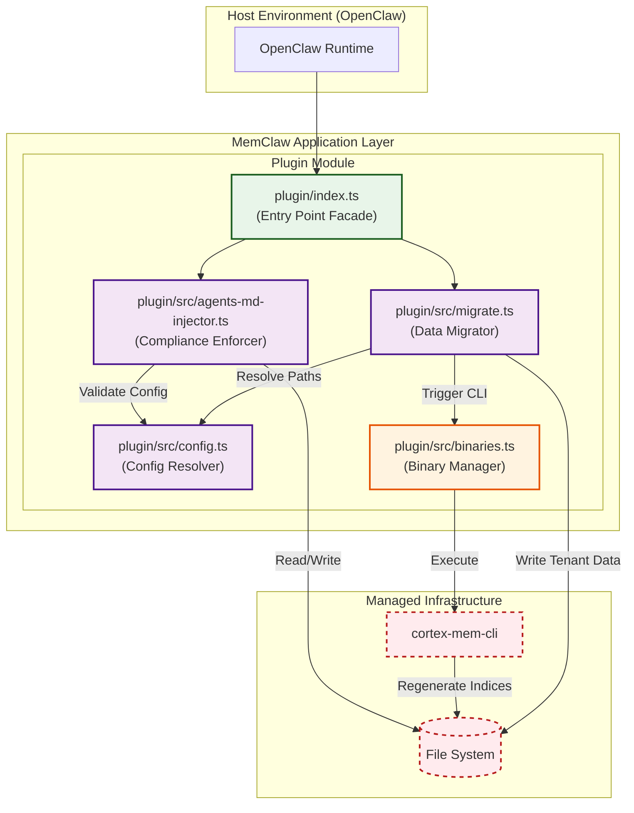
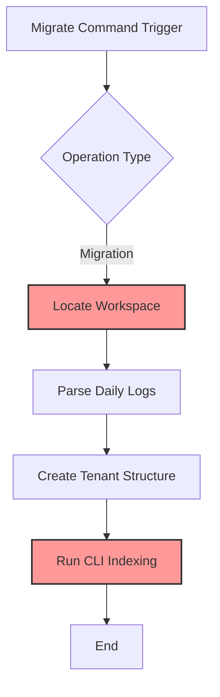
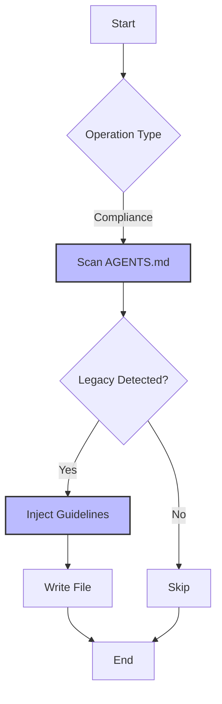

# Migration & Compliance Module Documentation

**Version:** 1.0  
**Domain:** Tool Support Domain  
**Status:** Active  
**Last Updated:** `2026-04-05 06:09:44 (UTC)`

---

## 1. Executive Summary

The **Migration & Compliance** module serves as the transitional bridge between the legacy OpenClaw architecture and the modern MemClaw standards. It encompasses two primary functional pillars: **Data Migration**, which restructures historical memory logs into tenant-isolated session timelines, and **Compliance Enforcement**, which ensures agent configuration files adhere to updated memory usage guidelines.

This domain is classified as a **Tool Support Domain** within the broader MemClaw ecosystem. While its operational frequency may be lower than core business domains, its criticality is high during system upgrades, initial setups, and long-term maintenance to ensure backward compatibility and data integrity.

---

## 2. Architectural Overview

The module operates within the **Plugin Layer** of the MemClaw architecture, leveraging the modular plugin design integrated into the OpenClaw ecosystem. It relies heavily on the **Configuration Management** domain for path resolution and the **System Orchestration** domain for executing external CLI binaries required for index regeneration.

### 2.1 High-Level Architecture Diagram



### 2.2 Domain Relations

*   **Configuration Dependency:** Migration & Compliance requires valid configuration (`plugin/src/config.ts`) to locate legacy workspaces and define target tenant directories.
*   **Service Call:** Post-migration index regeneration depends on `plugin/src/binaries.ts` to invoke external CLI tools (`cortex-mem-cli`).
*   **Infrastructure Coupling:** Both sub-modules interact directly with the local file system, necessitating strict permission handling and path validation.

---

## 3. Core Components

The domain is divided into two distinct sub-modules, each responsible for a specific aspect of the transition process.

### 3.1 Data Migrator (`plugin/src/migrate.ts`)

**Responsibility:** Transforms legacy memory artifacts into the new tenant-isolated structure and triggers vector index regeneration.

*   **Key Functions:**
    *   `locateWorkspace()`: Resolves legacy paths using environment variables (`OPENCLAW_HOME`) before falling back to defaults.
    *   `migrateLogs()`: Parses `YYYY-MM-DD.md` daily logs into granular session timeline files.
    *   `regenerateIndices()`: Executes external binaries to rebuild L0/L1/L2 vector layers.
*   **Technical Implementation:**
    *   Utilizes Node.js core libraries (`fs`, `path`, `os`) for file system management.
    *   **Current Limitation:** Implements synchronous I/O operations within asynchronous functions. On large datasets, this may cause event loop blocking. Refactoring to asynchronous file streams is recommended for scalability.
    *   **Error Handling:** Wrapped in `try-catch` blocks returning structured result objects to facilitate graceful degradation.

### 3.2 Compliance Enforcer (`plugin/src/agents-md-injector.ts`)

**Responsibility:** Enforces MemClaw memory usage guidelines within agent configuration files (`AGENTS.md`).

*   **Key Functions:**
    *   `scanMarkdown()`: Reads configuration files to detect legacy memory patterns.
    *   `injectGuidelines()`: Appends MemClaw-specific instructions using idempotent HTML markers.
    *   `removeLegacyKeywords()`: Strips deprecated directives to prevent conflicts.
*   **Technical Implementation:**
    *   Employs regular expressions for pattern detection.
    *   Ensures idempotency via unique HTML markers, preventing duplicate guideline injections upon repeated runs.
    *   Returns an `InjectionResult` object indicating success status and modification count.

---

## 4. Operational Workflows

### 4.1 Legacy Data Migration Workflow

This workflow is typically triggered during system updates or via manual CLI command.



**Step-by-Step Execution:**
1.  **Path Resolution:** The migrator queries the Configuration Manager to identify the legacy workspace directory.
2.  **Log Parsing:** Daily log files (`YYYY-MM-DD.md`) are read and parsed into structured session data.
3.  **Directory Creation:** Tenant-isolated directories are created to segregate user data securely.
4.  **Index Regeneration:** The Binary Manager invokes `cortex-mem-cli` to regenerate vector indices based on the new data structure.

### 4.2 Compliance Enforcement Workflow

This workflow runs automatically during plugin initialization or on-demand to ensure configuration validity.



**Step-by-Step Execution:**
1.  **Scanning:** The enforcer reads the target `AGENTS.md` file.
2.  **Pattern Matching:** Regex scans for legacy memory patterns that conflict with MemClaw standards.
3.  **Injection:** If legacy patterns are found, MemClaw guidelines are injected using idempotent markers.
4.  **Persistence:** The updated file is written back to the file system only if changes were made.

---

## 5. API Interface Reference

The module exposes standardized interfaces for interaction with other domains or external scripts.

### 5.1 Compliance Interface
Located in `plugin/src/agents-md-injector.ts`.

```typescript
/**
 * Ensures AGENTS.md contains necessary MemClaw guidelines.
 * @param logger - Logger instance for audit trails.
 * @param enabled - Flag to toggle enforcement logic.
 * @returns InjectionResult containing status and modification details.
 */
export function ensureAgentsMdEnhanced(
  logger: Logger, 
  enabled: boolean
): Promise<InjectionResult>;
```

### 5.2 Migration Interface
Located in `plugin/src/migrate.ts`.

```typescript
/**
 * Executes the full migration pipeline from OpenClaw to MemClaw.
 * @param log - Logging handler for progress tracking.
 * @returns MigrationResult containing success metrics and error summaries.
 */
export function migrateFromClaw(log: LogHandler): Promise<MigrationResult>;
```

---

## 6. Configuration & Dependencies

### 6.1 Environment Variables
The module prioritizes environment variables over config files for path resolution.

| Variable | Description | Default |
| :--- | :--- | :--- |
| `OPENCLAW_HOME` | Root directory for legacy workspace data | `undefined` |
| `MEMCLAW_DATA_DIR` | Target directory for tenant-isolated data | Derived from OS temp/user dir |

### 6.2 External Binaries
Migration requires access to native binaries managed by the **System Orchestration** domain.

*   **`cortex-mem-cli`**: Required for vector index regeneration post-migration.
*   **`Qdrant` / `Cortex-Mem`**: Must be running via `binaries.ts` for successful indexing.

---

## 7. Implementation Risks & Optimization Opportunities

Based on architectural analysis, the following areas require attention to ensure long-term stability and performance.

### 7.1 Synchronous I/O Blocking
*   **Issue:** `plugin/src/migrate.ts` currently uses synchronous file system calls within asynchronous contexts.
*   **Risk:** Large datasets may freeze the main thread, degrading application responsiveness.
*   **Recommendation:** Refactor to use Node.js stream-based APIs (`createReadStream`, `createWriteStream`) to enable non-blocking I/O.

### 7.2 Regex Complexity
*   **Issue:** The Compliance Enforcer relies on complex regular expressions for markdown parsing.
*   **Risk:** High cyclomatic complexity increases maintenance overhead and potential for edge-case failures.
*   **Recommendation:** Consider adopting a Markdown AST parser library to replace regex-heavy logic for more robust content manipulation.

### 7.3 Configuration Sync
*   **Issue:** Potential divergence between `plugin/src/config.ts` and `context-engine/config.ts`.
*   **Risk:** Migration paths may resolve incorrectly if settings differ between modules.
*   **Recommendation:** Implement a centralized configuration aggregator to ensure a single source of truth for path resolution.

### 7.4 Error Handling Standardization
*   **Issue:** Error handling varies across migration steps.
*   **Recommendation:** Centralize HTTP configuration and error handling in `plugin/src/client.ts` to eliminate boilerplate duplication and ensure consistent retry policies.

---

## 8. Conclusion

The **Migration & Compliance** module is a critical enabler for the MemClaw evolution strategy. By automating the transition of legacy data and enforcing configuration standards, it ensures data integrity and system consistency. While the current implementation provides essential functionality, adherence to the recommended optimizations—specifically regarding asynchronous I/O and dependency management—will significantly enhance scalability and maintainability for future iterations.