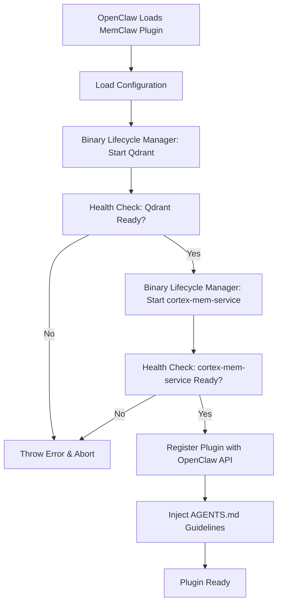
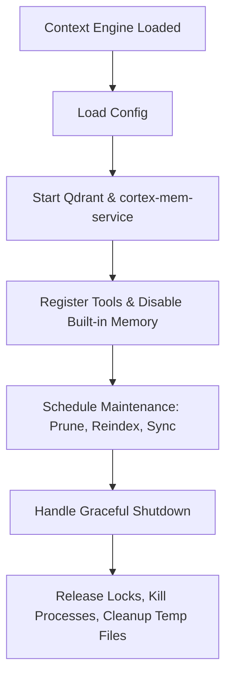
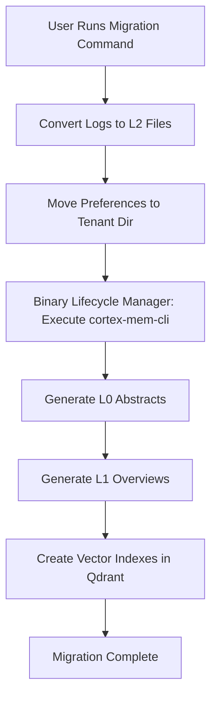

# Service Orchestration Domain Documentation

## Overview

The **Service Orchestration Domain** is a critical infrastructure component within the MemClaw system, responsible for managing the lifecycle, availability, and operational integrity of external binary dependencies required for layered semantic memory functionality. This domain ensures that core services — the **Qdrant vector database** and the **cortex-mem-service** REST API — are correctly discovered, configured, started, monitored, and shut down in a platform-agnostic, reliable, and concurrent-safe manner. It also orchestrates the invocation of the **cortex-mem-cli** tool during data migration workflows.

As an *Infrastructure Domain*, it does not implement business logic for memory retrieval or adaptation but enables it by guaranteeing that foundational services are healthy and accessible before any memory operations occur. Its correctness directly impacts system reliability, user trust, and operational resilience.

This domain is implemented across two deployment units — the **MemClaw Plugin** and the **MemClaw Context Engine** — with shared code modules that ensure consistency in behavior across both contexts.

---

## Core Responsibilities

The Service Orchestration Domain fulfills the following essential responsibilities:

| Responsibility | Description |
|----------------|-------------|
| **Platform Detection** | Automatically identifies the host operating system (Windows, macOS, Linux) and architecture (x64, arm64) to select the correct pre-compiled binary. |
| **Binary Path Resolution** | Locates bundled binaries (Qdrant, cortex-mem-service, cortex-mem-cli) from npm `optionalDependencies` packages using platform-specific naming conventions and file system traversal. |
| **Service Startup & Configuration** | Generates dynamic configuration files (e.g., `qdrant.conf`, `cortex-mem-service.yaml`) based on runtime settings from the Configuration Management Domain and launches services as background processes. |
| **Health Monitoring & Readiness Verification** | Polls HTTP health endpoints (e.g., `http://localhost:6333/health`, `http://localhost:8080/ready`) with exponential backoff and timeout handling to confirm service availability before exposing capabilities. |
| **Process Lifecycle Management** | Spawns, tracks, and cleanly terminates external processes using Node.js `child_process`, ensuring no orphaned processes remain after plugin shutdown. |
| **CLI Tool Execution** | Invokes `cortex-mem-cli` during data migration with proper environment variables, timeouts, and output capture for post-processing tasks like L0/L1 layer generation and vector indexing. |
| **Concurrency Control** | Coordinates access to shared resources (e.g., service binaries, configuration files) using a lock manager to prevent race conditions during parallel initialization or maintenance. |

> **Design Principle**: *“Never expose a memory system until its dependencies are verified healthy.”*  
> This domain enforces a strict *fail-fast, fail-safe* policy: if Qdrant or cortex-mem-service cannot be started and validated, the plugin refuses to register, preventing partial-state failures that could confuse agents or corrupt memory state.

---

## Architecture and Implementation

### 1. Key Components

The domain is composed of two primary sub-modules:

#### **Binary Lifecycle Manager**
- **Code Path**: `plugin/src/binaries.ts`, `context-engine/binaries.ts`
- **Language**: TypeScript (Node.js)
- **Core Dependencies**: `child_process`, `fs`, `path`, `axios` (for HTTP health checks)

**Implementation Highlights**:

```typescript
// Simplified pseudocode for startQdrant()
async function startQdrant(config: Config): Promise<ServiceStatus> {
  const platform = getPlatform(); // e.g., 'darwin-arm64'
  const binaryPath = resolveBinaryPath('qdrant', platform); // From bin-qdrant npm package
  const configPath = generateConfigFile(config.qdrant); // Write to data directory

  const process = spawn(binaryPath, ['--config', configPath], {
    env: { ...process.env, QDRANT_STORAGE_PATH: config.dataDir }
  });

  const healthUrl = `http://${config.host}:${config.port}/health`;
  const readiness = await waitForHealth(healthUrl, { retries: 30, timeout: 2000 });

  if (!readiness) throw new Error(`Qdrant failed to start after 60 seconds`);

  processRefMap.set('qdrant', process);
  return { status: 'running', pid: process.pid, port: config.port };
}
```

**Key Features**:
- **Cross-platform binary resolution**: Uses npm package naming conventions (e.g., `bin-qdrant-darwin-arm64`, `bin-qdrant-win-x64`) to locate platform-specific executables.
- **Dynamic config generation**: Creates configuration files at runtime using template literals or YAML serialization based on user-provided settings.
- **Execute permissions**: Ensures binaries are executable via `fs.chmodSync(binaryPath, '755')` on Unix-like systems.
- **Process tracking**: Maintains a `Map<string, ChildProcess>` to track spawned processes for graceful cleanup during shutdown.
- **Health polling**: Uses `axios` with retry logic (30 attempts, 2s interval) to verify HTTP readiness endpoints before proceeding.

#### **Lock Manager**
- **Code Path**: `context-engine/lock.ts`
- **Purpose**: Prevents concurrent access to shared resources during service startup, migration, or maintenance.

**Implementation Highlights**:
- Implements file-based advisory locking using `fs.open()` with `O_EXCL` flags on Unix systems and named mutex emulation on Windows.
- Provides `acquireLock()` and `releaseLock()` methods with timeout handling to avoid deadlocks.
- Used during:
  - Concurrent plugin initialization across multiple agent sessions.
  - Simultaneous migration and service restart operations.
  - Vector reindexing and layer regeneration tasks.

> **Critical Insight**: The Lock Manager is *only* present in the Context Engine, as it is the primary context for long-running background tasks. The Plugin uses the same logic via shared utilities but does not require locking for short-lived operations.

---

## Integration with Other Domains

The Service Orchestration Domain is a foundational dependency for all major workflows in MemClaw. Below are its key interactions:

| Dependency | Direction | Purpose | Importance |
|----------|-----------|---------|------------|
| **Configuration Management Domain** | ← Inbound | Receives service endpoints, data directories, binary paths, and timeouts. | ⭐⭐⭐⭐⭐ (Critical) |
| **Memory Retrieval Domain** | → Outbound | Ensures Qdrant and cortex-mem-service are ready before `CortexMemClient` can issue queries. | ⭐⭐⭐⭐⭐ (Critical) |
| **Data Migration Domain** | → Outbound | Invokes `cortex-mem-cli` to generate L0/L1 layers and index vectors after file conversion. | ⭐⭐⭐⭐☆ (High) |
| **Memory Integration Domain** | → Outbound | Must be invoked *before* plugin registration to avoid exposing unready memory capabilities. | ⭐⭐⭐⭐⭐ (Critical) |
| **Context Engine Core** | ↔ Mutual | Coordinates startup, maintenance, and shutdown; uses Lock Manager for synchronization. | ⭐⭐⭐⭐⭐ (Critical) |

> **Architectural Pattern**: **Dependency Inversion** — The Service Orchestration Domain is *consumed* by higher-level domains, but does not depend on them. This ensures it can be tested independently and reused across Plugin and Context Engine contexts.

---

## Critical Workflows Involving Service Orchestration

### 1. Plugin Initialization Flow


- **Failure Consequence**: If either service fails to start, the plugin *does not register*. This prevents agents from receiving incomplete or inconsistent memory responses.
- **User Experience**: Clear error messages guide users to check logs, permissions, or port conflicts.

### 2. Context Engine Lifecycle Flow


- **Maintenance Tasks**: Daily vector pruning, schema-aware reindexing, and L0/L1 regeneration are scheduled as async tasks that *rely on service availability*.
- **Graceful Shutdown**: On plugin unload, the Binary Lifecycle Manager ensures all processes are terminated and locks are released to prevent file corruption.

### 3. Data Migration Flow


- **CLI Invocation**: Uses `executeCliCommand()` with:
  - Timeout: 5 minutes (configurable)
  - Environment: `MEMCLAW_DATA_DIR`, `TENANT_ID`
  - Output Capture: Logs are streamed to user console for transparency
- **Idempotency**: Migration can be safely re-run; `cortex-mem-cli` detects existing indexes and skips redundant work.

---

## Technical Implementation Details

### Platform Detection and Binary Resolution

MemClaw uses a deterministic naming scheme for bundled binaries:

| Platform | Binary Package | Executable Name |
|----------|----------------|-----------------|
| macOS (ARM64) | `bin-qdrant-darwin-arm64` | `qdrant-darwin-arm64` |
| macOS (x64) | `bin-qdrant-darwin-x64` | `qdrant-darwin-x64` |
| Linux (x64) | `bin-qdrant-linux-x64` | `qdrant-linux-x64` |
| Windows (x64) | `bin-qdrant-win-x64` | `qdrant-win-x64.exe` |

The `resolveBinaryPath()` function:
1. Reads `process.platform` and `process.arch`
2. Looks for the corresponding npm package in `node_modules/`
3. Resolves the executable path via `require.resolve()`
4. Validates file existence and permissions
5. Throws a user-friendly error if missing (e.g., “Qdrant binary not found. Reinstall MemClaw.”)

### Health Check Protocol

| Service | Endpoint | Expected Response | Timeout | Retries |
|--------|----------|-------------------|---------|---------|
| Qdrant | `/health` | `{ "status": "ok" }` | 2s | 30 |
| cortex-mem-service | `/ready` | `200 OK` + `"status": "ready"` | 2s | 30 |

Health checks use exponential backoff (100ms → 200ms → 400ms...) for resilience against slow startup.

### Process Cleanup and Resource Management

- All spawned processes are stored in a global `processRefMap`.
- On plugin unload or context engine shutdown:
  ```typescript
  processRefMap.forEach(proc => {
    if (proc && !proc.killed) {
      proc.kill('SIGTERM');
      setTimeout(() => proc.kill('SIGKILL'), 5000); // Force kill after 5s
    }
  });
  ```
- Temporary config files are deleted after service shutdown.
- File locks are released via `fs.close()` and file deletion.

### Error Handling and User Guidance

The domain never throws raw Node.js errors. Instead, it surfaces **user-actionable** exceptions:

```typescript
throw new ServiceStartupError({
  service: 'cortex-mem-service',
  port: 8080,
  reason: 'Port already in use',
  suggestion: 'Run `lsof -i :8080` to find the conflicting process, or change port in config.toml'
});
```

This ensures that even non-technical users can resolve common issues without debugging logs.

---

## Practical Usage and Best Practices

### For Developers Integrating MemClaw

1. **Ensure Binaries Are Installed**  
   Verify `bin-qdrant-*` and `bin-cortex-mem-cli-*` are in `node_modules`. If missing, reinstall:
   ```bash
   npm install memclaw --save
   ```

2. **Validate Permissions**  
   On Linux/macOS, ensure binaries are executable:
   ```bash
   chmod +x node_modules/bin-qdrant-linux-x64/qdrant-linux-x64
   ```

3. **Configure Ports and Paths**  
   Edit `config.toml` to avoid conflicts:
   ```toml
   [qdrant]
   port = 6333
   data_dir = "~/.memclaw/data"

   [cortex-mem-service]
   port = 8080
   endpoint = "http://localhost:8080"
   ```

4. **Monitor Logs During Startup**  
   Enable debug mode:
   ```bash
   MEMCLAW_LOG_LEVEL=debug openclaw --plugin memclaw
   ```

### For System Administrators

- **Firewall Rules**: Ensure `localhost` access to ports 6333 (Qdrant) and 8080 (cortex-mem-service) is allowed.
- **Resource Limits**: Qdrant may consume significant RAM during indexing. Monitor memory usage in production.
- **Backup Strategy**: Back up `~/.memclaw/data` regularly — this contains vector indexes and session data.

---

## Architectural Strengths and Optimizations

### ✅ Strengths

| Strength | Impact |
|--------|--------|
| **Decoupled from Business Logic** | Enables independent testing, mocking, and replacement of services. |
| **Idempotent and Safe** | Can be safely re-invoked without side effects (e.g., re-starting healthy services is a no-op). |
| **Cross-Platform by Design** | Works seamlessly on Windows, macOS, and Linux without user intervention. |
| **Fail-Fast Design** | Prevents partial system states — users know immediately if memory is unavailable. |
| **Reusable Across Contexts** | Same code powers both Plugin and Context Engine — reduces maintenance burden. |

### 🔧 Optimization Opportunities

| Opportunity | Description | Priority |
|-----------|-------------|----------|
| **Lazy Service Startup** | Delay starting Qdrant/cortex-mem-service until first memory request (reduces plugin load time). | Medium |
| **Configuration Caching** | Cache parsed config after first load; invalidate on `fs.watch()` changes. | Low |
| **Fallback Mode** | If cortex-mem-service is unreachable, fall back to L2-only retrieval from disk (degraded mode). | Medium |
| **Async CLI Execution** | Queue `cortex-mem-cli` invocations during migration to avoid blocking UI threads. | Low |
| **Dockerized Deployment Option** | Offer a `memclaw-server` Docker image for enterprise deployments, decoupling from local binaries. | Low |

---

## Conclusion

The **Service Orchestration Domain** is the unsung hero of MemClaw’s reliability. It transforms a complex, multi-binary, cross-platform system into a seamless, self-managing memory plugin. By abstracting away the intricacies of binary deployment, health monitoring, and concurrency control, it allows the Core Business Domains to focus on semantic memory retrieval — not infrastructure.

Its implementation reflects mature engineering principles:
- **Separation of Concerns**
- **Configuration-Driven Behavior**
- **Fail-Safe Defaults**
- **User-Centric Error Handling**

With its dual-context reuse, robust health checks, and lock-based concurrency, this domain ensures that every memory search, migration, and agent interaction occurs in a stable, predictable environment — making MemClaw not just powerful, but trustworthy.

> **Final Note**: This domain exemplifies how infrastructure code, when designed with precision and empathy for the end user, becomes invisible — and that is its greatest success.