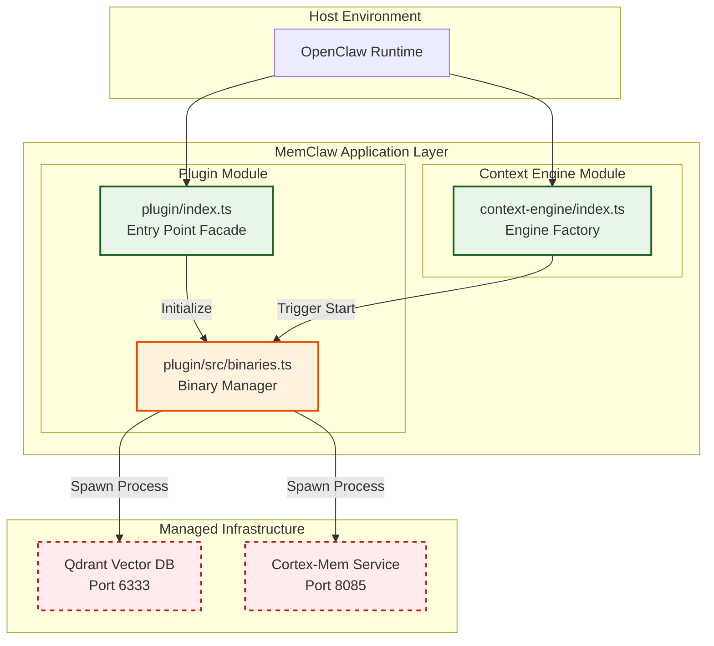

# System Orchestration Documentation

**Project:** MemClaw  
**Domain:** System Orchestration  
**Version:** 1.0.0  
**Last Updated:** 2026-04-05 06:08:20 (UTC)

---

## 1. Introduction

The **System Orchestration** domain serves as the infrastructure backbone of the MemClaw system. Its primary responsibility is to manage the lifecycle, discovery, and health of critical backend microservices required for memory persistence and semantic search. Specifically, it orchestrates native binaries that run **Qdrant** (Vector Database) and **Cortex-Mem** (Context Service) within the host environment (OpenClaw ecosystem).

This module ensures that all infrastructure components are operational, healthy, and correctly configured before the application exposes functionality to AI agents. It acts as the bridge between the high-level business logic (Context Engine) and the low-level native execution environment.

---

## 2. Architectural Overview

MemClaw employs a **Dual-Entry Point Strategy**, separating concerns into a `plugin` module and a `context-engine` module. System Orchestration resides primarily within the `plugin` module but interacts closely with both entry points.

### 2.1 Logical Position
The System Orchestration layer sits below the Application Logic and above the Managed Infrastructure. It abstracts platform-specific complexities (e.g., Darwin ARM64 vs. Linux) from the rest of the system.



### 2.2 Key Design Principles
*   **Native Binary Abstraction:** Backend services are not Docker containers but native executables bundled with the application (e.g., `@memclaw/bin-darwin-arm64`).
*   **Asynchronous Lifecycle:** Service spawning and health checks utilize asynchronous operations to prevent blocking the main thread.
*   **Configuration Driven:** Orchestration logic relies entirely on validated configuration paths (TOML) resolved by the Configuration Management domain.

---

## 3. Core Components

### 3.1 Binary Manager
*   **File Path:** `plugin/src/binaries.ts`
*   **Responsibility:** Handles binary discovery, process spawning, and health verification.
*   **Key Functions:**
    *   `discoverBinary(platform, arch)`: Locates the correct native executable based on the OS environment.
    *   `spawnService(name, args, cwd)`: Initiates child processes for Qdrant or Cortex-Mem.
    *   `checkHealth(serviceName, endpoint)`: Performs HTTP GET requests to verify service readiness.
*   **Importance:** Critical (9.5/10). Failure here renders the memory system unavailable.

### 3.2 Entry Point Facades
*   **File Paths:** `plugin/index.ts`, `context-engine/index.ts`
*   **Responsibility:** Defines API contracts and initiates the orchestration flow upon host load.
*   **Key Functions:**
    *   `onLoad()`: Triggers the initialization sequence.
    *   `definePlugin()`: Registers the plugin capabilities with OpenClaw.
    *   `registerHooks()`: Connects lifecycle events to orchestration handlers.

### 3.3 Utility Binaries Wrapper
*   **File Path:** `context-engine/binaries.ts` (Secondary)
*   **Note:** This file exists in the project structure but requires architectural review to ensure logic consistency with `plugin/src/binaries.ts` to avoid duplication.

---

## 4. Operational Workflows

### 4.1 Plugin Initialization & Service Startup
This workflow establishes the operational foundation. It must complete successfully before any agent interaction can occur.

1.  **Registration:** `plugin/index.ts` defines API contracts.
2.  **Configuration Resolution:** `plugin/src/config.ts` validates `config.toml` and resolves platform-specific paths.
3.  **Binary Discovery:** `plugin/src/binaries.ts` locates native executables.
4.  **Service Spawning:** Child processes for Qdrant (Port 6333) and Cortex-Mem (Port 8085) are launched.
5.  **Health Verification:** The system polls endpoints until services return `200 OK`.
6.  **Engine Ready:** `context-engine/index.ts` initializes the factory once infrastructure is confirmed.

### 4.2 Legacy Data Migration Support
During system upgrades, the Orchestration domain supports data migration workflows.

1.  **Path Resolution:** Configuration Management provides legacy workspace paths.
2.  **Data Movement:** Migration scripts move logs/preferences to tenant-isolated directories.
3.  **Index Regeneration:** `plugin/src/binaries.ts` invokes CLI wrappers to regenerate L0/L1 vector indices post-migration.

---

## 5. Integration & Dependencies

System Orchestration does not operate in isolation. It has strict dependencies on other domains.

| Dependency | Domain | Relationship Type | Description |
| :--- | :--- | :--- | :--- |
| **Configuration Management** | `plugin/src/config.ts` | **Configuration Dependency** | Requires valid TOML and resolved paths before attempting to spawn binaries. |
| **Core Context Engine** | `context-engine/*` | **Service Call Provider** | Provides the running infrastructure (API endpoints) required for semantic search. |
| **Migration & Compliance** | `plugin/src/migrate.ts` | **Tool Support** | Invokes CLI commands managed by the Binary Manager for index regeneration. |

**Flow Constraint:** The Core Context Engine cannot function without System Orchestration successfully starting the Cortex-Mem service. This creates a strict startup ordering dependency.

---

## 6. Implementation Guidelines

### 6.1 Platform Specificity
When implementing binary discovery, ensure support for target architectures:
*   **macOS:** `bin-darwin-arm64`
*   **Windows/Linux:** Corresponding binaries must be packaged similarly.
*   **Path Handling:** Always resolve paths using `path.resolve()` combined with `os.homedir()` or environment variables defined in configuration.

### 6.2 Error Handling & Resilience
*   **Timeouts:** Implement timeout-based retries when checking service health to prevent indefinite hanging during slow startups.
*   **Process Cleanup:** Ensure child processes are terminated gracefully if the host environment shuts down unexpectedly (handle SIGINT/SIGTERM).
*   **Logging:** Log service PID, start time, and port allocation for debugging purposes.

### 6.3 Synchronization Patterns
*   **Async:** Use `async/await` for all service spawning and health check operations.
*   **Sync:** Maintain synchronous patterns only for critical configuration parsing (`config.ts`) to ensure state validity before orchestration begins.

---

## 7. Maintenance & Risk Mitigation

Based on architectural validation analysis, the following areas require attention to maintain system stability and reduce technical debt.

### 7.1 Binary Logic Duplication
*   **Observation:** Both `plugin/src/binaries.ts` and `context-engine/binaries.ts` exist.
*   **Risk:** Logic drift where service spawning behavior differs between modules.
*   **Recommendation:** Consolidate binary management logic into `plugin/src/binaries.ts` as the single source of truth. Deprecate or refactor `context-engine/binaries.ts` to import from the primary manager.

### 7.2 Configuration State Divergence
*   **Observation:** Separate config files exist for Plugin and Context Engine.
*   **Risk:** Settings synchronization issues if paths differ between `plugin/src/config.ts` and `context-engine/config.ts`.
*   **Recommendation:** Implement a shared configuration aggregator or ensure `context-engine` explicitly references the `plugin` configuration state at runtime.

### 7.3 Performance Optimization
*   **Observation:** Current implementation uses synchronous file I/O in migration contexts.
*   **Recommendation:** Refactor `plugin/src/migrate.ts` to use asynchronous file streams (`fs.promises`) to improve scalability during large dataset migrations without blocking the event loop.

---

## 8. API Reference Summary

### Binary Manager Interface
```typescript
// plugin/src/binaries.ts

/**
 * Discovers the native binary for the current platform.
 */
export function discoverBinary(target: string): Promise<string>;

/**
 * Spawns a child process for a specific service.
 * @param serviceName 'qdrant' | 'cortex-mem'
 * @param args Array of CLI arguments
 * @param cwd Working directory
 */
export async function spawnService(serviceName: string, args: string[], cwd: string): Promise<ChildProcess>;

/**
 * Verifies service availability via HTTP endpoint.
 * @param port Target port (e.g., 6333, 8085)
 * @param path Health check path
 */
export async function checkHealth(port: number, path: string): Promise<boolean>;
```

---

*End of Documentation*