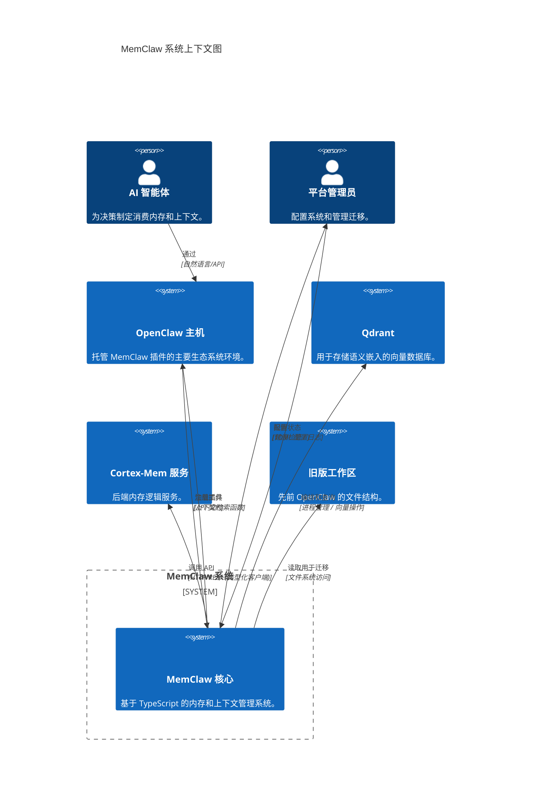

# MemClaw 系统概览文档

**版本:** 1.0  
**生成时间:** 2026-04-05 06:05:52 (UTC)  
**时间戳:** 1775369152  
**状态:** 草稿 / 已定稿  

---

## 1. 项目介绍

### 1.1 项目名称和描述
**项目名称:** MemClaw  
**描述:** MemClaw 是一个模块化的插件式内存和上下文管理系统，设计用于 OpenClaw 生态系统内的集成。它作为 AI 智能体的智能层，提供持久内存、语义搜索能力和上下文检索。该系统通过编排后端基础设施（向量数据库和内存服务）来运行，同时向主机环境暴露统一的 API。

### 1.2 核心功能和价值
MemClaw 的核心价值主张在于为自主智能体实现有状态的长期内存。关键功能能力包括：
*   **语义搜索:** 分层索引（L0/L1/L2）允许智能体高效检索相关历史数据。
*   **上下文处理:** 将原始检索数据转换为可操作的上下文，供下游智能体使用。
*   **基础设施编排:** 透明地管理必需的后端二进制文件（Qdrant、Cortex-Mem）的生命周期。
*   **旧版本迁移:** 促进从先前 OpenClaw 版本到新租户隔离结构的数据过渡。

### 1.3 技术特性概览
*   **架构风格:** 模块化插件架构，双入口点（插件和上下文引擎）。
*   **主要语言:** TypeScript（确保类型安全和可维护性）。
*   **部署模型:** 混合模式（TypeScript 逻辑管理原生二进制进程）。
*   **通信模式:** 服务生命周期使用异步；关键配置解析使用同步。

---

## 2. 目标用户

基于系统的操作流程和配置要求，目标用户和参与者分类如下：

### 2.1 主要参与者: AI 智能体
*   **角色:** 上下文和内存服务的消费者。
*   **使用场景:**
    *   启动语义搜索查询以回忆过去的交互。
    *   在任务完成后将会话数据提交到内存。
    *   检索上下文信息以支持决策制定。
*   **需求:** 对向量索引的低延迟访问、可靠的 API 契约和一致的数据格式。

### 2.2 次要参与者: 平台管理员和开发者
*   **角色:** MemClaw 实例的配置者和维护者。
*   **使用场景:**
    *   通过 TOML 文件定义配置模式。
    *   触发旧数据迁移流程。
*   **需求:** 可验证的配置路径、初始化期间清晰的错误报告以及幂等的迁移工具。

---

## 3. 系统边界

### 3.1 系统范围定义
MemClaw 定义为负责内存存储编排、上下文检索逻辑和配置管理的一组组件。它位于 AI 智能体/主机环境和底层数据基础设施之间。

### 3.2 包含的核心组件（边界内）
*   **配置管理:** 处理 TOML 验证、路径解析和设置同步。
*   **系统编排:** 管理二进制文件的发现、进程生成和后台服务的健康监控。
*   **核心上下文引擎:** 实现语义搜索逻辑、HTTP 客户端外观和智能体工具注册。
*   **迁移与合规:** 处理从旧格式的数据转换并执行指南注入。

### 3.3 排除的外部依赖（边界外）
*   **AI 模型 (LLMs):** MemClaw 向模型提供上下文，但不托管或执行推理。
*   **操作系统:** MemClaw 在操作系统之上运行，除了进程生成之外不管理操作系统级资源。
*   **用户界面:** MemClaw 暴露 API/插件；它不包括最终用户的直接图形界面。
*   **网络基础设施:** 虽然它使用 HTTP，但底层网络路由由外部处理。

---

## 4. 外部系统交互

MemClaw 与多个外部软件系统和数据存储进行交互以执行业务功能。这些交互定义了系统的依赖关系图。

### 4.1 外部系统列表

| 系统名称 | 类型 | 交互方法 | 目的 |
| :--- | :--- | :--- | :--- |
| **OpenClaw 主机** | 软件系统 | 插件 API / 钩子 | 提供执行环境；接收注册的工具和上下文。 |
| **Qdrant** | 向量数据库 | 本地进程 / 网络 | 存储向量嵌入以进行语义搜索（分层索引）。 |
| **Cortex-Mem 服务** | 微服务 | REST API (HTTP) | 处理内存逻辑、会话提交和上下文处理。 |
| **旧版工作区** | 数据存储 | 文件系统访问 | 升级期间迁移日志和首选项的源目录。 |

### 4.2 依赖关系分析

1.  **MemClaw ↔ OpenClaw 主机:**
    *   **依赖:** 高。MemClaw 作为插件加载。
    *   **流程:** 主机初始化 MemClaw；MemClaw 注册工具（例如 `semanticSearch`）回传到主机。
2.  **MemClaw ↔ Cortex-Mem 服务:**
    *   **依赖:** 关键。核心上下文引擎依赖此服务进行所有内存操作。
    *   **流程:** MemClaw 构建类型化的 HTTP 请求（`fetchJson`, `sessionCommit`）到服务。
3.  **MemClaw ↔ Qdrant:**
    *   **依赖:** 高。用于底层向量存储。
    *   **流程:** 由系统编排模块编排；通过 Cortex-Mem 或直接查询进行索引重新生成。
4.  **MemClaw ↔ 旧版工作区:**
    *   **依赖:** 临时。仅在迁移工作流期间激活。
    *   **流程:** 迁移与合规模块读取旧路径并写入租户隔离的目录。

---

## 5. 系统上下文图

以下 C4 系统上下文图说明了 MemClaw 相对于其用户和外部系统的位置。

### 5.1 关键交互流程
1.  **初始化流程:**
    *   OpenClaw 主机触发 `onLoad`。
    *   MemClaw 验证 TOML 配置（配置管理）。
    *   MemClaw 生成 Qdrant/Cortex 二进制文件（系统编排）。
    *   MemClaw 向 OpenClaw 主机暴露工具。
2.  **检索流程:**
    *   智能体通过 OpenClaw 请求上下文。
    *   MemClaw 将请求路由到 Cortex-Mem 服务。
    *   Cortex-Mem 查询 Qdrant 的向量。
    *   结果被处理并返回给智能体。
3.  **迁移流程:**
    *   管理员触发迁移。
    *   MemClaw 通过配置解析器定位旧版路径。
    *   数据迁移器将日志/首选项复制到隔离的租户目录。
    *   CLI 包装器在 Qdrant 中重新生成索引。

---

## 6. 技术架构概览

### 6.1 主要技术栈
*   **运行时:** Node.js（由 TypeScript/二进制管理暗示）。
*   **语言:** TypeScript（主要逻辑，类型安全）。
*   **配置:** TOML（模式验证，平台特定的路径解析）。
*   **协议:** HTTP/REST（客户端-服务器通信），IPC（二进制生成）。
*   **数据库:** Qdrant（向量存储），SQLite/文件系统（本地配置/日志）。

### 6.2 架构模式
*   **插件架构:** MemClaw 设计为动态加载到 OpenClaw 主机中，确保松散耦合。
*   **双入口点:** 同时使用 `plugin/index.ts`（用于主机集成）和 `context-engine/index.ts`（用于核心逻辑隔离）。
*   **外观模式:** `HTTP 客户端外观`抽象复杂的 REST 交互为类型化函数（`fetchJson`, `semanticSearch`）。
*   **编排模式:** `二进制管理器`处理外部进程的生命周期，确保可用性然后再接受流量。

### 6.3 关键设计决策
1.  **关注点分离:** 不同的域（配置、编排、核心引擎、迁移）防止单一复杂性并允许独立扩展或重构。
2.  **原生二进制管理:** MemClaw 不依赖容器化（Docker）来处理 Qdrant/Cortex，而是直接管理原生二进制文件。这减少了开销但增加了平台依赖处理（通过 `bin-darwin-arm64/package.json` 处理）。
3.  **租户隔离:** 迁移逻辑强制执行严格的目录分离，用于不同的租户/工作区，以确保从旧系统过渡时的数据隐私和完整性。
4.  **混合执行模型:**
    *   *同步:* 用于配置解析以在启动错误时快速失败。
    *   *异步:* 用于服务生命周期和 HTTP 调用，以保持非阻塞性能。

### 6.4 风险和注意事项
*   **二进制兼容性:** 跨平台（例如 Darwin ARM64）管理原生二进制文件需要严格的版本控制和兼容性测试。
*   **服务健康:** 核心上下文引擎完全依赖 Cortex-Mem 和 Qdrant 的健康。`HTTP 客户端外观`中暗示了强大的重试逻辑和断路器。
*   **迁移复杂性:** 迁移模块中正则表达式丰富的组件呈现了重构机会，以减少维护债务。

---

**文档结束**