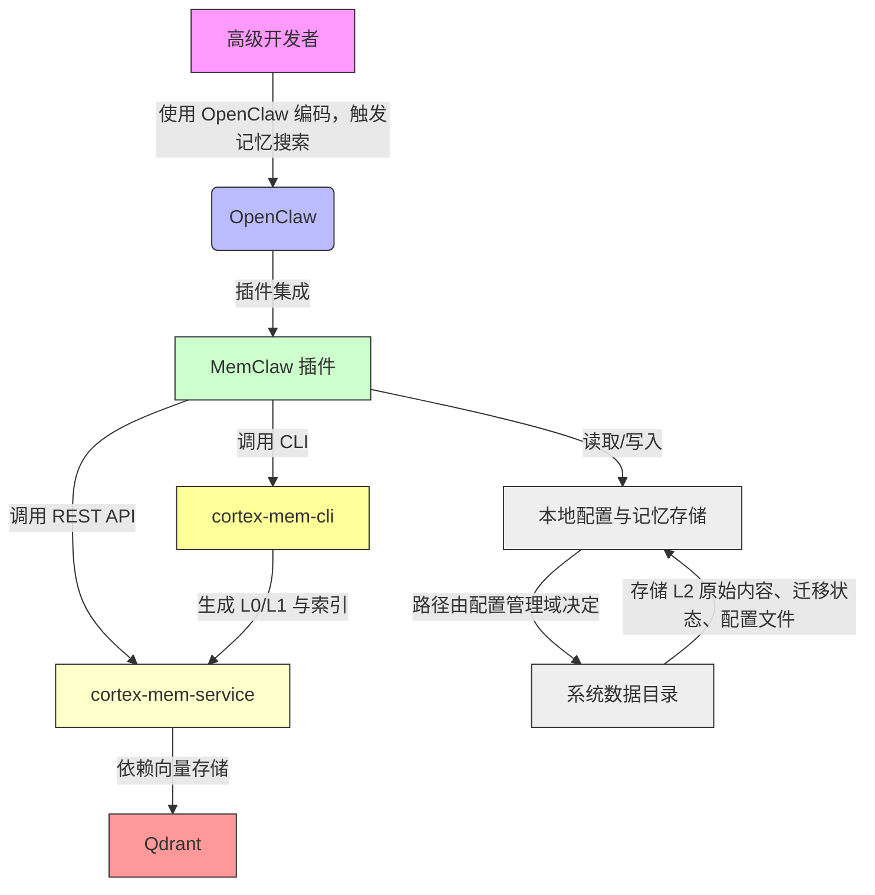

# System Context Overview

## 1. Project Introduction

**项目名称**：MemClaw  
**项目类型**：插件化组件库（ComponentLibrary）  
**项目描述**：  
MemClaw 是为开发者智能工作台 OpenClaw 设计的插件化分层语义记忆系统，旨在彻底取代其原生记忆模块，构建一套可扩展、可维护、高可靠的记忆基础设施。系统通过集成 Qdrant 向量数据库与 cortex-mem-service 后端服务，实现对开发者操作记忆的自动捕获、结构化存储与智能语义检索。其核心创新在于引入 L0（摘要）、L1（概览）、L2（完整内容）三级语义记忆层次，将碎片化、临时性的开发上下文转化为可搜索、可复用、可迁移的知识资产，显著提升开发者在多会话、多项目环境下的认知负载管理能力与知识复用效率。

**核心功能与价值**：  
- **分层语义记忆**：自动将开发会话中的操作、思考与代码片段结构化为 L0/L1/L2 三级记忆，支持语义相似性检索而非关键词匹配。  
- **跨会话记忆延续**：开发者在不同会话、不同项目间切换时，系统能智能召回历史相关记忆，减少重复劳动与上下文重建成本。  
- **无缝集成与透明替换**：作为 OpenClaw 插件，MemClaw 无需用户改变操作习惯，即可完全接管原生记忆功能，实现“开箱即用”的体验升级。  
- **数据平滑迁移**：支持从旧版 OpenClaw 的 MEMORY.md 与每日日志文件（YYYY-MM-DD.md）中自动迁移历史数据，并构建语义索引，保障知识资产不丢失。  
- **多租户隔离**：为不同项目或团队提供独立的记忆存储空间，避免上下文污染与权限混淆。  
- **自动化配置增强**：自动检测并注入 AGENTS.md 使用指南，降低新功能学习成本，提升系统采纳率。

**技术特性概览**：  
- **插件化架构**：以 OpenClaw 插件机制为载体，通过接口适配实现深度集成。  
- **服务解耦设计**：核心逻辑与外部服务（Qdrant、cortex-mem-service）通过 HTTP API 与 CLI 解耦，便于独立升级与维护。  
- **配置驱动**：所有行为由统一配置管理域控制，支持 TOML 配置文件动态调整策略（如自动捕获开关、存储路径等）。  
- **自动化生命周期管理**：系统启动时自动检测、启动并健康检查本地服务，确保依赖项就绪。  
- **幂等性与容错设计**：数据迁移、文档注入等关键操作均具备幂等性，避免重复执行导致的数据混乱。

---

## 2. Target Users

### 用户角色定义

| 用户角色 | 描述 | 核心使用场景 |
|----------|------|----------------|
| **高级开发者** | 使用 OpenClaw 进行高强度编码与知识管理的专业工程师，频繁进行跨会话任务衔接与上下文复用。 | 在编码过程中自然产生大量临时性思考（如调试思路、API 设计决策、错误排查路径），需在数小时或数天后快速召回；在重构、代码审查、知识传承场景中依赖历史记忆作为决策依据。 |
| **团队技术负责人** | 负责团队工具链标准化、知识沉淀与系统稳定性的管理者，关注系统可维护性、可迁移性与可扩展性。 | 需要确保团队成员在升级 MemClaw 后历史记忆完整继承；统一配置策略（如记忆保留周期、自动捕获粒度）；监控系统稳定性与数据一致性；避免因插件故障导致开发流中断。 |

### 用户需求分析

| 用户角色 | 核心需求 | 业务价值实现方式 |
|----------|----------|------------------|
| **高级开发者** | 1. 自动捕获并结构化保存开发会话中的关键操作与思考 2. 通过语义搜索快速召回历史记忆内容 3. 在多个项目或租户间隔离记忆数据 4. 无缝集成到现有工作流中，无需改变操作习惯 | - L0/L1/L2 分层结构自动构建，无需手动标记 - 基于向量嵌入的语义搜索，支持自然语言查询（如“我上周怎么解决那个数据库连接超时问题？”） - 租户隔离目录结构（如 `.memclaw/tenant/{project-id}/`）实现数据物理隔离 - 通过插件接口完全替换 OpenClaw 原生内存模块，用户感知无变化 |
| **团队技术负责人** | 1. 支持从旧版 OpenClaw 记忆系统平滑迁移数据 2. 通过配置文件统一管理记忆策略（如自动捕获开关） 3. 确保系统稳定、可调试、可监控 4. 避免记忆数据丢失或格式混乱 | - 提供 `migrate.ts` 工具自动扫描并转换旧格式日志，生成标准化 L2 内容 - 统一配置管理域（`config.ts`）支持全局策略控制，支持版本化配置文件 - 服务启动器（`binaries.ts`）提供健康检查与失败重试机制 - 迁移状态持久化标记，防止重复执行；所有操作生成日志与备份文件 |

---

## 3. System Boundaries

### 系统范围定义

MemClaw 的系统边界以 **插件化组件库** 为定义核心，其功能实现完全依赖于 OpenClaw 平台的插件机制，自身不包含任何独立运行的可执行程序或图形界面。系统边界明确区分“内部逻辑”与“外部依赖”，确保架构清晰、可维护性强。

### 包含的核心组件

以下组件属于 MemClaw 系统内部逻辑范畴，是其功能实现的直接载体：

| 组件路径 | 所属领域 | 功能说明 |
|----------|----------|----------|
| `plugin/src/client.ts` | 服务交互域 | 封装与 `cortex-mem-service` 的 REST API 交互，实现 L0/L1/L2 语义检索请求构造与响应解析 |
| `plugin/src/memory-adapter.ts` | 插件集成域 | 实现 OpenClaw 的 `MemoryPluginCapability` 接口，将 MemClaw 的分层响应适配为平台兼容格式 |
| `plugin/src/agents-md-injector.ts` | 配置增强域 | 自动发现并安全注入 MemClaw 使用指南至 AGENTS.md 文件，降低用户学习成本 |
| `plugin/src/migrate.ts` | 数据迁移域 | 扫描旧版 OpenClaw 记忆文件（YYYY-MM-DD.md、MEMORY.md），转换为 L2 层结构化数据并迁移至租户目录 |
| `plugin/src/binaries.ts` | 服务管理域 | 管理 `cortex-mem-cli` CLI 工具调用，用于迁移后构建 L0/L1 层与向量索引 |
| `plugin/index.ts` | 插件集成域 | 插件入口文件，注册插件元信息，导出核心能力（客户端、适配器） |
| `context-engine/index.ts` | 插件集成域 | 上下文引擎协调器，负责初始化流程编排与插件注册 |
| `context-engine/config.ts` | 配置管理域 | 计算平台数据路径，生成默认配置模板，验证配置文件存在性 |
| `context-engine/binaries.ts` | 服务管理域 | 启动并监控 Qdrant 与 cortex-mem-service 本地服务，执行健康检查 |
| `context-engine/config.ts` | 配置管理域 | 管理自动捕获、自动召回等核心策略开关 |

### 排除的外部依赖

以下组件**不属于** MemClaw 系统边界，仅作为外部依赖被动态引用：

| 组件 | 类型 | 说明 |
|------|------|------|
| `bin-darwin-arm64`, `bin-linux-x64`, `bin-win-x64` | 外部二进制包 | Qdrant、cortex-mem-service、cortex-mem-cli 的平台预编译可执行文件，由包管理器（如 npm、brew）分发，MemClaw 仅通过路径解析与进程调用使用，不包含其源码或构建逻辑 |
| OpenClaw 平台本身 | 外部平台 | MemClaw 是其插件，依赖 OpenClaw 的插件 API、事件总线与 UI 框架，但不包含其任何核心代码 |

> **架构决策说明**：  
> MemClaw 采用“**逻辑内聚、依赖外置**”的设计哲学，将平台特定二进制文件排除在系统边界之外，使 MemClaw 成为一个轻量、可复用、跨平台的插件组件库。该设计极大降低了版本耦合风险，允许 Qdrant 或 cortex-mem-service 独立升级，而无需重新发布 MemClaw 插件。

---

## 4. External System Interactions

MemClaw 通过四种主要交互方式与四个外部系统建立依赖关系，构建完整的智能记忆生态系统。

### 外部系统列表与交互详情

| 外部系统 | 描述 | 交互类型 | 交互方式 | 依赖强度 | 作用 |
|----------|------|----------|----------|----------|------|
| **OpenClaw** | 面向开发者的智能工作台，提供代码编辑、插件扩展与上下文记忆功能 | Plugin Integration | 通过 OpenClaw 插件 API（TypeScript 接口）注册 `MemoryPluginCapability` 实现，接管原生内存模块 | ★★★★★（最高） | MemClaw 的运行载体，所有用户交互与记忆请求均通过 OpenClaw 触发；系统通过插件机制实现“透明替换” |
| **cortex-mem-service** | MemClaw 的后端记忆服务，提供 REST API 支持 L0/L1/L2 分层语义检索、会话管理与多租户隔离存储 | HTTP API | MemClaw 的 `CortexMemClient` 通过 HTTPS 请求调用 `/api/v1/semantic-search`、`/api/v1/tenant/{id}/l0` 等端点 | ★★★★★ | 核心语义检索引擎，实现向量嵌入匹配、记忆分层查询、租户上下文管理；是智能记忆能力的“大脑” |
| **Qdrant** | 向量数据库，用于存储和检索语义嵌入向量，支撑 MemClaw 的语义搜索与相似性匹配能力 | Local Service | 作为本地运行的 gRPC/HTTP 服务，由 MemClaw 的 `BinaryManager` 启动与监控；cortex-mem-service 内部依赖 Qdrant 存储向量索引 | ★★★★☆ | 语义搜索的底层基础设施，提供高精度、低延迟的向量相似性检索；MemClaw 不直接与 Qdrant 通信，但其可用性直接影响系统功能 |
| **cortex-mem-cli** | 命令行工具，用于执行数据迁移后的后处理任务，如 L0/L1 层生成与向量索引构建 | CLI Execution | MemClaw 通过 `CliExecutor` 调用 `cortex-mem-cli migrate --l0-l1 --index` 等命令，执行批量后处理 | ★★★★☆ | 数据迁移的关键后处理工具，将原始 L2 内容转换为结构化摘要与向量索引，是“旧数据→新知识”转化的“加工车间” |

### 依赖关系分析

| 依赖关系 | 说明 | 架构意义 |
|----------|------|----------|
| **强依赖：cortex-mem-service** | MemClaw 的所有语义搜索功能均依赖该服务的可用性。若服务不可达，搜索功能将降级为本地缓存或报错。 | 强调“服务化架构”：语义智能被抽象为独立服务，便于横向扩展、灰度发布与性能优化。 |
| **中强依赖：Qdrant** | 虽不直接交互，但 Qdrant 是 cortex-mem-service 的底层依赖。若 Qdrant 启动失败，cortex-mem-service 将无法初始化，导致 MemClaw 搜索功能完全失效。 | 体现“基础设施嵌套”：MemClaw 依赖一个“服务栈”，而非单一组件，架构需具备服务链健康检查能力。 |
| **中依赖：cortex-mem-cli** | 仅在数据迁移阶段被调用，日常运行中不参与。其失败不影响系统核心功能，但影响历史数据继承。 | 体现“异步处理”：非核心路径的工具调用采用“触发式”执行，避免阻塞主流程。 |
| **基础依赖：OpenClaw** | MemClaw 无 OpenClaw 则无存在意义。插件机制是其唯一运行环境。 | 确立“平台嵌入式”定位：MemClaw 不是独立应用，而是“增强型插件”，其架构必须严格遵循宿主平台规范。 |

> **关键架构洞察**：  
> MemClaw 的外部依赖呈现出“**插件层 → 服务层 → 基础设施层 → 工具层**”的四层依赖结构。该分层设计确保了核心业务逻辑（插件适配）与底层技术实现（向量数据库）的松耦合，符合“关注点分离”原则，为未来替换 Qdrant 为 Milvus 或向量服务云化（如 AWS OpenSearch）提供了清晰的改造路径。

---

## 5. System Context Diagram

### 关键交互流程说明

1. **用户交互流**：  
   高级开发者在 OpenClaw 中输入自然语言查询（如“如何配置 TLS 证书？”），OpenClaw 调用 MemClaw 插件的 `MemorySearchManager` 接口 → MemClaw 的 `MemoryAdapter` 将请求转发至 `CortexMemClient` → `CortexMemClient` 发起 HTTP 请求至 `cortex-mem-service` → 服务查询 Qdrant 向量库，返回 L0/L1/L2 分层结果 → `MemoryAdapter` 将结果格式化为 OpenClaw 兼容结构，展示在 UI 中。

2. **系统初始化流**：  
   用户安装 MemClaw → `context-engine/index.ts` 启动初始化流程 → `ContextEngineConfig` 生成默认配置文件 → `BinaryManager` 启动 Qdrant 与 cortex-mem-service → 等待健康检查通过 → `MemoryAdapter` 注册至 OpenClaw，禁用原生内存模块 → 系统完成接管。

3. **数据迁移流**：  
   用户首次升级 → `migrate.ts` 扫描旧日志 → 生成 L2 文件并存入租户目录 → `CliExecutor` 调用 `cortex-mem-cli` 构建 L0/L1 层与向量索引 → 更新配置标记迁移完成 → 旧数据被安全归档，新系统启用。

4. **配置增强流**：  
   插件启动后，`AgentsMdInjector` 检测项目根目录下的 `AGENTS.md` → 若未注入，创建备份 → 插入 MemClaw 使用模板（含查询语法、L0/L1/L2 含义说明） → 完成用户教育闭环。

### 架构决策总结

- **选择 REST API 而非 gRPC**：因 cortex-mem-service 需支持多语言客户端（未来可能接入 VS Code、JetBrains 插件），REST 更具通用性。
- **不直接访问 Qdrant**：避免 MemClaw 与向量数据库绑定过紧，保持服务层作为唯一接口。
- **CLI 用于批处理**：L0/L1 生成与索引构建为高资源消耗任务，不适合在主进程执行，采用独立 CLI 保证稳定性。
- **配置文件驱动**：所有路径、端口、策略均由 TOML 配置统一管理，支持团队共享配置（如通过 Git 管理 `.memclaw.toml`）。

---

## 6. Technical Architecture Overview

### 主要技术栈

| 层级 | 技术 | 说明 |
|------|------|------|
| **宿主平台** | OpenClaw (TypeScript/Node.js) | 插件运行环境，提供插件 API、事件总线、UI 框架 |
| **核心语言** | TypeScript | 所