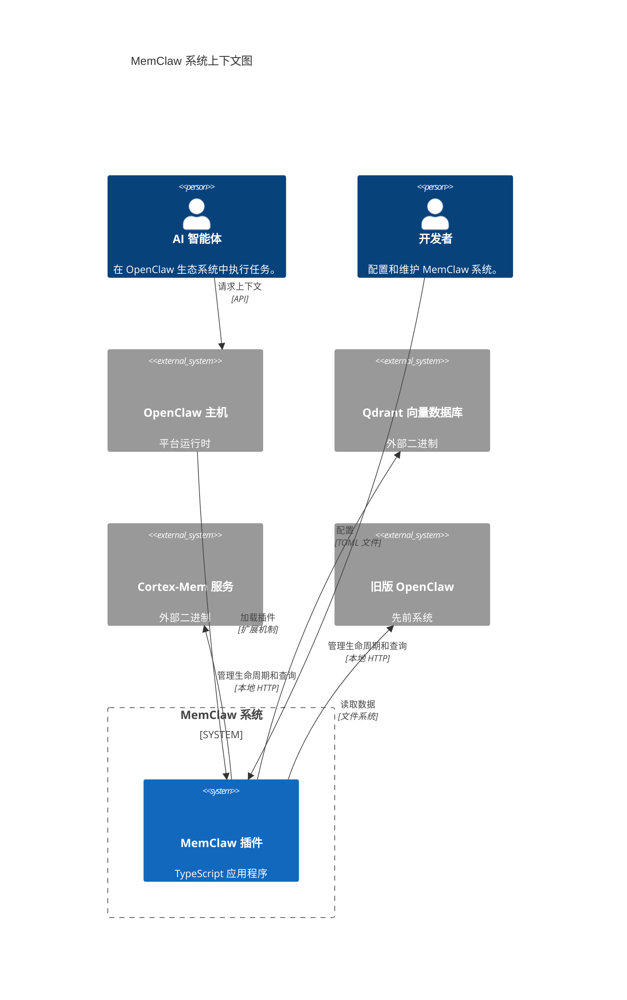
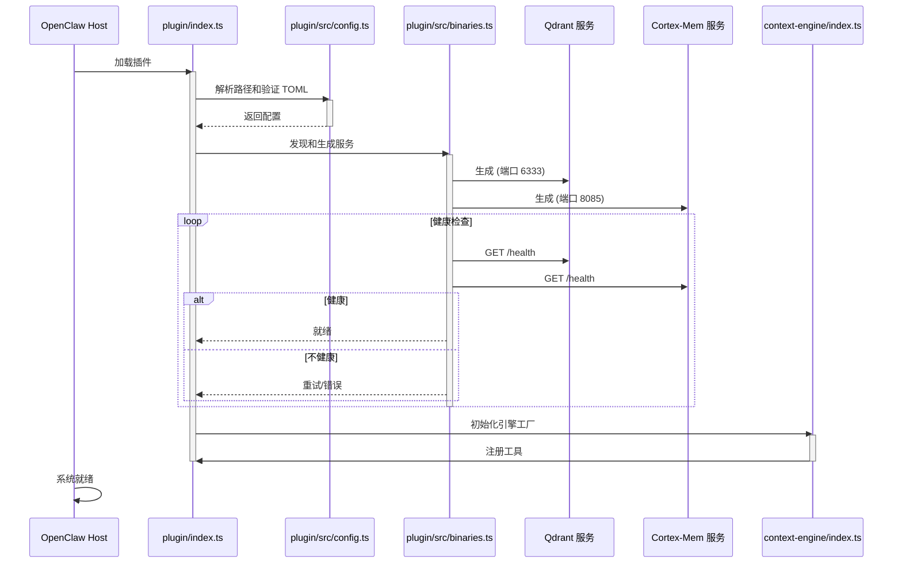
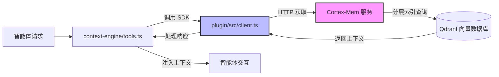
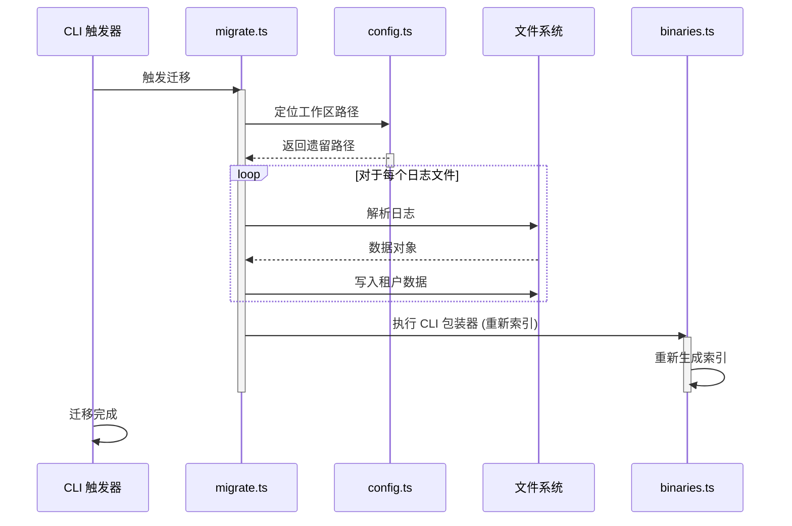

# MemClaw 系统架构文档

**项目名称:** MemClaw  
**文档版本:** 1.0  
**生成时间:** 2026-04-05 06:06:52 (UTC)  
**时间戳:** 1775369212  

---

## 1. 架构概览

### 1.1 架构设计哲学
MemClaw 系统围绕 **基础设施即插件** 的原则设计。它在更广泛的 OpenClaw 生态系统中作为模块化扩展运行，为 AI 智能体提供持久内存和语义上下文能力。该架构优先考虑 **类型安全**、**跨平台兼容性** 和 **操作自主性**。通过将后端微服务管理直接嵌入插件逻辑中，MemClaw 确保智能体无需复杂的外部部署依赖即可立即访问内存基础设施。

### 1.2 核心架构模式
*   **双入口点策略:** 系统利用两个不同的入口点（`plugin/index.ts` 和 `context-engine/index.ts`）将 API 暴露与内部引擎逻辑分离。这允许跨不同主机环境的灵活性，同时保持封装性。
*   **外观模式:** 在 `binaries.ts` 和 `client.ts` 中广泛使用，在干净的 TypeScript 接口后面抽象复杂的原生进程管理和 HTTP 交互。
*   **本地微服务:** MemClaw 不依赖远程 API，而是编排本地原生二进制文件（Qdrant、Cortex-Mem），将它们作为由应用程序生命周期管理的一等公民对待。
*   **分层上下文处理:** 实现分层索引策略（L0/L1/L2）进行内存检索，平衡召回精度与查询性能。

### 1.3 技术栈概览
| 层级 | 技术 | 用途 |
| :--- | :--- | :--- |
| **运行时** | Node.js / TypeScript | 编排逻辑的主要执行环境。 |
| **配置** | TOML (`smol-toml`) | 用于路径和设置的人类可读配置。 |
| **通信** | HTTP/REST (Localhost) | 插件与管理服务之间的内部通信。 |
| **向量存储** | Qdrant (原生二进制) | 用于语义内存的高性能向量数据库。 |
| **内存服务** | Cortex-Mem (原生二进制) | 内存索引和检索的业务逻辑层。 |
| **文件系统** | Node `fs` / Streams | 日志、配置和租户隔离的本地存储。 |

---

## 2. 系统上下文

### 2.1 系统定位和价值
MemClaw 作为 OpenClaw 平台的 **内存子系统** 运行。其核心商业价值在于通过存储、检索和会话化对话历史与知识库，为 AI 智能体实现有状态的交互。没有 MemClaw，智能体将以无状态方式运行，缺乏长期内存保留能力。

### 2.2 用户角色和场景
| 角色 | 描述 | 场景 |
| :--- | :--- | :--- |
| **AI 智能体** | 在 OpenClaw 内运行的自动化软件实体。 | 请求关于先前对话或用户偏好的上下文，以准确回答问题。 |
| **开发者** | MemClaw/OpenClaw 代码库的维护者。 | 配置路径、更新二进制文件或排查服务健康问题。 |
| **最终用户** | 与智能体交互的人类。 | 由于更好的内存检索，间接受益于改进的智能体响应。 |

### 2.3 外部系统交互
*   **OpenClaw 运行时:** 加载 MemClaw 插件并将其工具暴露给智能体的主机环境。
*   **操作系统:** 为原生二进制文件提供文件系统访问和进程管理（spawn/exec）。
*   **旧版 OpenClaw 系统:** 迁移场景中历史数据的来源。

### 2.4 系统边界定义
*   **包含:** TypeScript 编排逻辑、配置管理、二进制生命周期控制、HTTP 客户端包装器和迁移实用程序。
*   **排除:** OpenClaw 核心运行时逻辑、Qdrant/Cortex-Mem 二进制文件的内部实现（视为黑盒）和外部云数据库。



---

## 3. 容器视图

### 3.1 领域模块划分
系统基于职责分解为四个主要域：
1.  **系统编排:** 管理原生二进制文件的生命周期。
2.  **核心上下文引擎:** 处理语义搜索和智能体上下文处理。
3.  **配置管理:** 集中设置、路径和验证。
4.  **迁移与合规:** 处理数据过渡和指南执行。

### 3.2 领域模块架构
架构在本地遵循 **客户端-服务器** 模型，其中 TypeScript 插件作为客户端/编排器，原生二进制文件作为服务器。

```mermaid
C4Container
    title MemClaw 容器图

    Person(agent, "AI 智能体", "消费内存工具。")
    System_Boundary(host, "主机环境 (OpenClaw)") {
        System(plugin_container, "MemClaw 插件", "Node.js 应用程序", "主要入口点和外观。")
    }

    ContainerBin(container_engine, "上下文引擎模块", "TypeScript 库", "上下文处理和工具注册的核心逻辑。")
    ContainerBin(bin_manager, "二进制管理器", "TypeScript 模块", "生成和监控 Qdrant/Cortex-Mem。")
    ContainerBin(config_mgr, "配置管理器", "TypeScript 模块", "解析路径和解析 TOML。")
    ContainerBin(migrator, "迁移实用程序", "TypeScript 模块", "处理遗留数据过渡。")

    ContainerDb(qdrant, "Qdrant", "向量数据库", "存储 L0/L1/L2 内存索引。", "端口 6333")
    Container(cortex, "Cortex-Mem", "微服务", "内存检索逻辑。", "端口 8085")

    Rel(agent, plugin_container, "调用工具", "API")
    Rel(plugin_container, container_engine, "初始化", "导入")
    Rel(plugin_container, bin_manager, "调用", "生成/健康检查")
    Rel(plugin_container, config_mgr, "读取", "配置文件")
    Rel(plugin_container, migrator, "触发", "CLI 命令")
    
    Rel(bin_manager, qdrant, "生成和监控", "进程")
    Rel(bin_manager, cortex, "生成和监控", "进程")
    Rel(container_engine, cortex, "查询", "HTTP REST")
    Rel(migrator, bin_manager, "调用 CLI", "进程")

    UpdateLayoutConfig($c4ShapeInRow="3", $c4BoundaryInRow="1")
```

### 3.3 存储设计
*   **配置:** 存储在 `config.toml` 中的工作区目录内。支持平台特定的路径覆盖。
*   **内存索引:** 由 Qdrant 内部管理。MemClaw 不直接存储向量，而是管理连接和模式。
*   **租户隔离:** 数据隔离到租户特定的目录中，以安全地支持多用户或多项目上下文。
*   **日志:** 在迁移期间解析每日内存日志；操作日志流式传输到主机环境。

### 3.4 跨域模块通信
*   **同步:** 配置加载阻止初始化，以确保在服务生成之前有有效路径。
*   **异步:** 服务健康检查和二进制生成利用 async/await 模式，以防止在启动期间阻塞事件循环。
*   **IPC:** TS 插件与原生二进制文件之间的通信通过本地 HTTP（环回接口）发生。

---

## 4. 组件视图

### 4.1 核心功能组件
此视图详细说明了 `plugin` 和 `context-engine` 模块的内部组件。

```mermaid
C4Component
    title MemClaw 插件和引擎的组件图

    Container(plugin, "MemClaw 插件", "TypeScript", "编排层") {
        Component(entry_plugin, "入口点外观", "index.ts", "定义 API 契约和加载钩子。")
        Component(bin_ctrl, "二进制控制器", "binaries.ts", "生成 Qdrant 和 Cortex-Mem。")
        Component(cfg_ctrl, "配置解析器", "config.ts", "解析 TOML 和解析路径。")
        Component(client_http, "HTTP 客户端", "client.ts", "包装对 Cortex-Mem 的 REST 调用。")
        Component(injector, "合规执行器", "agents-md-injector.ts", "更新 AGENTS.md 指南。")
        Component(migrator, "数据迁移工具", "migrate.ts", "将遗留数据移动到租户。")
    }

    Container(engine, "上下文引擎", "TypeScript", "业务逻辑层") {
        Component(entry_engine, "引擎工厂", "index.ts", "注册上下文工具。")
        Component(proc_ctx, "上下文处理器", "context-engine.ts", "格式化检索的数据。")
        Component(tool_reg, "工具注册器", "tools.ts", "向主机暴露功能。")
        Component(cfg_ctx, "上下文配置", "config.ts", "引擎特定的默认值。")
    }

    BiRel(entry_plugin, cfg_ctrl, "加载")
    BiRel(entry_plugin, bin_ctrl, "触发")
    BiRel(bin_ctrl, client_http, "验证服务")
    BiRel(entry_engine, proc_ctx, "创建")
    BiRel(entry_engine, tool_reg, "注册")
    BiRel(tool_reg, client_http, "使用")
    BiRel(proc_ctx, client_http, "获取")
    BiRel(migrator, bin_ctrl, "调用 CLI")
    BiRel(injector, cfg_ctrl, "读取路径")
```

### 4.2 技术支持组件
*   **HTTP 客户端外观 (`client.ts`):** 抽象获取逻辑、处理重试策略和标准化 Cortex-Mem 交互的错误处理。
*   **健康检查监控器:** 嵌入在 `binaries.ts` 中，轮询 HTTP 端点（`/health`）以在允许查询之前验证服务准备情况。
*   **路径解析器:** 使用 `path` 模块和平台检测（`os.platform()`）为 Windows/macOS/Linux 生成正确的绝对路径。

### 4.3 组件职责划分
| 组件 | 职责 | 关键性 |
| :--- | :--- | :--- |
| **入口点外观** | 初始化生命周期，定义公共 API。 | 高 |
| **二进制控制器** | 确保基础设施可用性。 | 关键 |
| **HTTP 客户端** | 网络可靠性和类型安全。 | 高 |
| **配置解析器** | 环境一致性。 | 中-高 |
| **数据迁移工具** | 一次性升级路径支持。 | 中 |

### 4.4 组件交互关系
*   **依赖注入:** `上下文引擎` 依赖于 `插件` 模块提供的 `HTTP 客户端` 以避免与网络细节紧密耦合。
*   **生命周期钩子:** `入口点外观` 在主机中注册钩子，在加载时触发 `二进制控制器`，在卸载时进行清理。
*   **错误传播:** 来自 `二进制控制器` 的错误（例如端口冲突）向上传播到 `入口点外观` 以优雅地中止初始化。

---

## 5. 关键流程

### 5.1 核心功能流程

#### 5.1.1 插件初始化与服务启动
此工作流建立操作基础。它确保所有基础设施健康后才暴露功能。



#### 5.1.2 上下文检索与语义搜索
使智能体能够跨内存层执行语义搜索。



### 5.2 技术处理工作流

#### 5.2.1 遗留数据迁移
促进从旧版 OpenClaw 架构到租户隔离结构的过渡。



### 5.3 数据流路径
1.  **写入路径:** 智能体交互 -> Cortex-Mem -> Qdrant (嵌入)。
2.  **读取路径:** 智能体查询 -> Cortex-Mem -> Qdrant (相似性搜索) -> 上下文处理器 -> 智能体。
3.  **配置路径:** 用户编辑 TOML -> 配置解析器 -> 插件/二进制文件。

### 5.4 异常处理机制
*   **二进制失败:** 如果 Qdrant/Cortex-Mem 无法生成，插件停止初始化并记录退出代码。
*   **网络超时:** HTTP 客户端为 Cortex-Mem 请求实现超时以防止智能体挂起。
*   **配置验证:** TOML 解析失败导致立即启动拒绝，并提供关于模式违规的清晰错误消息。

---

## 6. 技术实现

### 6.1 核心模块实现

#### 6.1.1 二进制编排 (`plugin/src/binaries.ts`)
*   **实现:** 使用 Node.js `child_process.spawn` 启动原生可执行文件。
*   **模式:** 通过健康检查轮询间隔实现的观察者模式。
*   **代码详情:**
    ```typescript
    // 简化逻辑
    const service = spawn(binaryPath, args, { stdio: 'pipe' });
    await waitForHealth(serviceUrl, retries);
    // 确保进程在插件生命周期内保持运行
    process.on('exit', () => service.kill());
    ```
*   **优化:** 当前同步配置解析阻止二进制生成。建议: 如果启动延迟成为问题，将重 IO 移动到工作线程。

#### 6.1.2 HTTP 客户端外观 (`plugin/src/client.ts`)
*   **实现:** 使用 TypeScript 泛型将原生 `fetch` 包装为类型化接口。
*   **特性:** 集中错误处理中间件将原始 HTTP 错误转换为特定于域的异常。
*   **安全性:** 所有请求仅针对 `localhost`，降低与外部网络调用相关的 SSRF 风险。

### 6.2 关键算法设计
*   **分层索引 (L0/L1/L2):**
    *   **L0:** 短期对话窗口（高优先级，低延迟）。
    *   **L1:** 会话级摘要（中优先级）。
    *   **L2:** 长期知识库（低优先级，高召回）。
    *   *机制:* Cortex-Mem 基于时间衰减和重要性分数在命中 Qdrant 之前路由查询。

```markdown