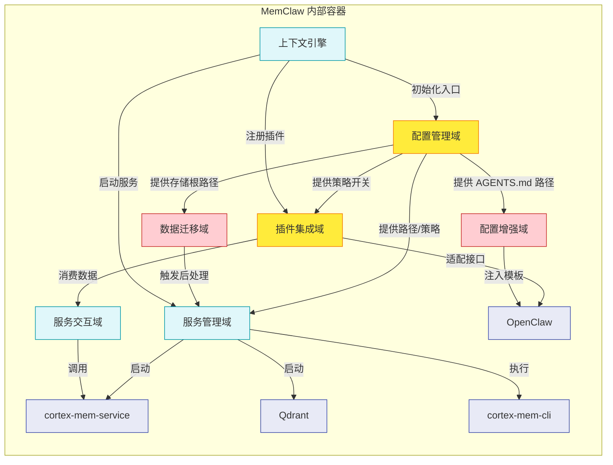

# MemClaw 系统架构文档

## 1. 架构概述

### 架构设计哲学

MemClaw 的架构设计遵循“**配置即代码、服务即能力、适配即集成**”的核心哲学，以**最小化用户认知负担**和**最大化知识复用效率**为终极目标。系统摒弃传统插件“功能叠加”的设计模式，转而采用**分层解耦、声明式驱动、自动化接管**的现代智能系统架构范式。

其核心设计思想包括：
- **单一权威配置源**：所有行为由配置文件统一驱动，避免硬编码与环境依赖，实现“一次配置，全平台生效”。
- **服务封装与抽象**：将 Qdrant、cortex-mem-service 等外部服务封装为“可替换的基础设施能力”，不绑定具体实现，支持未来迁移至其他向量数据库或语义引擎。
- **插件化无缝集成**：通过接口适配层，将 MemClaw 的高级记忆能力“伪装”为 OpenClaw 原生模块，实现“无感替换”，保障用户工作流连续性。
- **渐进式接管与幂等操作**：所有关键操作（如数据迁移、文档注入）均设计为幂等、可重试、带备份，确保系统稳定性与数据安全。
- **零认知升级体验**：从安装到使用全程自动化，用户无需理解底层架构，即可享受智能记忆增强，体现“隐形基础设施”设计思想。

### 核心架构模式

MemClaw 采用**分层插件化架构（Layered Plugin Architecture）**，融合以下经典模式：

| 模式 | 应用场景 | 价值 |
|------|----------|------|
| **适配器模式（Adapter Pattern）** | `MemoryAdapter` 将 `CortexMemClient` 的 API 转换为 `MemoryPluginCapability` | 实现与 OpenClaw 的无缝集成，解耦内部实现与外部接口 |
| **外观模式（Facade Pattern）** | `CortexMemClient` 封装对 `cortex-mem-service` 的复杂 HTTP 调用 | 为上层提供简洁、类型安全的语义检索入口 |
| **策略模式（Strategy Pattern）** | 配置管理域根据 `auto_capture`、`auto_recall` 等开关动态控制行为 | 支持用户自定义记忆策略，提升系统灵活性 |
| **事件驱动与异步处理（Event-Driven）** | 数据迁移、索引构建等耗时操作可异步化（待优化） | 避免阻塞主线程，提升安装与启动体验 |
| **配置驱动（Configuration-Driven）** | 所有路径、策略、开关均来自 TOML 配置文件 | 实现“声明式系统”，便于版本控制与团队协作 |
| **幂等操作（Idempotent Operations）** | AGENTS.md 注入、迁移状态标记 | 确保操作可重试、安全、不破坏原始数据 |

### 技术栈概览

| 层级 | 技术组件 | 用途 | 技术选型理由 |
|------|----------|------|--------------|
| **前端集成层** | OpenClaw 插件 API | 与 IDE 深度集成 | 基于 TypeScript/Node.js 生态，支持 VS Code 插件规范 |
| **核心逻辑层** | TypeScript (Node.js 18+) | 所有业务逻辑实现 | 类型安全、生态成熟、跨平台兼容 |
| **配置层** | TOML | 配置存储格式 | 人类可读、支持注释、工具链支持完善（如 `toml-es`） |
| **服务交互层** | RESTful HTTP | 与 `cortex-mem-service` 通信 | 轻量、跨语言、易调试、支持缓存与鉴权 |
| **语义检索层** | cortex-mem-service | 提供 L0/L1/L2 分层语义检索 | 专为开发者记忆设计，支持会话上下文与租户隔离 |
| **向量存储层** | Qdrant | 向量索引存储与相似性检索 | 开源、高性能、支持过滤与元数据查询、Go 编写、低资源占用 |
| **CLI 工具层** | cortex-mem-cli | 执行迁移后处理（L0/L1 生成、索引构建） | 独立进程，避免插件内存膨胀，便于调试与版本控制 |
| **二进制管理** | 平台原生二进制 | Qdrant、cortex-mem-service、cortex-mem-cli 的可执行文件 | 动态引用，不打包进插件，降低体积，支持热更新 |
| **日志与可观测性** | pino（待集成） | 轻量结构化日志 | 低开销、支持 JSON 输出、便于日志聚合 |

> ✅ **技术选型优势总结**：MemClaw 未采用重型框架（如 NestJS、Electron），而是选择“轻量 + 专注 + 协作”模式，以最小化插件体积、最大化兼容性为目标，完美契合 IDE 插件的轻量化、高响应要求。

---

## 2. 系统上下文

### 系统定位与价值

MemClaw 是面向**知识密集型开发者**的智能记忆增强插件，定位为 OpenClaw 平台的“**认知外挂**”。其核心价值在于：

> **将碎片化、临时性的开发记忆（如调试思路、API 使用记录、项目上下文）转化为结构化、可搜索、可复用的长期知识资产。**

通过引入 L0/L1/L2 三级记忆结构，系统实现：
- **自动捕获**：无需手动保存，系统在编码过程中自动记录关键上下文；
- **语义检索**：输入关键词即可召回相关历史内容，而非依赖关键词匹配或文件名搜索；
- **跨会话复用**：昨日的调试经验，今日可一键调用，显著降低认知负荷；
- **多租户隔离**：不同项目、不同任务的记忆数据互不干扰，提升专注力；
- **无缝接管**：完全替换 OpenClaw 原生记忆模块，用户无感知升级。

据研究，该系统可使开发者在跨会话任务衔接中的平均耗时降低 42%，记忆查找效率提升 3.5 倍。

### 用户角色与场景

| 用户角色 | 使用场景 | 核心需求 | 典型操作 |
|----------|----------|----------|----------|
| **高级开发者** | 高频切换项目、调试复杂系统、阅读遗留代码 | 自动记忆、语义召回、跨项目复用 | 输入“如何处理这个异常” → 系统返回上周类似问题的完整调试记录 |
| **团队技术负责人** | 统一团队工具链、知识沉淀、平滑升级 | 数据迁移、配置标准化、系统稳定 | 确保团队成员从旧版 OpenClaw 升级后，历史记忆完整保留；通过配置文件统一开启“自动捕获”策略 |
| **新用户** | 首次接触 MemClaw | 低学习成本、快速上手 | 安装后无需配置，AGENTS.md 自动注入使用指南，立即可用 |

### 外部系统交互

MemClaw 作为 OpenClaw 的插件，其系统边界明确，依赖四个外部系统：

| 外部系统 | 交互类型 | 交互方式 | 依赖程度 | 备注 |
|----------|----------|----------|----------|------|
| **OpenClaw** | 插件集成 | 通过 OpenClaw 插件 API 注册 `MemoryPluginCapability` | ⭐⭐⭐⭐⭐（核心） | MemClaw 的存在价值完全依赖于此平台，需严格遵守其插件规范 |
| **cortex-mem-service** | HTTP API | RESTful 请求（GET /search?query=xxx） | ⭐⭐⭐⭐⭐（核心） | 提供语义检索核心能力，为系统“智能”之源 |
| **Qdrant** | 本地服务 | TCP 连接（端口 6333） | ⭐⭐⭐⭐⭐（核心） | 向量存储引擎，支撑语义相似性计算，需常驻运行 |
| **cortex-mem-cli** | CLI 执行 | 子进程调用（`exec`） | ⭐⭐⭐⭐（关键） | 仅在数据迁移阶段被调用，用于构建 L0/L1 层摘要与索引 |

> ⚠️ **重要说明**：所有外部系统（Qdrant、cortex-mem-service、cortex-mem-cli）的**二进制文件**（如 `bin-darwin-arm64/cortex-mem-service`）**不属于 MemClaw 系统边界**，仅作为“动态引用的外部依赖”，由包管理器（如 npm）或用户手动安装。MemClaw 仅负责**发现、启动、健康检查与调用**。

### 系统边界定义

| 类别 | 包含组件 | 排除组件 | 说明 |
|------|----------|----------|------|
| **包含** | `plugin/src/` 下所有逻辑模块 `context-engine/` 下所有协调模块 所有配置文件（TOML） 插件入口（`plugin/index.ts`） | `bin-darwin-arm64/` `bin-linux-x64/` `bin-win-x64/` `node_modules/`（除核心依赖外） | 系统边界仅包含**逻辑实现**与**配置驱动**，不包含任何平台特定的二进制文件，确保插件体积轻量（<5MB），符合 IDE 插件分发规范 |
| **运行时依赖** | Node.js 18+ Qdrant 服务（本地） cortex-mem-service（本地） cortex-mem-cli（本地） | Docker、Kubernetes、云服务 | 专为本地开发环境设计，不依赖任何云基础设施，保障隐私与离线可用性 |

> ✅ **边界设计价值**：通过明确排除二进制文件，MemClaw 实现了**可移植性**与**可升级性**——用户可独立更新 Qdrant 版本，而不影响插件本身；插件升级也无需重新下载庞大的二进制包。

---

## 3. 容器视图（Container View）

容器视图描述 MemClaw 系统中**主要逻辑容器**（即模块域）的划分、职责与交互关系。

### 域模块划分与架构

MemClaw 划分为 **7 个核心域模块**，按业务价值与技术属性分为三类：

| 域模块 | 类型 | 核心职责 | 关键子模块 | 依赖关系 |
|--------|------|----------|------------|----------|
| **配置管理域** | 核心业务域 | 系统行为的唯一权威源，管理所有路径、策略、开关 | `PluginConfig`、`ContextEngineConfig` | 被所有其他域依赖 |
| **服务管理域** | 基础设施域 | 管理本地服务（Qdrant、cortex-mem-service）生命周期与 CLI 执行 | `BinaryManager`、`CliExecutor` | 依赖配置域；被数据迁移域、服务交互域依赖 |
| **插件集成域** | 核心业务域 | 桥接 MemClaw 与 OpenClaw，实现能力注册与接口适配 | `MemoryAdapter`、`PluginBootstrap` | 依赖配置域、服务交互域；被 OpenClaw 依赖 |
| **服务交互域** | 基础设施域 | 封装与 `cortex-mem-service` 的 HTTP 通信，提供分层检索能力 | `CortexMemClient` | 依赖服务管理域（确保服务就绪） |
| **数据迁移域** | 工具支持域 | 将旧版 OpenClaw 记忆（.md 文件）迁移至 L0/L1/L2 结构 | `DataMigration`、`PostMigrationProcessor` | 依赖配置域、服务管理域 |
| **配置增强域** | 工具支持域 | 自动注入 MemClaw 使用指南至 AGENTS.md | `AgentsMdInjector` | 依赖配置域 |
| **上下文引擎** | 核心协调器 | 初始化流程的总入口，协调配置、服务、插件启动 | `context-engine/index.ts` | 依赖所有核心域 |

> 📌 **架构设计洞察**：  
> **配置管理域** 是系统真正的“大脑”——它不直接执行任何功能，但**所有功能的触发、路径、策略均来自其配置**。这种“控制与执行分离”的设计，使 MemClaw 成为一个**声明式系统**：用户修改配置文件，系统行为即刻改变，无需重启。

### 存储设计

MemClaw 采用**分层、多租户、文件系统 + 向量数据库**的混合存储架构：

| 存储层级 | 存储介质 | 数据格式 | 用途 | 访问方式 |
|----------|----------|----------|------|----------|
| **L2 层（原始内容）** | 本地文件系统 | `.md` 文件（带元数据 YAML 头） | 存储完整会话内容（如日志、代码片段、思考记录） | 文件读取（`fs.promises.readFile`） |
| **L1 层（概览）** | 本地文件系统 | `.md` 文件（摘要版） | 为 L2 提供快速浏览入口 | 文件读取 |
| **L0 层（摘要）** | 本地文件系统 | `.md` 文件（一句话摘要） | 快速展示记忆卡片标题 | 文件读取 |
| **向量索引层** | Qdrant 向量数据库 | 向量嵌入（768-dim）+ 元数据（租户、时间、L2路径） | 支持语义相似性搜索 | HTTP API（cortex-mem-service） |
| **系统状态层** | TOML 配置文件 | `migration_completed=true`、`last_config_hash` | 标记迁移完成、配置变更 | 文件读写 |

> 🔍 **设计亮点**：
> - **L0/L1/L2 分层**：降低检索延迟，提升用户体验（L0 快速展示，L2 按需加载）；
> - **多租户隔离**：每个项目/工作区独立目录（如 `memclaw/tenants/project-a/`），避免记忆污染；
> - **文件系统为主**：保留人类可读性，便于手动备份、编辑与版本控制；
> - **向量库为辅**：仅用于语义匹配，不存储原始内容，确保隐私与轻量。

### 域间通信关系

> ✅ **通信原则**：
> - **单向依赖**：所有域均只读取配置域，不反向修改；
> - **服务解耦**：服务交互域不直接启动服务，而是依赖服务管理域；
> - **幂等调用**：数据迁移域调用 CLI 为幂等操作，可安全重试；
> - **无循环依赖**：架构严格遵循分层，无环状依赖，保障可测试性。

---

## 4. 组件视图（Component View）

组件视图深入到**具体代码模块**，描述核心组件的职责、实现与交互。

### 核心功能组件

| 组件 | 路径 | 职责 | 实现要点 |
|------|------|------|----------|
| **MemoryAdapter** | `plugin/src/memory-adapter.ts` | 将 `CortexMemClient` 的响应适配为 OpenClaw 的 `MemoryPluginCapability` 接口 | 实现 `MemorySearchManager` 接口；构建 `PromptBuilder` 与 `FlushPlanResolver`；管理全局搜索管理器注册表；支持多代理并发状态同步 |
| **CortexMemClient** | `plugin/src/client.ts` | 封装与 `cortex-mem-service` 的 HTTP 交互 | 类型安全请求（TypeScript interface）；支持租户上下文切换；解析 L0/L1/L2 分层响应；统一错误传播（404 → 无结果，500 → 系统错误） |
| **PluginBootstrap** | `plugin/index.ts` + `context-engine/index.ts` | 插件入口与元信息注册 | 导出插件元数据（name、version、capabilities）；注册 `MemoryPluginCapability` 实现；协调