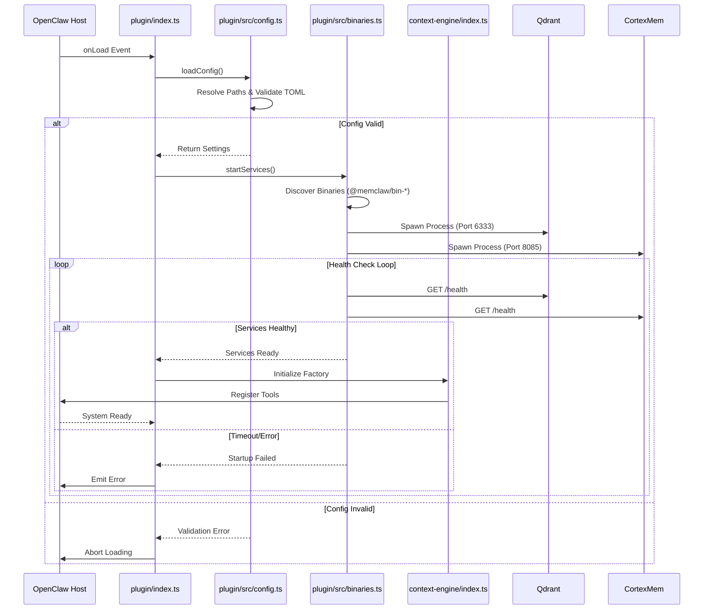
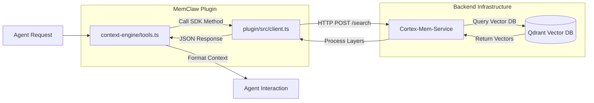
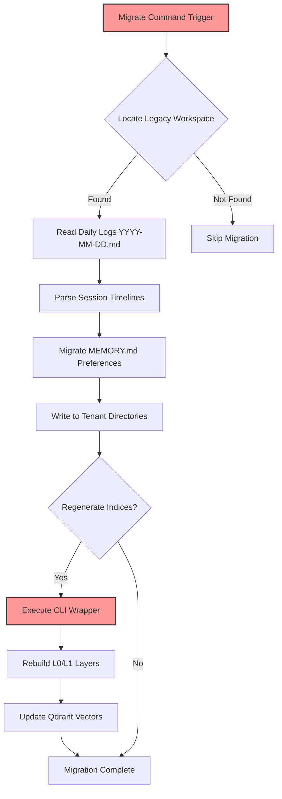

# 核心工作流

## 1. 工作流概览

MemClaw 系统作为模块化插件集成在 OpenClaw 主机生态系统中。其主要目标是为 AI 智能体提供智能的上下文检索和内存管理能力。系统架构依赖于严格的初始化顺序，以确保在暴露功能之前后端基础设施的稳定性。

### 系统主要工作流
1.  **插件初始化与服务启动**: 验证配置、发现平台特定的二进制文件并编排后端微服务（Qdrant 和 Cortex-Mem）生命周期的关键路径。
2.  **上下文检索与语义搜索**: 运行时操作流程，智能体通过类型化的 HTTP 客户端查询系统以获取相关的内存层（L0/L1/L2）。
3.  **遗留数据迁移**: 负责将数据从遗留 OpenClaw 架构过渡到新的租户隔离 MemClaw 结构的实用程序工作流。

### 核心执行路径
*   **引导**: 主机环境 → 插件入口 (`plugin/index.ts`) → 配置解析 → 二进制编排 → 引擎注册。
*   **运行时查询**: 智能体请求 → 上下文工具 → HTTP 客户端外观 → Cortex-Mem 服务 → 向量数据库 (Qdrant)。
*   **数据转换**: 迁移命令 → 工作区发现 → 日志解析 → 租户目录写入 → 索引重新生成。

### 关键流程节点
*   **配置验证**: 确保 `config.toml` 完整性和平台路径解析在任何服务启动之前。
*   **二进制生命周期**: 为 Qdrant（端口 6333）和 Cortex-Mem（端口 8085）生成和监控子进程。
*   **语义索引**: 由上下文引擎管理的分层检索逻辑（抽象、概览、完整内容）。

### 流程协调机制
系统使用 **依赖注入** 模式，其中更高层的域（核心上下文引擎）依赖于更低层的基础设施（系统编排）。配置作为路径和设置的单一事实来源，将业务逻辑与环境细节解耦。

---

## 2. 主要工作流

### 2.1 插件初始化与服务启动
此工作流建立操作基础。它确保所有基础设施组件健康并在向主机环境暴露工具之前准备就绪。

**流程执行顺序:**
1.  **插件注册**: `plugin/index.ts` 定义 API 契约和配置模式。
2.  **配置解析**: `plugin/src/config.ts` 解析操作系统特定的路径（Windows/macOS/Linux）并解析 `config.toml`。
3.  **二进制编排**: `plugin/src/binaries.ts` 定位原生二进制文件并生成后端服务。
4.  **健康验证**: 轮询 HTTP 端点以确认服务准备情况。
5.  **引擎初始化**: `context-engine/index.ts` 创建引擎工厂并注册工具。

**Mermaid 图: 初始化流程**

**输入/输出数据流:**
*   **输入**: 主机环境变量，`config.toml` 文件内容。
*   **输出**: 活动的子进程，注册的工具定义，验证的配置对象。
*   **状态转换**: `Stopped` → `Loading Config` → `Starting Services` → `Running` → `Failed`。

### 2.2 上下文检索与语义搜索
此工作流处理系统的核心智能，使智能体能够执行语义搜索并从向量数据库中检索内存层。

**流程执行顺序:**
1.  **智能体调用**: 主机触发插件中定义的上下文工具。
2.  **请求构造**: `context-engine/tools.ts` 格式化查询参数。
3.  **HTTP 外观**: `plugin/src/client.ts` 构造到 `cortex-mem-service` 的类型化 HTTP 请求。
4.  **分层搜索**: 服务使用 L0/L1/L2 索引层查询 Qdrant。
5.  **响应处理**: 检索的上下文被处理并注入到智能体交互中。

**Mermaid 图: 上下文检索序列**

**关键技术细节:**
*   **分层索引**: 实现 L0（抽象）、L1（概览）和 L2（完整内容）检索策略。
*   **会话管理**: 支持会话生命周期管理，包括通过 `sessionCommit` 进行的消息记录和会话提交。
*   **类型安全**: 使用 TypeScript 接口强制客户端和后台服务之间的严格契约。

### 2.3 遗留数据迁移
此实用程序工作流促进从遗留 OpenClaw 架构到新 MemClaw 租户隔离结构的过渡。

**流程执行顺序:**
1.  **触发**: 用户启动迁移命令或首次运行检测。
2.  **工作区位置**: `plugin/src/config.ts` 识别遗留工作区路径 (~/.openclaw/workspace)。
3.  **数据解析**: `plugin/src/migrate.ts` 解析每日内存日志 (YYYY-MM-DD.md)。
4.  **租户隔离**: 首选项和日志迁移到租户特定的目录。
5.  **索引重新生成**: CLI 命令触发重新生成 L0/L1 层和向量索引。

**Mermaid 图: 迁移流程**

---

## 3. 流程协调和控制

### 多模块协调机制
系统使用 **外观模式** 作为入口点，使用 **依赖链** 进行执行控制。
*   **入口点外观**: `plugin/index.ts` 和 `context-engine/index.ts` 充当双入口点，允许在插件如何被加载方面具有灵活性，同时保持 API 暴露与内部引擎逻辑之间的分离。
*   **配置依赖**: `系统编排` 域（`binaries.ts`）无法在没有来自 `配置管理`（`config.ts`）的有效配置的情况下启动。这是通过传递配置对象的显式函数调用强制执行的。
*   **服务耦合**: `核心上下文引擎` 完全依赖于 `系统编排` 来激活端口（6333, 8085）。如果二进制文件失败，引擎工具将变得无功能。

### 状态管理和同步
*   **进程跟踪**: `plugin/src/binaries.ts` 维护运行中的子进程的内存注册表，以管理生命周期事件（停止、重新启动）。
*   **配置同步**: 瞬态插件设置与持久 `config.toml` 设置合并。`validateConfig` 函数确保状态更改之前的一致性。
*   **健康状态**: 服务通过由 HTTP 健康检查响应定义的状态进行转换（`Ready`、`Unhealthy`、`Timeout`）。

### 数据传递和共享
*   **共享上下文**: 包含路径和 API 密钥的配置对象从入口点向下传递到二进制文件和引擎模块。
*   **租户隔离**: 在迁移期间，租户 ID 参数化目录结构，确保不同用户或工作区之间的数据隔离。
*   **API 契约**: `plugin/src/client.ts` 使用共享的 TypeScript 接口以确保在插件和 `cortex-mem-service` 之间传递的数据结构保持一致。

### 执行控制和调度
*   **异步启动**: 服务生成使用 `child_process.spawn` 和异步等待机制，以防止在初始化期间阻塞主机事件循环。
*   **同步风险**: `migrate.ts` 中的文件 I/O 操作当前使用同步模式（`fs.readFileSync`），这可能阻塞大数据集上的执行。这是由迁移实用程序作用域管理的受控瓶颈。
*   **重试逻辑**: `binaries.ts` 为服务启动验证实现基于超时的重试机制，以处理瞬态网络或资源争用问题。

---

## 4. 异常处理和恢复

### 错误检测和处理
*   **配置验证**: `plugin/src/config.ts` 检测格式错误的 TOML 文件或缺少的必需字段（例如 API 密钥）。它抛出特定错误以防止进一步启动。
*   **二进制发现**: `plugin/src/binaries.ts` 检查平台特定的包（例如 `@memclaw/bin-darwin-arm64`）是否存在。缺失的二进制文件触发立即失败。
*   **网络故障**: `plugin/src/client.ts` 捕获 HTTP 获取错误。当前，错误处理逻辑跨方法重复；建议集中化。

### 异常恢复机制
*   **健康检查重试**: 如果 `cortex-mem-service` 在生成后无法立即响应，系统在定义的超时窗口内重试 HTTP 健康检查，然后在声明服务死亡之前。
*   **幂等注入**: `plugin/src/agents-md-injector.ts` 对指南到 `AGENTS.md` 中执行幂等注入。如果多次运行，它会检测现有指南以防止重复或损坏。
*   **优雅降级**: 虽然未完全实现，但架构允许插件即使在后端服务离线时也能加载（尽管功能将受限），前提是主机不强制执行严格阻塞。

### 容错策略设计
*   **进程隔离**: 后端服务作为单独的子进程运行。如果 Qdrant 崩溃，Cortex-Mem 可能会继续运行，允许部分恢复或更容易地重新启动单个组件。
*   **版本兼容性**: 二进制包通过 npm 可选依赖版本固定，以确保插件逻辑和原生可执行文件之间的兼容性。

### 故障重试和降级
*   **启动超时**: `binaries.ts` 包括超时机制。如果服务未在限制内达到健康状态，初始化停止以防止挂起主机应用程序。
*   **CLI 后备**: 在迁移工作流中，如果 CLI 命令失败，过程记录错误但可能根据关键性继续（例如索引重新生成与数据复制）。
*   **建议**: 在 `context-engine/config.ts` 中实现运行时验证（例如 Zod）以替换不安全的类型断言，为配置失败提供更清晰的错误消息。

---

## 5. 关键流程实现

### 核心算法流程
*   **分层语义搜索**:
    *   **L0 (抽象)**: 检索高层摘要以进行快速相关性检查。
    *   **L1 (概览)**: 检索中等深度的上下文概览。
    *   **L2 (完整内容)**: 检索用于深度分析的详细内容。
    *   **实现**: 在 `plugin/src/client.ts` 中通过 `semanticSearch` 方法管理，抽象了底层向量查询复杂性。
*   **配置合并**:
    *   **逻辑**: 结合持久 `config.toml` 值和瞬态插件提供的设置。
    *   **优先级**: 瞬态设置通常覆盖持久性设置以实现运行时灵活性，但基本参数（API 密钥）优先持久性以确保安全性。
    *   **复杂性**: 当前实现具有高圈复杂度（22.0），由于更新和合并函数中的嵌套条件逻辑。

### 数据处理管道
*   **日志解析管道**:
    *   **输入**: 每日 Markdown 日志 (`YYYY-MM-DD.md`)。
    *   **转换**: 解析为具有确定时间戳的细粒度会话时间线文件。
    *   **输出**: 租户隔离的内存文件。
    *   **工具**: `plugin/src/migrate.ts`。
*   **向量索引管道**:
    *   **触发**: 迁移后或手动重新索引命令。
    *   **执行**: 通过 `binaries.ts` 调用外部 CLI 包装器。
    *   **目标**: 使用新嵌入更新 Qdrant 集合。

### 业务规则执行
*   **租户隔离**: 所有用户数据必须驻留在 `config.toml` 中配置的租户 ID 派生的目录中。这防止跨用户数据泄漏。
*   **指南执行**: `AGENTS.md` 文件必须包含特定的 MemClaw 指南。系统自动扫描和注入这些内容以确保合规性。
*   **路径解析**: 绝对路径在 `config.ts` 中使用 Node.js `os` 和 `path` 模块按操作系统（Windows 与 macOS/Linux）不同方式解析。

### 技术实现细节
*   **HTTP 客户端架构**:
    *   **库**: 使用原生 Node.js `fetch` API（零外部依赖）。
    *   **模式**: 类型化外观类 (`CortexMemClient`)。
    *   **弱点**: 错误处理中有显著的样板重复；缺乏用于日志记录/身份验证的集中拦截器。
    *   **改进**: 重构私有 `fetchJson` 方法以包括全局拦截器。
*   **二进制管理**:
    *   **发现**: 依赖于 npm 包解析 (`@memclaw/bin-*`)。
    *   **生成**: 使用 `child_process.spawn` 并适当的 stdio 处理。
    *   **配置生成**: 在启动期间动态生成 `qdrant-config.yaml`。
*   **优化机会**:
    *   **异步迁移**: 在 `migrate.ts` 中采用异步文件流而不是同步 fs 操作以提高可扩展性。
    *   **正则重构**: 重构 `agents-md-injector.ts` 中的正则表达式以降低圈复杂度。
    *   **验证**: 实现运行时模式验证以替换配置解析中不安全的类型断言。

---

*文档生成时间: 2026-04-05 06:06:52 (UTC)*
*时间戳: 1775369212*