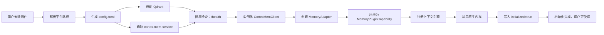
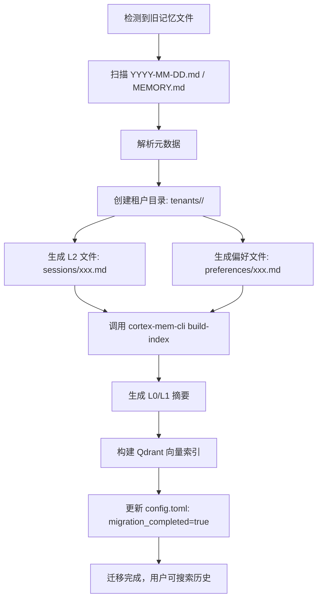

# Core Workflows

## 1. Workflow Overview

MemClaw 是一个为 OpenClaw 开发者平台深度集成的分层语义记忆系统，其核心价值在于将碎片化、临时性的开发上下文转化为可搜索、可复用、跨会话的结构化知识资产。系统通过“配置驱动、服务解耦、接口适配、渐进接管”的架构哲学，构建了一个零认知负担、开箱即用的智能记忆基础设施。

本系统共包含五大核心工作流，形成有机协同的业务闭环：

### 核心执行路径
1. **系统初始化与自动配置**：插件安装后触发的首条主线程流程，完成从配置生成、服务启动到插件注册的全链路自动化，是所有其他流程的前置依赖。
2. **记忆数据迁移与结构化**：在初始化完成后异步执行（或首次运行时同步执行），将旧版 OpenClaw 的非结构化记忆（如 `YYYY-MM-DD.md` 和 `MEMORY.md`）迁移至 MemClaw 的 L0/L1/L2 分层租户存储模型。
3. **智能记忆检索与使用**：开发者在编码过程中主动触发的高频核心交互流程，通过三级语义检索召回历史上下文，实现“记忆即代码”的开发范式。
4. **记忆配置自动增强**：插件启动时被动触发的辅助流程，自动向开发者文档 `AGENTS.md` 注入使用指南，降低新用户学习成本，提升系统采纳率。
5. **周期性维护与优化**（隐式流程）：由上下文引擎在后台周期性执行的系统自愈与性能优化任务，如向量索引重建、L1 层更新、缓存清理等，保障系统长期稳定运行。

### 关键流程节点
| 节点名称 | 所属工作流 | 负责模块 | 核心动作 |
|----------|------------|----------|----------|
| 配置生成 | 系统初始化 | 配置管理域 | 生成 TOML 配置模板，解析平台路径 |
| 服务启动 | 系统初始化 | 服务管理域 | 启动 Qdrant 与 cortex-mem-service，健康检查 |
| 接口适配 | 系统初始化 | 插件集成域 | 将 CortexMemClient 适配为 MemoryPluginCapability |
| 插件注册 | 系统初始化 | 插件集成域 | 向 OpenClaw 注册工具并禁用原生内存 |
| 数据扫描 | 数据迁移 | 数据迁移域 | 查找 `YYYY-MM-DD.md` 和 `MEMORY.md` |
| L2 转换 | 数据迁移 | 数据迁移域 | 构建带元数据的会话文件，隔离租户目录 |
| 索引构建 | 数据迁移 | 服务管理域 | 调用 cortex-mem-cli 生成 L0/L1 与向量索引 |
| 语义搜索 | 智能检索 | 服务交互域 | 构造 REST 请求，调用 L0/L1/L2 分层检索 |
| 响应适配 | 智能检索 | 插件集成域 | 转换为 OpenClaw 兼容格式，缓存结果 |
| 文档注入 | 配置增强 | 配置增强域 | 幂等注入 MemClaw 使用模板，创建备份 |
| 状态标记 | 多流程共享 | 配置管理域 | 记录迁移完成、注入完成等状态标志 |

### 过程协调机制
- **配置中心化驱动**：所有工作流均依赖 `配置管理域` 提供的统一路径与策略（如数据目录、服务端口、自动捕获开关），实现“配置即代码”的行为控制。
- **服务解耦与封装**：Qdrant 和 cortex-mem-service 被抽象为“二进制管理”与“HTTP 客户端”两个独立域，技术栈可独立演进。
- **幂等性保障**：在数据迁移、文档注入等关键操作中，采用“备份+状态标记”机制（如 HTML 注释、配置标志），确保操作可重试、无副作用。
- **渐进式接管**：通过“注册 + 禁用”模式平滑替换 OpenClaw 原生内存，避免中断用户工作流，实现无缝升级。
- **生命周期管理**：插件集成域通过全局 `MemorySearchManager` 注册表管理多代理并发访问，确保缓存状态与资源释放的线程安全。

---

## 2. Main Workflows

### 2.1 系统初始化与自动配置（System Initialization & Auto-Configuration）

#### 业务价值
这是 MemClaw 的“首次运行体验”核心，决定了用户对系统的第一印象。其目标是实现“安装即可用”，消除传统插件需手动配置、启动服务、迁移数据的高认知负担，提升采纳率与用户满意度。

#### 技术流程详解
1. **配置生成（Configuration Generation）**
   - **入口**：`context-engine/index.ts` → `context-engine/config.ts`
   - **输入**：无（首次安装）
   - **执行逻辑**：
     - 根据操作系统（Windows/macOS/Linux）调用 `resolveDataDirectory()` 自动计算平台专属数据路径（如 `~/.memclaw` 或 `%APPDATA%\MemClaw`）。
     - 检查配置文件 `config.toml` 是否存在，若不存在，则加载内置 TOML 模板（含默认端口、自动捕获开关、L0/L1/L2 策略）。
     - 写入磁盘，并调用 `openConfigInEditor()` 在系统默认编辑器中打开配置文件（如 VSCode），引导用户自定义。
   - **输出**：`<data-dir>/config.toml` 文件，内容示例：
     ```toml
     [auto_capture]
     enabled = true
     max_context_length = 8192

     [service]
     port = 8080
     qdrant_port = 6333

     [memory]
     retention_days = 30
     ```
   - **业务意义**：配置文件是系统行为的唯一权威源，后续所有流程均依赖此文件的路径与参数。

2. **服务启动（Service Startup）**
   - **入口**：`context-engine/index.ts` → `context-engine/binaries.ts`
   - **输入**：`config.toml` 中的 `service.port`、`qdrant_port`
   - **执行逻辑**：
     - 调用 `resolveBinaryPath("qdrant")` 和 `resolveBinaryPath("cortex-mem-service")`，从 npm 包的 `bin-*` 目录中定位平台对应二进制文件。
     - 设置执行权限（Linux/macOS 执行 `chmod +x`）。
     - 启动 Qdrant 服务（监听 `qdrant_port`）与 cortex-mem-service（监听 `port`）。
     - 启动健康检查协程：每 500ms 发送 `GET /health` 请求（非端口监听），等待返回 `{"status":"healthy"}`，超时 15 秒失败。
   - **输出**：两个本地服务进程运行，端口可访问。
   - **技术细节**：使用 `child_process.spawn()` 启动，捕获 stderr/stdout 用于日志记录；服务启动失败时，记录错误并提示用户手动安装依赖。

3. **接口适配（Interface Adaptation）**
   - **入口**：`context-engine/index.ts` → `plugin/src/memory-adapter.ts`
   - **输入**：`CortexMemClient` 实例（基于 `config.toml` 中的 service 地址初始化）
   - **执行逻辑**：
     - 实例化 `CortexMemorySearchManager`，实现 OpenClaw 的 `MemorySearchManager` 接口。
     - 重写 `search()` 方法：将 OpenClaw 的关键词查询 → 转换为 CortexMemClient 的 `semanticSearch(query, { tiers: ['L0', 'L1', 'L2'] })`。
     - 实现 `getPromptBuilder()`、`getFlushPlanResolver()`、`getRuntimeHandler()` 等扩展接口，支持 OpenClaw 的上下文注入与内存刷新机制。
     - 注册到全局 `MemorySearchManagerRegistry`，支持多 Agent 并发场景下的状态隔离。
   - **输出**：一个符合 OpenClaw 插件规范的 `MemoryPluginCapability` 实例。

4. **插件注册与禁用（Plugin Registration & Replacement）**
   - **入口**：`context-engine/index.ts`
   - **输入**：适配后的 `MemoryPluginCapability` 实例
   - **执行逻辑**：
     - 调用 OpenClaw 的 `registerContextEngine()` 注册 MemClaw 上下文引擎。
     - 调用 `registerMemoryTool()` 注册语义搜索工具。
     - 调用 `disableNativeMemory()` 强制关闭 OpenClaw 内置记忆模块（防止冲突）。
     - 写入 `initialized: true` 标志至配置文件，避免重复初始化。
   - **输出**：OpenClaw 界面中“记忆”功能完全由 MemClaw 接管，用户可立即使用语义搜索。

#### 数据流图


#### 关键依赖
- **强依赖**：配置管理域 → 服务管理域（路径/端口）、插件集成域（适配器）
- **时序依赖**：服务启动必须在接口适配之前完成，否则 CortexMemClient 无法连接。
- **幂等性**：通过 `initialized` 标志保证多次安装不重复执行。

---

### 2.2 记忆数据迁移与结构化（Memory Migration & Structuring）

#### 业务价值
解决用户从 OpenClaw 升级至 MemClaw 的“历史数据孤岛”问题，确保用户多年积累的开发经验不因系统更换而丢失，实现“知识资产平滑迁移”，极大提升用户迁移意愿。

#### 技术流程详解
1. **旧数据扫描（Legacy Data Discovery）**
   - **入口**：`plugin/src/migrate.ts`
   - **输入**：`config.toml` 中的 `data_dir`、`legacy_memory_path`
   - **执行逻辑**：
     - 按优先级顺序查找：
       1. `config.legacy_memory_path`（用户自定义）
       2. 环境变量 `OPENCLAW_MEMORY_DIR`
       3. 默认路径：`~/.openclaw/memory/`
     - 遍历目录，识别所有 `YYYY-MM-DD.md`（每日会话日志）与 `MEMORY.md`（全局记忆）。
   - **输出**：待迁移文件列表。

2. **L2 层转换与租户隔离（L2 Conversion & Tenant Isolation）**
   - **输入**：原始 `.md` 文件内容
   - **执行逻辑**：
     - 对 `YYYY-MM-DD.md`：解析文件头元数据（如 `session_id`, `start_time`, `project_path`），保留原始内容，重命名为 `<tenant_id>/sessions/<session_id>.md`，并添加 MemClaw 元数据头部：
       ```markdown
       ---
       memclaw_version: 1.2
       session_id: abc-123
       created_at: 2024-06-15T10:00:00Z
       project: my-app
       tags: [react, api, bugfix]
       ---
       # 2024-06-15 会话记录
       ...
       ```
     - 对 `MEMORY.md`：提取每个记忆块（以 `---` 分隔），转换为独立的 `<tenant_id>/preferences/<key>.md` 文件，作为用户偏好记忆。
     - 所有文件写入 `data_dir/tenants/<user_id>/` 目录下，实现多租户隔离。
   - **输出**：结构化 L2 层原始内容文件（完整会话/偏好）。

3. **L0/L1 生成与向量索引构建（Summary & Index Generation）**
   - **入口**：`plugin/src/migrate.ts` → `plugin/src/binaries.ts`
   - **输入**：迁移完成的 L2 文件目录
   - **执行逻辑**：
     - 调用 `executeCliCommand('cortex-mem-cli', ['build-index', '--data-dir', dataDir])`
     - `cortex-mem-cli` 工具执行：
       - 对每个 L2 文件，使用嵌入模型（如 Sentence-BERT）生成语义向量。
       - 生成 L0（摘要）：提取首段、关键词、标签。
       - 生成 L1（概览）：合并相似会话，生成主题摘要。
       - 写入 L0/L1 文件至 `data_dir/tenants/<id>/summaries/`。
       - 将所有向量写入 Qdrant 向量数据库，建立索引（collection: `memclaw_tenant_<id>`）。
   - **输出**：Qdrant 中完成向量索引，L0/L1 文件生成，系统可支持语义搜索。

4. **迁移状态标记（Migration Status Finalization）**
   - **入口**：`plugin/src/migrate.ts` → `plugin/src/config.ts`
   - **输入**：迁移成功标志
   - **执行逻辑**：
     - 更新 `config.toml`，写入 `migration_completed: true`。
     - 删除临时迁移日志文件。
   - **输出**：防止下次启动重复迁移。

#### 数据流图


#### 关键依赖
- **强依赖**：服务管理域（必须在服务启动后才能调用 CLI）。
- **时序依赖**：L2 转换 → L0/L1 生成 → 索引构建，不可颠倒。
- **容错设计**：若 CLI 执行失败，记录错误日志但不阻塞插件启动，用户可手动重试。

---

### 2.3 智能记忆检索与使用（Intelligent Memory Retrieval）

#### 业务价值
这是 MemClaw 的核心价值体现点。开发者在编码时输入关键词（如“如何处理 JWT 过期”），系统能精准召回过去会话中相关代码片段、调试思路、API 使用方式，实现“记忆即代码”的智能辅助，显著减少重复搜索与上下文切换成本。

#### 技术流程详解
1. **语义搜索请求构造（Semantic Search Request）**
   - **入口**：OpenClaw 触发 `MemorySearchManager.search(query)` → `plugin/src/memory-adapter.ts`
   - **输入**：用户输入的自然语言查询（如 “如何在 React 中使用 useReducer”）
   - **执行逻辑**：
     - `MemoryAdapter.search()` 调用 `CortexMemClient.semanticSearch(query, { tiers: ['L0', 'L1', 'L2'], tenant: currentTenant })`
     - 构造 HTTP 请求：`POST /v1/search/semantic`，Body 包含：
       ```json
       {
         "query": "如何在 React 中使用 useReducer",
         "tiers": ["L0", "L1", "L2"],
         "limit": 5,
         "tenant_id": "user_abc123"
       }
       ```

2. **分层响应获取（Tiered Response Retrieval）**
   - **入口**：`plugin/src/client.ts`
   - **输入**：构造的请求体
   - **执行逻辑**：
     - 调用私有 `fetchJson()` 方法，使用 `fetch()` 发起请求。
     - 处理响应：
       - **L0**：摘要（1–2 句话，如 “使用 useReducer 管理复杂状态，推荐用于跨组件共享状态”）
       - **L1**：概览（3–5 个关键点，如 “1. 定义初始状态 2. 创建 reducer 函数 3. 使用 dispatch 触发更新”）
       - **L2**：完整内容（原始会话内容，含代码块、注释、上下文）
     - 支持租户上下文切换：通过 `X-Tenant-ID` 请求头自动切换当前用户环境。
   - **输出**：JSON 结构响应：
     ```json
     {
       "L0": [{"text": "摘要内容", "source": "sessions/abc123.md"}],
       "L1": [{"text": "概览内容", "source": "sessions/abc123.md"}],
       "L2": [{"text": "完整会话内容...", "source": "sessions/abc123.md", "timestamp": "2024-06-15T10:00:00Z"}]
     }
     ```

3. **响应适配与缓存管理（Response Adaptation & Caching）**
   - **入口**：`plugin/src/memory-adapter.ts`
   - **输入**：CortexMemClient 返回的原始响应
   - **执行逻辑