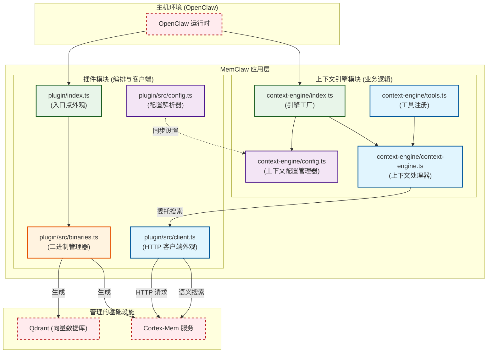

# 核心上下文引擎文档

**版本:** 1.0  
**域:** 核心业务域 (MemClaw 系统)  
**状态:** 活跃  
**最后更新:** 2026-04-05 06:07:41 (UTC)  

---

## 1. 执行摘要

**核心上下文引擎** 是 MemClaw 系统的智能层，设计用于为 OpenClaw 生态系统内的 AI 智能体提供持久内存、语义搜索和上下文检索能力。它充当高级智能体交互与低级向量数据库操作之间的桥梁。

基于模块化插件架构，核心上下文引擎利用 **双入口点策略** (`plugin` 和 `context-engine`) 来确保跨主机环境的灵活性。其主要职责是管理上下文处理的生命周期、执行分层语义搜索以及格式化检索出的数据以供下游 AI 智能体使用。

### 关键价值主张
*   **持久内存:** 通过租户隔离结构使智能体能够跨会话保留知识。
*   **语义搜索:** 利用针对 Qdrant 向量数据库的分层索引 (L0/L1/L2) 实现高效检索。
*   **类型安全:** 为 API 交互和配置管理实现严格的 TypeScript 接口。
*   **基础设施抽象:** 将业务逻辑与原生二进制管理 (Qdrant、Cortex-Mem) 解耦。

---

## 2. 系统架构

核心上下文引擎在更广泛的 MemClaw 应用层中运行。它与系统编排域密切交互以获取基础设施健康状态，与配置管理域交互以同步设置。

### 2.1 逻辑分解

以下图表说明了核心上下文引擎在 MemClaw 架构中的位置，突出了其依赖关系和内部结构。

### 2.2 组件边界
*   **核心上下文引擎域:** 包括 `context-engine/*.ts` 和 `plugin/src/client.ts`。负责业务逻辑、工具注册和 API 抽象。
*   **系统编排域:** 包括 `plugin/src/binaries.ts`。负责生成引擎消费的后端服务 (Cortex-Mem、Qdrant)。
*   **外部服务:** Cortex-Mem (端口 8085) 和 Qdrant (端口 6333) 由外部管理但通过客户端外观逻辑集成。

---

## 3. 关键组件

核心上下文引擎由三个主要子模块组成，每个子模块在内存检索管道中执行不同的功能。

### 3.1 HTTP 客户端外观 (`plugin/src/client.ts`)
此组件充当引擎与后端微服务之间的通信桥梁。
*   **职责:** 提供与 Cortex-Mem 服务的 REST API 交互的类型化包装器。
*   **关键函数:**
    *   `fetchJson()`: 带有错误处理的通用 JSON 获取器。
    *   `semanticSearch()`: 针对向量索引执行查询。
    *   `sessionCommit()`: 持久化新的上下文数据。
*   **技术实现:** 使用异步 HTTP 请求。实现重试逻辑和超时配置以确保对短暂网络故障的弹性。

### 3.2 上下文处理器 (`context-engine/context-engine.ts`)
这是负责管理引擎生命周期和格式化数据的中央逻辑单元。
*   **职责:** 管理引擎状态、处理检索出的数据块以及格式化主机智能体的输出。
*   **关键函数:**
    *   `createEngine()`: 使用必要的配置初始化引擎实例。
    *   `handleContextRequest()`: 编排从查询到响应的流程。
*   **生命周期:** 与主机环境的插件生命周期钩子相关联。确保在关闭时清理资源。

### 3.3 工具注册 (`context-engine/tools.ts`)
此模块向外部 OpenClaw 运行时暴露功能。
*   **职责:** 在主机环境中注册工具，使智能体能够以编程方式查询内存。
*   **关键函数:**
    *   `registerTools()`: 定义可用内存工具的架构和处理器。
    *   `injectContext()`: 将检索出的内存合并到活跃的对话上下文中。

---

## 4. 核心工作流

### 4.1 上下文检索与语义搜索
这是引擎展示其业务价值的主要操作工作流。

1.  **请求发起:** 智能体通过 `context-engine/tools.ts` 调用注册的工具。
2.  **客户端构造:** `plugin/src/client.ts` 构造针对 Cortex-Mem 服务的类型化 HTTP 请求。
3.  **分层执行:** 搜索使用分层方法针对向量数据库 (Qdrant) 执行：
    *   **L0:** 即时短期内存。
    *   **L1:** 最近会话上下文。
    *   **L2:** 长期持久知识。
4.  **处理:** 结果返回到 `context-engine/context-engine.ts`。
5.  **格式化:** 数据被清理并格式化为注入到智能体的提示上下文中。

### 4.2 引擎初始化
在检索发生之前，引擎必须与基础设施一起初始化。

1.  **入口:** 主机加载 `context-engine/index.ts`。
2.  **配置:** `context-engine/config.ts` 定义默认参数；`plugin/src/config.ts` 验证平台特定路径。
3.  **依赖检查:** 引擎等待来自 `plugin/src/binaries.ts` 的确认，确保 Cortex-Mem 和 Qdrant 健康。
4.  **注册:** 工具暴露给主机环境。

---

## 5. 配置与状态管理

正确的配置确保跨不同部署环境 (Windows、macOS、Linux) 的一致性。

### 5.1 配置文件
*   **`plugin/src/config.ts` (配置解析器):** 处理 TOML 生命周期、平台特定目录解析以及合并瞬态/持久设置。这是路径位置的 **真实来源**。
*   **`context-engine/config.ts` (上下文配置管理器):** 定义 `ContextEngineConfig` 接口和引擎特定的默认值。

### 5.2 最佳实践
*   **同步:** 确保 `context-engine/config.ts` 引用由 `plugin/src/config.ts` 解析的路径以防止状态发散。
*   **验证:** 在 `context-engine/config.ts` 中实现运行时验证 (例如 Zod) 以替换配置解析期间不安全的类型断言。
*   **异步加载:** 虽然关键配置解析应为稳定保持同步，但服务发现应利用异步模式以避免阻塞主线程。

---

## 6. 集成与依赖

核心上下文引擎不是孤立运行的。它对系统编排域有严格的依赖。

| 依赖 | 类型 | 描述 | 关键性 |
| :--- | :--- | :--- | :--- |
| **系统编排** | 服务调用 | 需要 Cortex-Mem 运行以进行 API 调用。 | **高 (10.0)** |
| **配置管理** | 数据依赖 | 需要有效路径用于日志存储和租户目录。 | **中-高 (8.5)** |
| **迁移与合规** | 工具支持 | 可能在迁移后调用二进制文件以重新生成索引。 | **中 (7.0)** |

---

## 7. 技术考虑与已知问题

基于架构验证和漂移分析，以下考虑适用于维护此模块的开发者。

### 7.1 二进制管理重复
*   **观察:** 有两个文件可能管理二进制文件：`plugin/src/binaries.ts` 和 `context-engine/binaries.ts`。
*   **风险:** 逻辑重复可能导致不一致的服务生成行为。
*   **建议:** 将二进制生成逻辑合并到 `plugin/src/binaries.ts` 中。验证 `context-engine/binaries.ts` 是否服务于专门的实用程序角色或是否已弃用。

### 7.2 性能优化
*   **当前状态:** 迁移和重配置任务当前使用同步文件 I/O。
*   **影响:** 大数据集的潜在性能瓶颈。
*   **建议:** 在迁移实用程序 (`migrate.ts`) 中采用异步文件流以提高可扩展性而不损害启动稳定性。

### 7.3 错误处理标准化
*   **当前状态:** `plugin/src/client.ts` 中的 HTTP 配置和错误处理可能因方法而异。
*   **建议:** 在客户端外观内集中 HTTP 配置和错误处理中间件，以消除样板重复并确保一致的故障模式。

### 7.4 安全与合规
*   **租户隔离:** 确保所有内存操作尊重配置中定义的租户边界。
*   **指南执行:** `agents-md-injector.ts` 模块以幂等方式将指南注入 `AGENTS.md`。确保此过程不与用户编辑冲突。

---

## 8. 附录：文件参考

| 文件路径 | 模块 | 职责 |
| :--- | :--- | :--- |
| `context-engine/index.ts` | 入口点 | 引擎工厂初始化。 |
| `context-engine/context-engine.ts` | 核心逻辑 | 上下文处理与生命周期。 |
| `context-engine/tools.ts` | 接口 | 主机智能体的工具注册。 |
| `context-engine/config.ts` | 支持 | 引擎特定配置接口。 |
| `plugin/src/client.ts` | 核心逻辑 | 用于 Cortex-Mem 的 HTTP 客户端外观。 |
| `plugin/src/binaries.ts` | 基础设施 | 二进制发现与服务生成。 |
| `plugin/src/config.ts` | 支持 | 平台路径解析和 TOML 解析。 |