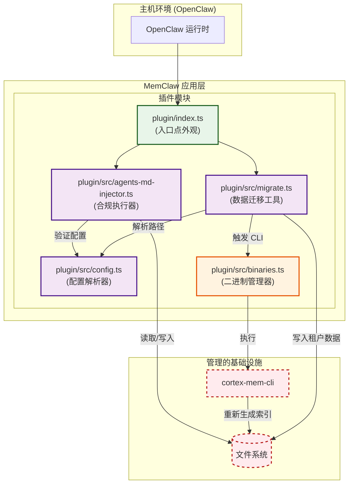
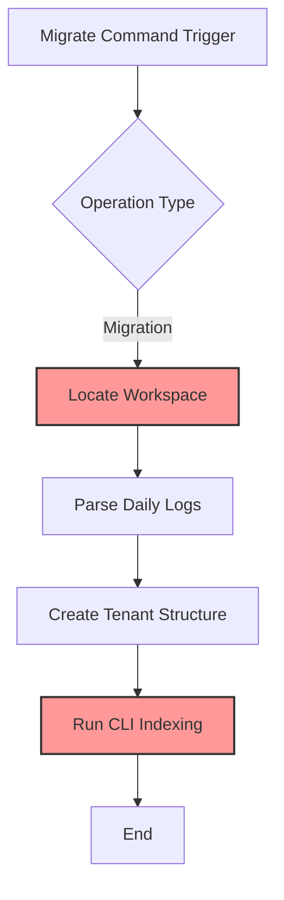
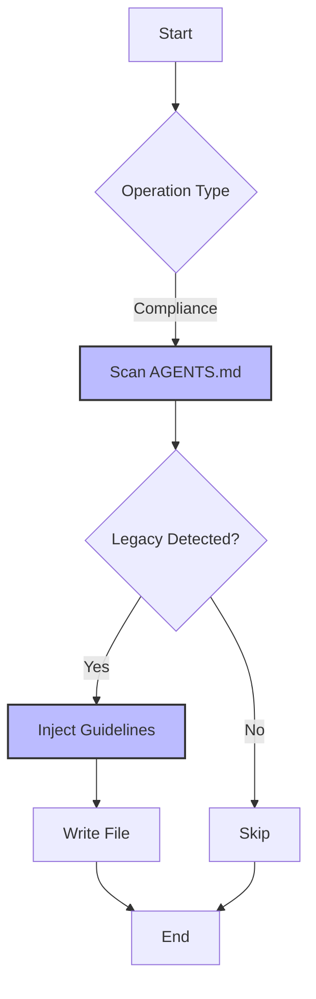

# 迁移与合规模块文档

**版本:** 1.0  
**域:** 工具支持域  
**状态:** 活跃  
**最后更新:** `2026-04-05 06:09:44 (UTC)`

---

## 1. 执行摘要

**迁移与合规** 模块作为遗留 OpenClaw 架构与现代 MemClaw 标准之间的过渡桥梁。它涵盖两个主要功能支柱：**数据迁移**，它将历史内存日志重构为租户隔离的会话时间线；以及**合规执行**，它确保智能体配置文件遵守更新的内存使用指南。

此域在更广泛的 MemClaw 生态系统中被归类为 **工具支持域**。虽然其操作频率可能低于核心业务域，但其关键性在系统升级、初始设置和长期维护期间很高，以确保向后兼容性和数据完整性。

---

## 2. 架构概览

该模块在 MemClaw 架构的 **插件层** 内运行，利用集成到 OpenClaw 生态系统中的模块化插件设计。它很大程度上依赖 **配置管理** 域进行路径解析，依赖 **系统编排** 域执行索引重新生成所需的外部 CLI 二进制文件。

### 2.1 高层架构图



### 2.2 域关系

*   **配置依赖:** 迁移与合规需要有效配置 (`plugin/src/config.ts`) 来定位遗留工作区并定义目标租户目录。
*   **服务调用:** 迁移后索引重新生成依赖于 `plugin/src/binaries.ts` 来调用外部 CLI 工具 (`cortex-mem-cli`)。
*   **基础设施耦合:** 两个子模块都直接与本地文件系统交互，需要严格的权限处理和路径验证。

---

## 3. 核心组件

该域分为两个不同的子模块，每个模块负责过渡过程的特定方面。

### 3.1 数据迁移工具 (`plugin/src/migrate.ts`)

**职责:** 将遗留内存工件转换为新的租户隔离结构并触发向量索引重新生成。

*   **关键函数:**
    *   `locateWorkspace()`: 使用环境变量 (`OPENCLAW_HOME`) 解析遗留路径，然后回退到默认值。
    *   `migrateLogs()`: 将 `YYYY-MM-DD.md` 每日日志解析为细粒度会话时间线文件。
    *   `regenerateIndices()`: 执行外部二进制文件以重建 L0/L1/L2 向量层。
*   **技术实现:**
    *   使用 Node.js 核心库 (`fs`, `path`, `os`) 进行文件系统管理。
    *   **当前限制:** 在异步函数内实现同步 I/O 操作。在大数据集上，这可能导致事件循环阻塞。建议重构为异步文件流以提高可扩展性。
    *   **错误处理:** 包装在 `try-catch` 块中，返回结构化结果对象以促进优雅降级。

### 3.2 合规执行器 (`plugin/src/agents-md-injector.ts`)

**职责:** 在智能体配置文件 (`AGENTS.md`) 中强制执行 MemClaw 内存使用指南。

*   **关键函数:**
    *   `scanMarkdown()`: 读取配置文件以检测遗留内存模式。
    *   `injectGuidelines()`: 使用幂等 HTML 标记附加 MemClaw 特定说明。
    *   `removeLegacyKeywords()`: 删除已弃用的指令以防止冲突。
*   **技术实现:**
    *   使用正则表达式进行模式检测。
    *   通过唯一 HTML 标记确保幂等性，防止重复运行时的重复指南注入。
    *   返回 `InjectionResult` 对象，指示成功状态和修改计数。

---

## 4. 操作工作流

### 4.1 遗留数据迁移工作流

此工作流通常在系统更新期间或通过手动 CLI 命令触发。



**逐步执行:**
1.  **路径解析:** 迁移器查询配置管理器以识别遗留工作区目录。
2.  **日志解析:** 每日日志文件 (`YYYY-MM-DD.md`) 被读取并解析为结构化会话数据。
3.  **目录创建:** 创建租户隔离的目录以安全地隔离用户数据。
4.  **索引重新生成:** 二进制管理器调用 `cortex-mem-cli` 基于新数据结构重新生成向量索引。

### 4.2 合规执行工作流

此工作流在插件初始化期间自动运行或按需运行以确保配置有效性。



**逐步执行:**
1.  **扫描:** 执行器读取目标 `AGENTS.md` 文件。
2.  **模式匹配:** 正则表达式扫描与 MemClaw 标准冲突的遗留内存模式。
3.  **注入:** 如果检测到遗留模式，使用幂等标记注入 MemClaw 指南。
4.  **持久化:** 更新的文件仅在有更改时才写回文件系统。

---

## 5. API 接口参考

该模块暴露标准化接口，用于与其他域或外部脚本交互。

### 5.1 合规接口
位于 `plugin/src/agents-md-injector.ts`。

```typescript
/**
 * 确保 AGENTS.md 包含必要的 MemClaw 指南。
 * @param logger - 用于审计跟踪的日志记录器实例。
 * @param enabled - 切换执行逻辑的标志。
 * @returns 包含状态和修改详情的 InjectionResult。
 */
export function ensureAgentsMdEnhanced(
  logger: Logger, 
  enabled: boolean
): Promise<InjectionResult>;
```

### 5.2 迁移接口
位于 `plugin/src/migrate.ts`。

```typescript
/**
 * 执行从 OpenClaw 到 MemClaw 的完整迁移管道。
 * @param log - 用于进度跟踪的日志处理器。
 * @returns 包含成功指标和错误摘要的 MigrationResult。
 */
export function migrateFromClaw(log: LogHandler): Promise<MigrationResult>;
```

---

## 6. 配置与依赖

### 6.1 环境变量
该模块优先使用环境变量而非配置文件进行路径解析。

| 变量 | 描述 | 默认值 |
| :--- | :--- | :--- |
| `OPENCLAW_HOME` | 遗留工作区数据的根目录 | `undefined` |
| `MEMCLAW_DATA_DIR` | 租户隔离数据的目标目录 | 从操作系统临时/用户目录派生 |

### 6.2 外部二进制文件
迁移需要访问由 **系统编排** 域管理的原生二进制文件。

*   **`cortex-mem-cli`**: 迁移后向量索引重新生成所需。
*   **`Qdrant` / `Cortex-Mem`**: 必须通过 `binaries.ts` 运行以成功索引。

---

## 7. 实现风险与优化机会

基于架构分析，以下领域需要关注以确保长期稳定性和性能。

### 7.1 同步 I/O 阻塞
*   **问题:** `plugin/src/migrate.ts` 当前在异步上下文中使用同步文件系统调用。
*   **风险:** 大数据集可能冻结主线程，降低应用程序响应能力。
*   **建议:** 重构为使用 Node.js 基于流的 API (`createReadStream`, `createWriteStream`) 以启用非阻塞 I/O。

### 7.2 正则表达式复杂性
*   **问题:** 合规执行器依赖复杂的正则表达式进行 Markdown 解析。
*   **风险:** 高圈复杂度增加维护开销和边缘情况失败的潜在性。
*   **建议:** 考虑采用 Markdown AST 解析器库替换正则表达式繁重的逻辑，以实现更稳健的内容操作。

### 7.3 配置同步
*   **问题:** `plugin/src/config.ts` 和 `context-engine/config.ts` 之间可能发生偏离。
*   **风险:** 如果模块之间的设置不同，迁移路径可能解析不正确。
*   **建议:** 实现集中式配置聚合器以确保路径解析的单一事实来源。

### 7.4 错误处理标准化
*   **问题:** 跨迁移步骤的错误处理各不相同。
*   **建议:** 在 `plugin/src/client.ts` 中集中 HTTP 配置和错误处理，以消除样板重复并确保一致的重试策略。

---

## 8. 结论

**迁移与合规** 模块是 MemClaw 进化策略的关键推动者。通过自动化遗留数据过渡和执行配置标准，它确保数据完整性和系统一致性。虽然当前实现提供基本功能，但坚持推荐的优化——特别是关于异步 I/O 和依赖管理——将显著增强未来版本的可扩展性和可维护性。