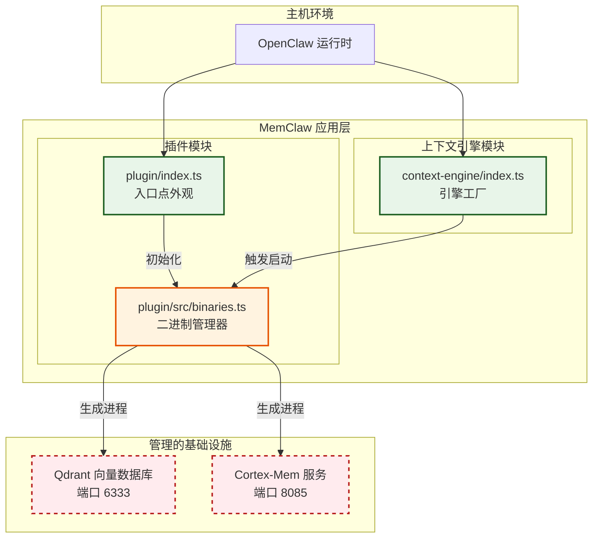

# 系统编排文档

**项目:** MemClaw  
**域:** 系统编排  
**版本:** 1.0.0  
**最后更新:** 2026-04-05 06:08:20 (UTC)

---

## 1. 介绍

**系统编排** 域是 MemClaw 系统的基础设施骨干。其主要职责是管理内存持久化和语义搜索所需的关键后端微服务的生命周期、发现和健康状态。具体来说，它在主机环境 (OpenClaw 生态系统) 内编排运行 **Qdrant** (向量数据库) 和 **Cortex-Mem** (上下文服务) 的原生二进制文件。

此模块确保所有基础设施组件在应用程序向 AI 智能体暴露功能之前处于运行状态、健康且正确配置。它充当高级业务逻辑 (上下文引擎) 与低级原生执行环境之间的桥梁。

---

## 2. 架构概览

MemClaw 采用 **双入口点策略**，将关注点分离为 `plugin` 模块和 `context-engine` 模块。系统编排主要驻留在 `plugin` 模块内，但与两个入口点都密切交互。

### 2.1 逻辑位置
系统编排层位于应用逻辑下方和管理基础设施上方。它从系统其余部分抽象平台特定的复杂性 (例如 Darwin ARM64 与 Linux)。



### 2.2 关键设计原则
*   **原生二进制抽象:** 后端服务不是 Docker 容器，而是与应用程序捆绑的原生可执行文件 (例如 `@memclaw/bin-darwin-arm64`)。
*   **异步生命周期:** 服务生成和健康检查利用异步操作以防止阻塞主线程。
*   **配置驱动:** 编排逻辑完全依赖配置管理域解析的验证配置路径 (TOML)。

---

## 3. 核心组件

### 3.1 二进制管理器
*   **文件路径:** `plugin/src/binaries.ts`
*   **职责:** 处理二进制发现、进程生成和健康验证。
*   **关键函数:**
    *   `discoverBinary(platform, arch)`: 基于操作系统环境定位正确的原生可执行文件。
    *   `spawnService(name, args, cwd)`: 为 Qdrant 或 Cortex-Mem 启动子进程。
    *   `checkHealth(serviceName, endpoint)`: 执行 HTTP GET 请求以验证服务准备情况。
*   **重要性:** 关键 (9.5/10)。此处的失败会使内存系统不可用。

### 3.2 入口点外观
*   **文件路径:** `plugin/index.ts`, `context-engine/index.ts`
*   **职责:** 定义 API 契约并在主机加载时启动编排流程。
*   **关键函数:**
    *   `onLoad()`: 触发初始化序列。
    *   `definePlugin()`: 向 OpenClaw 注册插件功能。
    *   `registerHooks()`: 将生命周期事件连接到编排处理器。

### 3.3 实用程序二进制包装器
*   **文件路径:** `context-engine/binaries.ts` (次要)
*   **注意:** 此文件存在于项目结构中，但需要架构审查以确保与 `plugin/src/binaries.ts` 的逻辑一致性以避免重复。

---

## 4. 操作工作流

### 4.1 插件初始化与服务启动
此工作流建立操作基础。它必须在任何智能体交互发生之前成功完成。

1.  **注册:** `plugin/index.ts` 定义 API 契约。
2.  **配置解析:** `plugin/src/config.ts` 验证 `config.toml` 并解析平台特定路径。
3.  **二进制发现:** `plugin/src/binaries.ts` 定位原生可执行文件。
4.  **服务生成:** Qdrant (端口 6333) 和 Cortex-Mem (端口 8085) 的子进程被启动。
5.  **健康验证:** 系统轮询端点直到服务返回 `200 OK`。
6.  **引擎就绪:** 一旦基础设施确认，`context-engine/index.ts` 初始化工厂。

### 4.2 遗留数据迁移支持
在系统升级期间，编排域支持数据迁移工作流。

1.  **路径解析:** 配置管理提供遗留工作区路径。
2.  **数据移动:** 迁移脚本将日志/首选项移动到租户隔离的目录。
3.  **索引重新生成:** `plugin/src/binaries.ts` 调用 CLI 包装器以在迁移后重新生成 L0/L1 向量索引。

---

## 5. 集成与依赖

系统编排不是孤立运行的。它对其他域有严格的依赖。

| 依赖 | 域 | 关系类型 | 描述 |
| :--- | :--- | :--- | :--- |
| **配置管理** | `plugin/src/config.ts` | **配置依赖** | 在尝试生成二进制之前需要有效的 TOML 和解析的路径。 |
| **核心上下文引擎** | `context-engine/*` | **服务调用提供者** | 提供语义搜索所需的运行基础设施 (API 端点)。 |
| **迁移与合规** | `plugin/src/migrate.ts` | **工具支持** | 调用由二进制管理器管理的 CLI 命令以重新生成索引。 |

**流程约束:** 核心上下文引擎无法在系统编排成功启动 Cortex-Mem 服务的情况下运行。这创建了严格的启动顺序依赖。

---

## 6. 实现指南

### 6.1 平台特异性
实现二进制发现时，确保支持目标架构:
*   **macOS:** `bin-darwin-arm64`
*   **Windows/Linux:** 对应的二进制文件必须以类似方式打包。
*   **路径处理:** 始终使用 `path.resolve()` 结合 `os.homedir()` 或配置中定义的环境变量来解析路径。

### 6.2 错误处理与弹性
*   **超时:** 检查服务健康时实现基于超时的重试以防止启动缓慢期间的无限挂起。
*   **进程清理:** 确保如果主机环境意外关闭 (处理 SIGINT/SIGTERM)，子进程被优雅终止。
*   **日志记录:** 记录服务 PID、启动时间和端口分配以用于调试目的。

### 6.3 同步模式
*   **异步:** 对所有服务生成和健康检查操作使用 `async/await`。
*   **同步:** 仅对关键配置解析 (`config.ts`) 维护同步模式以确保在编排开始前的状态有效性。

---

## 7. 维护与风险缓解

基于架构验证分析，以下领域需要关注以维护系统稳定性和减少技术债务。

### 7.1 二进制逻辑重复
*   **观察:** `plugin/src/binaries.ts` 和 `context-engine/binaries.ts` 都存在。
*   **风险:** 逻辑漂移，其中服务生成行为在模块之间不一致。
*   **建议:** 将二进制管理逻辑合并到 `plugin/src/binaries.ts` 作为单一事实来源。弃用或重构 `context-engine/binaries.ts` 以从主要管理器导入。

### 7.2 配置状态偏离
*   **观察:** 插件和上下文引擎存在单独的配置文件。
*   **风险:** 如果 `plugin/src/config.ts` 和 `context-engine/config.ts` 之间的路径不同，设置同步问题。
*   **建议:** 实现共享配置聚合器或确保 `context-engine` 在运行时显式引用 `plugin` 配置状态。

### 7.3 性能优化
*   **观察:** 当前实现在迁移上下文中使用同步文件 I/O。
*   **建议:** 重构 `plugin/src/migrate.ts` 以使用异步文件流 (`fs.promises`) 以在大数据集迁移期间提高可扩展性而不阻塞事件循环。

---

## 8. API 参考摘要

### 二进制管理器接口
```typescript
// plugin/src/binaries.ts

/**
 * 为当前平台发现原生二进制文件。
 */
export function discoverBinary(target: string): Promise<string>;

/**
 * 为特定服务生成子进程。
 * @param serviceName 'qdrant' | 'cortex-mem'
 * @param args CLI 参数数组
 * @param cwd 工作目录
 */
export async function spawnService(serviceName: string, args: string[], cwd: string): Promise<ChildProcess>;

/**
 * 通过 HTTP 端点验证服务可用性。
 * @param port 目标端口 (例如 6333, 8085)
 * @param path 健康检查路径
 */
export async function checkHealth(port: number, path: string): Promise<boolean>;
```

---

*文档结束*