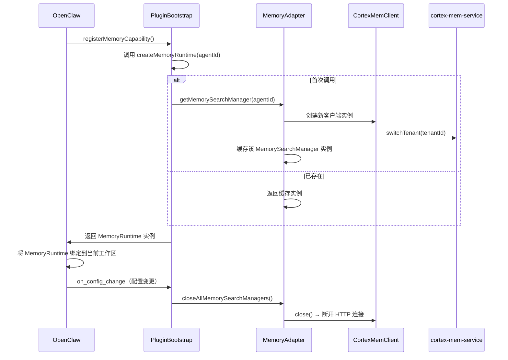
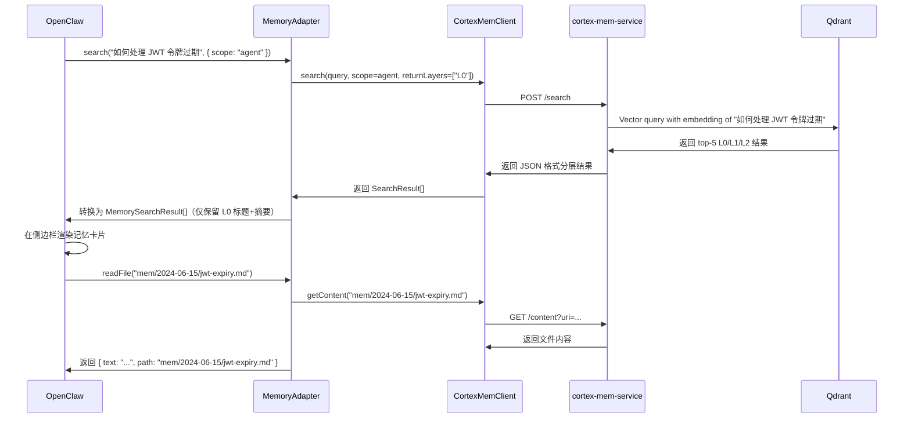

# 插件集成域（Plugin Integration Domain）技术文档

---

## **1. 概述：插件集成域的核心使命**

**插件集成域**是 MemClaw 系统中连接**智能记忆引擎**与**OpenClaw 开发平台**的**核心桥梁模块**。其核心使命是：**将 MemClaw 的分层语义记忆能力（L0/L1/L2）无缝适配为 OpenClaw 原生的 MemoryPluginCapability 接口规范，实现“开箱即用”的记忆能力接管**，使开发者在不改变操作习惯的前提下，获得智能上下文召回、跨会话知识复用等增强体验。

该域不是简单的功能封装，而是**架构级的接口对齐与行为代理**。它通过实现 OpenClaw 的插件契约，使 MemClaw 在 OpenClaw 生态中被识别为“原生记忆模块”，从而彻底替换其内置的碎片化内存系统，完成从“插件”到“系统组件”的身份跃迁。

> ✅ **业务价值对齐**：  
> 插件集成域是 MemClaw 实现“**减少重复劳动、增强上下文感知能力**”这一核心业务价值的**唯一入口**。没有该域的精准适配，L0/L1/L2 分层语义检索、多租户隔离、自动化迁移等全部能力将无法在 OpenClaw 中被用户感知和使用。

---

## **2. 架构定位与职责边界**

### **2.1 架构定位**
| 维度 | 说明 |
|------|------|
| **领域类型** | 核心业务域（Core Business Domain） |
| **角色** | 系统与外部平台的**适配层（Adapter Layer）** |
| **依赖关系** | 上游依赖：服务交互域（CortexMemClient）、配置管理域；下游依赖：OpenClaw Plugin API |
| **被依赖关系** | 被上下文引擎（Context Engine）与 OpenClaw 平台直接调用 |
| **关键抽象** | `MemorySearchManager`、`MemoryPluginCapability`、`MemoryProviderStatus` |

### **2.2 职责边界（明确不包含）**
- ❌ **不负责** Qdrant 或 cortex-mem-service 的启动与管理 → 由**服务管理域**负责  
- ❌ **不负责** 数据迁移、L0/L1 层生成 → 由**数据迁移域**负责  
- ❌ **不负责** AGENTS.md 注入 → 由**配置增强域**负责  
- ❌ **不负责** 配置文件解析与路径计算 → 由**配置管理域**负责  
- ❌ **不负责** 二进制文件分发或平台兼容性检测 → 由**服务管理域**的 BinaryManager 处理  

> ✅ **唯一职责**：**将 MemClaw 的内部记忆服务，翻译为 OpenClaw 所期望的插件接口行为**，并确保其生命周期、并发性、状态一致性完全符合平台规范。

---

## **3. 核心模块与实现细节**

插件集成域由两个关键子模块构成，协同完成“注册”与“执行”两大任务。

### **3.1 子模块一：MemoryAdapter —— 接口适配核心引擎**

**代码路径**：`plugin/src/memory-adapter.ts`  
**重要性**：★★★★★★★★★（9.0/10）  
**复杂度**：8.0（高）

#### **3.1.1 核心职责**
| 功能 | 实现说明 |
|------|----------|
| **接口实现** | 实现 OpenClaw 定义的 `MemorySearchManager` 接口，提供 `search()`、`readFile()`、`status()` 等方法 |
| **分层响应翻译** | 将 `CortexMemClient` 返回的 L0/L1/L2 分层结构，转换为 OpenClaw 期望的 `MemorySearchResult[]` 格式，包括 `title`、`content`、`path`、`score`、`timestamp` 等字段 |
| **多代理会话管理** | 维护一个线程安全的全局注册表（`globalManagerRegistry`），以 `tenantId:agentId` 为键，缓存独立的 `CortexMemorySearchManager` 实例，支持开发者在多个项目/租户间切换时保持记忆上下文隔离 |
| **Prompt 构建器** | 实现 `PromptBuilder`，将历史记忆片段动态注入到代码补全提示（code completion prompt）中，提升 AI 辅助编码的上下文准确性 |
| **Flush Plan 解析器** | 实现 `FlushPlanResolver`，根据用户操作（如保存文件、切换分支）触发记忆内容的“压缩”与“归档”策略，优化向量索引效率 |
| **缓存与生命周期管理** | 对搜索结果进行 LRU 缓存（默认 50 条），并监听 OpenClaw 的 `on_config_change` 事件，主动关闭所有内存管理器，防止内存泄漏 |

#### **3.1.2 关键实现代码结构（伪代码）**
```ts
class CortexMemorySearchManager implements MemorySearchManager {
  private client: CortexMemClient;
  private tenantId: string;
  private agentId: string;
  private cache: Map<string, MemorySearchResult[]>; // LRU 缓存

  async search(query: string, options: SearchOptions): Promise<MemorySearchResult[]> {
    // 1. 检查缓存
    const cached = this.cache.get(query);
    if (cached) return cached;

    // 2. 调用后端服务（L0层优先）
    const response = await this.client.search(query, {
      scope: 'agent',
      limit: 10,
      returnLayers: ['L0'] // OpenClaw UI 仅展示摘要层
    });

    // 3. 翻译格式
    const translated = response.map(r => ({
      title: r.l0.title,
      content: r.l0.summary,
      path: r.uri, // 映射为相对路径
      score: r.similarity,
      timestamp: r.metadata.createdAt,
      tags: r.metadata.tags
    }));

    // 4. 缓存并返回
    this.cache.set(query, translated);
    return translated;
  }

  async readFile(relativePath: string): Promise<{ text: string; path: string }> {
    const content = await this.client.getContent(relativePath);
    return { text: content, path: relativePath };
  }

  status(): MemoryProviderStatus {
    return {
      enabled: true,
      ready: this.client.isHealthy(),
      memoryCount: this.cache.size,
      tenant: this.tenantId
    };
  }
}
```

> ⚠️ **关键设计决策**：  
> **仅返回 L0 层摘要**，而非 L1/L2 全文，是为匹配 OpenClaw UI 的轻量展示需求。L1/L2 内容仅在用户点击“查看详情”时通过 `readFile()` 按需加载，避免界面卡顿。

---

### **3.2 子模块二：PluginBootstrap —— 插件注册与生命周期协调器**

**代码路径**：`plugin/index.ts` + `context-engine/index.ts`  
**重要性**：★★★★★★★★☆（8.0/10）

#### **3.2.1 核心职责**
| 功能 | 实现说明 |
|------|----------|
| **插件元信息注册** | 向 OpenClaw 的 `registerMemoryCapability()` API 注册工厂函数：`createMemoryPromptSectionBuilder`、`createMemoryFlushPlanResolver`、`createMemoryRuntime` |
| **运行时工厂实现** | 每次调用 `createMemoryRuntime(agentId)` 时，返回一个绑定该 agent 的 `MemorySearchManager` 实例（由 MemoryAdapter 创建） |
| **系统级接管** | 在 `context-engine/index.ts` 中调用 `registerContextEngine()` 和 `registerTool()`，**主动禁用 OpenClaw 原生内存模块**，确保 MemClaw 成为唯一记忆提供者 |
| **服务启动协调** | 作为初始化流程的终点，确保在 MemoryAdapter 注册前，服务管理域已完成 Qdrant 与 cortex-mem-service 的启动与健康检查 |
| **配置解析与注入** | 通过 `parsePluginConfig()` 读取 `openclaw.json` 中的 `memclaw` 配置段，传递自动捕获、缓存大小等策略至 MemoryAdapter |

#### **3.2.2 注册流程（OpenClaw 插件契约）**
```ts
// plugin/index.ts —— 插件导出入口
export const createMemoryPromptSectionBuilder = () => new PromptBuilder();
export const createMemoryFlushPlanResolver = () => new FlushPlanResolver();
export const createMemoryRuntime = (agentId: string) => {
  return MemoryAdapter.getMemorySearchManager(agentId); // 从全局注册表获取或创建
};

// context-engine/index.ts —— 系统接管入口
export function initialize() {
  // 1. 启动服务（由服务管理域完成）
  await BinaryManager.startServices();

  // 2. 注册插件能力
  OpenClaw.registerMemoryCapability({
    createMemoryPromptSectionBuilder,
    createMemoryFlushPlanResolver,
    createMemoryRuntime
  });

  // 3. **关键动作：禁用原生内存**
  OpenClaw.disableNativeMemoryModule();

  // 4. 注册记忆摄入工具（用于自动捕获）
  OpenClaw.registerTool('memclaw-capture', captureToolDefinition);
}
```

> ✅ **架构亮点**：  
> 通过 **工厂模式 + 契约注册**，实现“**运行时动态实例化**”——每个开发者代理（agent）拥有独立的记忆上下文，互不干扰，完美支持多项目、多租户场景。

---

## **4. 关键交互流程详解**

### **4.1 系统启动流程：插件注册与接管**



> 🔍 **关键洞察**：  
> 插件集成域不主动“启动”服务，但**依赖服务管理域的健康检查结果**。若服务未就绪，`CortexMemClient` 在首次 `search()` 时会抛出 `ServiceUnavailableError`，由 OpenClaw UI 展示友好提示，而非崩溃。

---

### **4.2 用户搜索流程：语义召回与结果展示**



> 💡 **用户体验设计**：  
> - **L0 层**：快速展示，用于搜索结果列表  
> - **L1 层**：隐藏，仅在“展开详情”时加载（提升响应速度）  
> - **L2 层**：仅在 `readFile()` 时加载，避免内存占用过高

---

## **5. 配置依赖与策略控制**

插件集成域的行为完全由**配置管理域**驱动，体现“**配置即代码**”的设计哲学。

| 配置项 | 来源 | 作用 | 默认值 |
|--------|------|------|--------|
| `memclaw.autoCapture.enabled` | `plugin/src/config.ts` | 是否自动捕获用户操作 | `true` |
| `memclaw.cache.maxSize` | `plugin/src/config.ts` | 搜索结果缓存最大条目数 | `50` |
| `memclaw.service.url` | `context-engine/config.ts` | cortex-mem-service 的 HTTP 地址 | `http://localhost:8080` |
| `memclaw.search.returnLayers` | `plugin/src/config.ts` | 默认返回的层级（L0/L1/L2） | `["L0"]` |
| `memclaw.tenantId` | `plugin/src/config.ts` | 当前租户标识（用于多项目隔离） | `default` |

> ✅ **最佳实践**：  
> 所有配置变更均通过 `on_config_change` 事件触发 `MemoryAdapter` 的 `closeAllMemorySearchManagers()`，确保新配置立即生效，无需重启 OpenClaw。

---

## **6. 高级能力：多代理并发与上下文隔离**

MemClaw 支持**多租户、多代理并发**场景（如：同时打开前端、后端、DevOps 三个项目）。

### **6.1 实现机制**
- 每个 OpenClaw 工作区（Workspace）绑定一个 `agentId`。
- `MemoryAdapter` 维护全局注册表：`Map<string, MemorySearchManager>`，键为 `${tenantId}:${agentId}`。
- 每次 `createMemoryRuntime(agentId)`，返回对应实例，**不同 agent 之间内存完全隔离**。
- 向量索引在 cortex-mem-service 端按 `tenantId` 分库，实现物理隔离。

### **6.2 场景示例**
| 场景 | 行为 |
|------|------|
| 开发者 A 在 `project-a` 中搜索 “Redis 连接池” | 返回 `project-a` 的 L0 摘要，与 `project-b` 无关 |
| 开发者 A 切换到 `project-b` | OpenClaw 调用 `createMemoryRuntime("project-b")`，返回全新实例 |
| 开发者 A 重启 OpenClaw | 配置加载后，从缓存恢复所有 agent 的 MemorySearchManager 实例 |

> ✅ **优势**：彻底解决传统记忆系统“全局混杂、上下文污染”的痛点，实现真正的**项目级记忆上下文**。

---

## **7. 错误处理与可观测性**

### **7.1 关键错误类型与处理策略**
| 错误类型 | 触发场景 | 处理策略 |
|----------|----------|----------|
| `ServiceUnavailableError` | cortex-mem-service 未启动 | UI 显示“记忆服务未就绪，请等待启动” |
| `ConfigurationError` | 配置路径错误或缺失 | 弹出“请检查 MemClaw 配置文件”提示，并打开配置编辑器 |
| `AuthenticationError` | 租户令牌失效 | 清空当前 agent 缓存，提示重新登录或切换租户 |
| `NetworkTimeoutError` | HTTP 请求超时 | 降级为本地缓存检索，记录日志并重试 3 次 |

### **7.2 可观测性建议（待增强）**
| 建议 | 说明 |
|------|------|
| ✅ **添加轻量日志** | 在 `CortexMemClient` 和 `MemoryAdapter` 中集成 `pino` 日志，记录关键调用（如 search、readFile） |
| ✅ **暴露健康指标** | 在 `status()` 中增加 `lastSearchLatency`、`cacheHitRate` 等字段，供 OpenClaw 监控面板使用 |
| ✅ **错误上报** | 捕获非预期异常，上报至 `cortex-mem-service` 的 `/analytics/error` 接口，用于系统诊断 |

> 📌 **当前状态**：已具备基础错误传播机制，但**缺乏统一日志与监控埋点**，建议在 v1.2 版本中补全。

---

## **8. 架构优势与设计哲学**

| 原则 | 实现体现 |
|------|----------|
| **单一职责** | 插件集成域只做“适配”，不负责启动、迁移、注入 |
| **关注点分离** | 与服务交互域、配置管理域完全解耦，可独立测试与替换 |
| **幂等与安全** | `createMemoryRuntime()` 可被多次调用，但