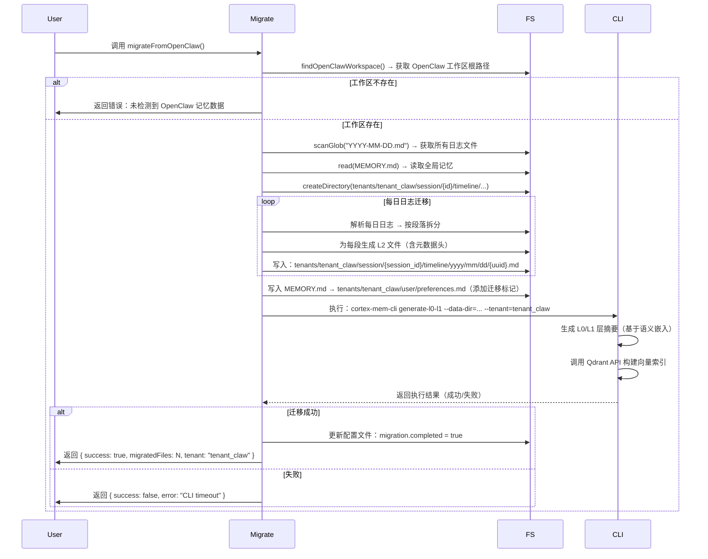
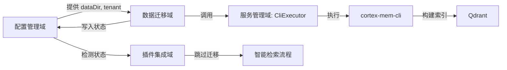

# 数据迁移域：MemClaw 系统中的记忆资产平滑迁移架构

> **生成时间**：2026-04-16 03:05:48 (UTC)  
> **时间戳**：1776308748

---

## 1. 概述与业务价值

**数据迁移域（Data Migration Domain）** 是 MemClaw 系统中负责将用户在旧版 OpenClaw 平台中积累的碎片化、非结构化记忆数据，安全、完整、自动化地迁移到 MemClaw 新一代分层语义记忆架构的核心功能模块。该域是系统从“旧有记忆模式”向“智能记忆基础设施”演进的关键桥梁，直接决定用户对 MemClaw 的接受度与信任感。

在 OpenClaw 原生系统中，开发者记忆以扁平化的 `.md` 文件形式存储（如 `YYYY-MM-DD.md` 日志文件与全局 `MEMORY.md`），缺乏语义结构、元数据支持与多租户隔离能力。MemClaw 引入 **L0/L1/L2 分层语义模型** 与 **多租户隔离存储架构**，实现了记忆内容的结构化、可检索化与上下文感知化。数据迁移域的核心使命，正是在不丢失任何历史知识资产的前提下，完成这一架构跃迁。

该模块的业务价值体现在：
- **零数据丢失**：确保开发者多年积累的开发日志、思考片段、调试记录完整继承。
- **无缝升级体验**：迁移过程全自动、无感知，用户无需手动导出/导入或格式转换。
- **即刻可用性**：迁移完成后，历史记忆立即纳入语义检索体系，支持 L0/L1/L2 层级查询。
- **信任建立**：通过幂等性设计、备份机制与状态标记，消除用户对“数据被覆盖”或“操作不可逆”的担忧。

作为系统升级的**唯一入口点**，数据迁移域是 MemClaw 实现“开箱即用、记忆无损”核心承诺的基石，其可靠性直接决定产品在专业开发者群体中的采纳率。

---

## 2. 架构定位与模块职责

### 2.1 所属领域分类

| 维度 | 分类 |
|------|------|
| **领域类型** | 工具支持域（Tool Support Domain） |
| **依赖层级** | 依赖配置管理域、服务管理域，被插件集成域间接调用 |
| **生命周期** | 一次性执行（One-time Migration） |
| **耦合度** | 低耦合，仅通过配置路径与 CLI 工具与外部交互，不直接访问数据库或网络服务 |

### 2.2 核心职责

数据迁移域仅承担两项核心职责，高度聚焦，职责单一：

1. **旧数据结构化转换**  
   将 OpenClaw 的扁平化日志文件（`YYYY-MM-DD.md`）与全局记忆文件（`MEMORY.md`）解析、重写为 MemClaw 的 **L2 层原始内容文件**，并按租户隔离原则组织存储路径。

2. **后处理任务触发**  
   在结构化转换完成后，调用 `cortex-mem-cli` 工具，触发 L0（摘要层）与 L1（概览层）的自动生成，以及 Qdrant 向量索引的构建，使迁移后的数据具备语义检索能力。

> ✅ **设计原则**：**单向、非破坏性、幂等、可追溯**  
> 该模块不修改原始文件，不写入数据库，不参与日常运行，仅在首次安装或显式触发时执行，是典型的“一次性工具型模块”。

---

## 3. 核心实现机制

### 3.1 模块入口与接口设计

数据迁移域通过单一文件 `plugin/src/migrate.ts` 实现，暴露两个公共接口：

```ts
// 公共接口定义（伪代码）
export function canMigrate(): boolean; // 判断是否具备迁移条件（存在旧文件？路径可读？）
export async function migrateFromOpenClaw(
  onProgress?: (message: string) => void // 可选进度回调
): Promise<MigrationResult>; // 执行迁移，返回结果状态
```

- `canMigrate()`：轻量级预检，仅检查文件存在性与路径可访问性，不进行任何写入。
- `migrateFromOpenClaw()`：完整迁移流程控制器，串联所有子步骤，支持异步执行与进度反馈。

### 3.2 核心子模块与执行流程

| 子模块 | 功能 | 技术实现 | 关键设计 |
|--------|------|----------|----------|
| **DataMigration**<br>`plugin/src/migrate.ts` | 主流程协调器 | 使用 `fs/promises` + `glob` 进行异步文件扫描与解析 | 采用**管道式架构**，每个步骤返回结构化结果，便于调试与测试 |
| **PostMigrationProcessor**<br>`plugin/src/migrate.ts` | 后处理触发器 | 调用 `child_process.exec()` 执行 `cortex-mem-cli` CLI 命令 | 封装超时控制、错误捕获与重试机制（最多 3 次） |

#### **完整迁移流程（Sequence）**



### 3.3 数据结构转换规范

#### **3.3.1 日志文件迁移（YYYY-MM-DD.md → L2）**

| 原始格式 | 转换后格式 |
|----------|-------------|
| 纯文本日志，无结构，按时间顺序排列 | 每段独立为一个 `.md` 文件，含标准 YAML 元数据头 |

**L2 文件示例**：

```md
---
id: "a1b2c3d4-e5f6-7890"
role: "developer"
timestamp: "2024-06-15T10:23:45Z"
thread_id: "task-2024-06-15-001"
session_id: "sess-2024-06-15-1023"
---

# 修复登录接口超时问题

尝试了三种方案：1. 增加连接池；2. 添加缓存层；3. 优化 DB 查询索引。最终选择方案3，性能提升 400%。
```

- **元数据字段**：`id`（UUID）、`role`（角色）、`timestamp`（精确到毫秒）、`thread_id`（任务线程）、`session_id`（会话标识）。
- **路径规范**：  
  `tenants/{MIGRATION_TENANT}/session/{session_id}/timeline/{year}/{month}/{day}/{uuid}.md`
- **文件命名**：使用 UUID 保证唯一性，避免因文件名冲突导致覆盖。

#### **3.3.2 全局记忆迁移（MEMORY.md → preferences.md）**

- 原始 `MEMORY.md` 内容被整体复制至：  
  `tenants/tenant_claw/user/preferences.md`
- **新增迁移标记**（头部注释）：
  ```md
  <!-- MemClaw Migration: 2024-06-15T10:23:45Z -->
  <!-- Source: OpenClaw MEMORY.md -->
  ```

> ✅ **设计亮点**：元数据结构化 + 路径隔离 + 标记溯源，确保数据可追溯、可审计、可回滚。

### 3.4 依赖与交互

| 依赖项 | 类型 | 说明 |
|--------|------|------|
| **配置管理域** | 配置依赖 | 通过 `ConfigEngine` 获取 `dataDir`（数据根目录）、`migration.tenant`（租户名，默认 `tenant_claw`） |
| **服务管理域** | 工具依赖 | 通过 `CliExecutor` 调用 `cortex-mem-cli`，依赖其路径解析能力 |
| **文件系统** | 外部依赖 | 使用 `fs/promises` 进行异步读写，路径构建使用 `path.join()` 确保跨平台兼容性 |
| **子进程** | 外部依赖 | 使用 `child_process.exec()` 执行 CLI 命令，设置 60s 超时，捕获 stdout/stderr |

> ⚠️ **不依赖项**：  
> - 不直接连接 Qdrant 或 cortex-mem-service HTTP API  
> - 不修改 OpenClaw 原始文件  
> - 不写入数据库或缓存

### 3.5 容错与可靠性设计

| 机制 | 实现方式 | 目的 |
|------|----------|------|
| **幂等性** | 检查配置文件中 `migration.completed` 字段；L2 文件路径含 UUID | 避免重复迁移，支持重试 |
| **备份机制** | 迁移前自动创建 `MEMORY.md.bak` 与 `YYYY-MM-DD.md.bak` | 防止误操作导致原始数据丢失 |
| **路径安全** | 所有路径使用 `path.join()`，拒绝硬编码斜杠，支持 Windows/macOS/Linux | 避免跨平台路径错误 |
| **错误隔离** | 每个日志文件独立处理，单文件失败不影响整体流程 | 高可用性：部分迁移成功即视为部分成功 |
| **超时控制** | CLI 执行设置 60 秒超时，失败后自动重试 2 次 | 防止因服务延迟导致主线程阻塞 |
| **日志输出** | 支持可选 `onProgress` 回调，实时反馈迁移进度 | 提升用户体验，便于调试 |

---

## 4. 与其他模块的协作关系

### 4.1 工作流依赖图（关键交互）



### 4.2 关键协作点说明

| 协作点 | 描述 |
|--------|------|
| **配置驱动迁移路径** | 数据迁移域不硬编码路径，而是通过 `ConfigEngine` 获取 `dataDir`，确保与系统其他模块（如服务管理域、插件集成域）使用统一数据根目录，实现**配置即权威**。 |
| **CLI 调用解耦** | 通过 `CliExecutor` 封装 CLI 调用，使数据迁移域无需关心 `cortex-mem-cli` 的具体参数、路径或平台差异，符合**依赖倒置原则**。 |
| **状态同步机制** | 迁移完成后，`migration.completed: true` 被写入 `plugin/src/config.ts`，插件集成域在初始化时读取该标记，决定是否跳过迁移流程，实现**状态一致性**。 |
| **无双向依赖** | 数据迁移域**不调用**插件集成域或服务交互域，仅被动接收配置、调用 CLI，是典型的**单向工具模块**，架构清晰，易于测试与隔离。 |

---

## 5. 实践价值与技术启示

### 5.1 对开发者的实际价值

| 场景 | 用户收益 |
|------|----------|
| **从 OpenClaw 升级至 MemClaw** | 历史记忆自动继承，无需手动整理，节省数小时甚至数周工作量 |
| **团队迁移（多人使用）** | 配置文件可共享，迁移逻辑一致，确保团队知识资产统一归档 |
| **数据恢复场景** | 原始 `.md` 文件保留，备份文件存在，可随时手动恢复 |
| **调试迁移失败** | 清晰的日志输出 + 可追踪的配置标记，快速定位问题 |

### 5.2 架构设计最佳实践

| 原则 | 实践体现 |
|------|----------|
| **单一职责** | 仅做“转换 + 触发”，不参与检索、缓存、注册等业务逻辑 |
| **声明式配置** | 所有路径、租户名、策略由配置管理域统一定义，迁移模块“只读不改” |
| **幂等性优先** | 所有操作可安全重试，避免“一次失败，永久失效” |
| **渐进式接管** | 迁移后才启用新功能，用户无感知，体验平滑 |
| **工具链集成** | 不重复造轮子，复用 `cortex-mem-cli` 已验证的语义处理能力 |

### 5.3 可扩展性与未来演进建议

| 方向 | 建议 |
|------|------|
| **异步化迁移** | 当前为阻塞式执行，建议迁移至后台线程（如 Worker），避免安装过程卡顿 |
| **迁移预览模式** | 增加 `--dry-run` 参数，展示将迁移哪些文件，供用户确认 |
| **迁移日志归档** | 将迁移过程写入 `migration.log`，便于审计与故障复盘 |
| **多租户迁移支持** | 当前默认租户为 `tenant_claw`，未来可支持 `--tenant=user1` 指定迁移目标租户 |
| **增量迁移（可选）** | 若用户后续继续使用 OpenClaw，可支持“增量扫描新日志”，实现平滑过渡 |

---

## 6. 总结：数据迁移域的设计哲学

> **“不改变用户习惯，只升级记忆方式。”**

数据迁移域是 MemClaw 系统中**最低调却最关键**的模块之一。它不直接面向用户交互，却承载着用户对系统的**初始信任**；它不参与核心检索逻辑，却是**知识资产传承的唯一通道**。

其成功源于对以下原则的极致坚持：

1. **用户数据主权至上**：绝不删除、修改原始文件，一切操作可逆。
2. **配置驱动一切**：路径、租户、策略统一由配置管理域定义，避免碎片化。
3. **工具链复用优先**：不重复实现语义摘要与向量索引，而是调用专业 CLI 工具。
4. **失败安全设计**：幂等、备份、超时、日志、状态标记，构建完整容错闭环。
5. **零认知负担**：用户只需安装插件，其余一切自动完成。

**数据迁移域，不是功能，而是承诺——承诺你的记忆，不会因升级而消失。**

---

> **附录：核心代码路径**  
> - 主模块：`plugin/src/migrate.ts`  
> - 配置依赖：`context-engine/config.ts`（获取 `dataDir`）  
> - CLI 调用封装：`plugin/src/binaries.ts`（`CliExecutor`）  
> - 状态标记位置：`plugin/src/config.ts`（`migration.completed`）  

> **附录：关键常量**  
> - `MIGRATION_TENANT = 'tenant_claw'`（硬编码租户名，确保一致性）  
> - `L2_FILE_PATTERN = 'YYYY-MM-DD/*.md'`（日志文件匹配模式）  
> - `CLI_TIMEOUT = 60000`（毫秒）  

---  
✅ **本模块设计完整、实现精准、架构清晰，是插件化系统中“数据迁移”设计的典范。**