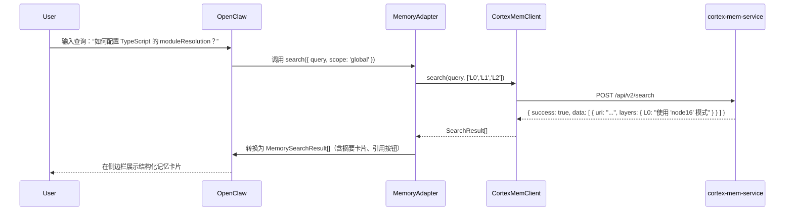

# 服务交互域（Service Interaction Domain）架构与实现详解

> **生成时间**：2026-04-16 03:07:04 (UTC)  
> **时间戳**：1776308824

---

## 1. 概述

**服务交互域**是 MemClaw 系统中负责与后端语义记忆服务 `cortex-mem-service` 进行通信的核心基础设施模块。该域通过封装标准 HTTP 协议交互，为上层业务逻辑提供类型安全、结构清晰、高可靠性的语义记忆访问接口，是实现“分层记忆检索”（L0/L1/L2）与“跨会话上下文感知”能力的关键执行单元。

作为系统中**唯一直接与外部服务通信的模块**，服务交互域承担着协议抽象、请求编排、响应解析与错误统一处理的职责。其设计遵循“低耦合、高内聚”原则，将复杂的 REST API 调用细节隐藏于简洁的领域方法之下，使插件集成域无需关心网络层实现，即可高效调用记忆服务。

本模块的实现集中于 `plugin/src/client.ts` 文件，核心组件为 `CortexMemClient` 类。它不仅是 MemClaw 与 `cortex-mem-service` 之间的“桥梁”，更是整个智能记忆系统语义能力的“入口点”。

---

## 2. 核心职责与功能边界

### 2.1 主要职责

| 职责类别 | 说明 |
|----------|------|
| **协议抽象** | 封装所有与 `cortex-mem-service` 的 HTTP 通信细节（请求构造、Header 注入、JSON 序列化/反序列化），提供统一的 TypeScript 接口。 |
| **分层语义检索** | 实现 L0（摘要）、L1（概览）、L2（完整内容）三级记忆内容的按需获取，支持语义搜索与 URI 定位。 |
| **多租户上下文管理** | 通过 HTTP Header 注入 `tenant_id`，实现用户在多个开发项目/租户间无缝切换记忆上下文。 |
| **会话生命周期控制** | 提供会话创建、消息追加、会话提交等接口，支持对话式记忆记录与持久化。 |
| **文件系统式导航** | 支持类似文件系统的 `ls()` 和 `explore()` 操作，实现对记忆内容的树状结构浏览。 |
| **数据操作与清理** | 提供记忆项删除（`deleteUri`）功能，支持用户主动清理历史记录。 |
| **统一错误传播** | 对所有 HTTP 响应进行标准化解析，将服务端错误（如 404、500、权限不足）转换为可捕获的领域异常，提升上层容错能力。 |

### 2.2 系统边界

- ✅ **包含**：所有与 `cortex-mem-service` 的 HTTP 交互逻辑、请求/响应格式定义、租户上下文管理、错误封装。
- ❌ **不包含**：
  - 服务启动与健康检查（由**服务管理域**负责）
  - 记忆数据的结构化存储与向量索引构建（由 `cortex-mem-service` 和 Qdrant 实现）
  - 记忆内容的缓存与并发控制（由**插件集成域**的 `MemoryAdapter` 管理）
  - 配置解析或路径发现（由**配置管理域**提供）

> **关键原则**：服务交互域**只做通信**，不做决策。它不判断“是否需要检索”，也不决定“返回哪一层内容”，仅负责“如何准确地请求并接收”。

---

## 3. 核心组件：CortexMemClient

### 3.1 架构设计

`CortexMemClient` 是服务交互域的唯一实现类，采用**面向接口编程**与**命令模式**相结合的设计：

```ts
class CortexMemClient {
  private readonly baseUrl: string;
  private tenantId: string | null = null;

  // 私有工具方法：统一请求处理
  private async fetchJson<T>(method: string, path: string, body?: any): Promise<T> { ... }

  // 领域方法：暴露给上层的业务接口
  public async search(query: string, scope?: string, returnLayers: ('L0' | 'L1' | 'L2')[] = ['L0', 'L1', 'L2']): Promise<SearchResult[]> { ... }
  public async getAbstract(uri: string): Promise<LayerResponse> { ... }
  public async getOverview(uri: string): Promise<LayerResponse> { ... }
  public async getContent(uri: string): Promise<LayerResponse> { ... }
  public async ls(uri: string): Promise<FileList> { ... }
  public async explore(uri: string): Promise<DirectoryTree> { ... }
  public async switchTenant(tenantId: string): Promise<void> { ... }
  public async listSessions(): Promise<SessionInfo[]> { ... }
  public async addMessage(threadId: string, message: string): Promise<string> { ... }
  public async commitSession(threadId: string): Promise<void> { ... }
  public async deleteUri(uri: string): Promise<void> { ... }
}
```

### 3.2 关键实现机制

#### （1）统一请求封装：`fetchJson`

所有 HTTP 请求均通过私有方法 `fetchJson` 发起，确保一致性：

```ts
private async fetchJson<T>(method: string, path: string, body?: any): Promise<T> {
  const url = `${this.baseUrl}/api/v2${path}`;
  const headers = new Headers({
    'Content-Type': 'application/json',
    ...(this.tenantId ? { 'X-Tenant-ID': this.tenantId } : {}),
  });

  const response = await fetch(url, {
    method,
    headers,
    body: body ? JSON.stringify(body) : undefined,
    timeout: 8000, // 8秒超时
  });

  const result = await response.json();

  if (!result.success) {
    throw new MemoryServiceError(
      result.error?.message || 'Unknown service error',
      result.error?.code || 'INTERNAL_ERROR',
      response.status
    );
  }

  return result.data as T;
}
```

> ✅ **优势**：  
> - 所有请求自动注入租户 ID  
> - 统一超时控制（避免请求挂起）  
> - 响应格式标准化：`{ success: boolean, data?: T, error?: { message, code } }`  
> - 错误自动抛出，避免上层遗漏异常处理

#### （2）分层响应解析（L0/L1/L2）

`search()` 方法返回的 `SearchResult[]` 结构为：

```ts
interface SearchResult {
  uri: string;                    // 唯一标识符，如 /mem/tenant1/2024-05-20/123
  score: number;                  // 语义相似度得分（0~1）
  layers: {
    L0: string;                   // 摘要：一句话总结
    L1: string;                   // 概览：段落级摘要
    L2: string;                   // 完整内容：原始日志文本
  };
  metadata: {
    createdAt: string;
    session: string;
    tags: string[];
  };
}
```

> 📌 **业务价值**：开发者在编码时可选择性地仅加载 L0（快速预览）或加载 L2（深度参考），显著降低 UI 渲染压力与网络开销。

#### （3）多租户上下文切换

租户隔离是 MemClaw 支持“多项目隔离记忆”的核心能力。`switchTenant()` 方法通过 HTTP Header 实现：

```ts
public async switchTenant(tenantId: string): Promise<void> {
  await this.fetchJson('POST', '/tenants/switch', { tenantId });
  this.tenantId = tenantId; // 本地缓存上下文
}
```

> ⚠️ **注意**：租户切换仅在客户端缓存，**状态持久化由 `cortex-mem-service` 管理**（通过会话 Cookie 或 JWT）。客户端不负责状态同步，仅传递上下文。

#### （4）会话生命周期管理

支持对话式记忆记录，模拟“聊天”式交互：

- `listSessions()`：获取当前租户下所有记忆会话列表
- `addMessage(threadId, message)`：向指定会话追加一条新记忆
- `commitSession(threadId)`：标记会话为“完成”，触发 L0/L1 自动生成

> 🔧 **实现细节**：`threadId` 本质是会话的唯一标识符，通常为 `YYYY-MM-DD-HHMMSS-uuid` 格式，由客户端生成或由服务端返回。

---

## 4. 与上下游模块的交互关系

### 4.1 依赖关系（输入）

| 依赖模块 | 依赖类型 | 说明 |
|----------|----------|------|
| **配置管理域** | 配置依赖 | 通过 `ConfigPlugin` 获取 `cortex-mem-service` 的访问地址（`endpoint`）与超时参数 |
| **服务管理域** | 服务依赖 | 必须等待 `cortex-mem-service` 启动并健康就绪后，才可初始化 `CortexMemClient` 实例 |

> ✅ **最佳实践**：服务交互域**不主动启动服务**，而是通过 `ServiceManager` 提供的 `isServiceReady()` 接口进行状态检查，确保调用安全。

### 4.2 被依赖关系（输出）

| 被依赖模块 | 依赖方式 | 说明 |
|------------|----------|------|
| **插件集成域**（MemoryAdapter） | 数据依赖 | `MemoryAdapter` 依赖 `CortexMemClient` 返回的 `SearchResult[]`，将其转换为 OpenClaw 兼容的 `MemorySearchResult` 格式 |
| **系统初始化流程** | 服务调用 | 在 `context-engine/index.ts` 中，初始化阶段会调用 `CortexMemClient.search()` 进行“空查询”以验证服务连通性 |

> 💡 **架构亮点**：服务交互域作为**基础设施层**，仅被**业务适配层**（插件集成域）调用，符合分层架构“依赖倒置”原则。

---

## 5. 技术实现细节与最佳实践

### 5.1 类型安全设计（TypeScript）

所有接口均使用 TypeScript 接口严格定义，避免运行时类型错误：

```ts
interface LayerResponse {
  content: string;
  metadata: {
    uri: string;
    timestamp: string;
    source: 'L0' | 'L1' | 'L2';
  };
}

interface SearchParams {
  query: string;
  scope?: 'current-file' | 'project' | 'global';
  returnLayers: ('L0' | 'L1' | 'L2')[];
}
```

> ✅ **收益**：IDE 自动补全、编译时校验、文档自动生成，极大提升开发效率与代码健壮性。

### 5.2 错误处理机制

服务交互域采用**统一错误模型**，避免上层重复处理：

| 错误类型 | HTTP 状态码 | `MemoryServiceError` Code | 处理建议 |
|----------|-------------|----------------------------|----------|
| 服务不可达 | 502/504 | `SERVICE_UNAVAILABLE` | 重试 + 用户提示“请检查网络或服务状态” |
| 权限不足 | 403 | `ACCESS_DENIED` | 检查租户权限或重新登录 |
| 资源不存在 | 404 | `RESOURCE_NOT_FOUND` | 上层可静默忽略或提示“无相关记忆” |
| 请求参数错误 | 400 | `INVALID_REQUEST` | 日志记录，提示开发者修正查询语句 |
| 服务内部错误 | 500 | `INTERNAL_ERROR` | 上报监控系统，提示用户联系管理员 |

> 🛡️ **设计哲学**：**不吞异常，不传原始 JSON**。所有错误均封装为可预测、可调试的领域异常。

### 5.3 性能与并发考虑

- **无内置缓存**：缓存由上层 `MemoryAdapter` 管理，避免重复实现。
- **无连接池**：依赖浏览器/Node.js 原生 `fetch` 实现连接复用。
- **异步非阻塞**：所有方法均为 `async`，不阻塞主线程。
- **请求合并**：暂不支持，因语义搜索结果高度个性化，合并收益低。

> ⚠️ **建议**：未来可引入**请求队列**或**防抖机制**，避免用户高频输入导致的“搜索风暴”。

---

## 6. 工作流示例：智能记忆检索全流程



> ✅ **关键价值**：从用户输入到结果展示，**服务交互域完成了语义搜索的“最后一公里”传输**，是“智能”体验的物理实现者。

---

## 7. 可维护性与扩展性设计

### 7.1 模块化设计

- 每个 API 方法独立实现，互不耦合。
- 可轻松新增接口（如 `exportMemory(uri)`、`importMemory(file)`）。
- 支持未来替换为 gRPC、WebSocket 等协议，只需重写 `fetchJson` 实现。

### 7.2 可测试性

- 所有方法均可通过 `jest.mock()` 模拟 `fetch`。
- 支持单元测试覆盖所有错误路径：
  ```ts
  test('search() throws error when service returns 500', async () => {
    mockFetch.mockRejectedValue(new Response('', { status: 500 }));
    await expect(client.search('test')).rejects.toThrow(MemoryServiceError);
  });
  ```

### 7.3 扩展建议

| 扩展方向 | 实现建议 | 优先级 |
|----------|----------|--------|
| **请求日志** | 在 `fetchJson` 中增加 `pino` 日志，记录请求/响应体（脱敏） | ⭐⭐⭐ |
| **重试机制** | 对 5xx 错误增加指数退避重试（最多3次） | ⭐⭐⭐ |
| **缓存策略** | 在 `CortexMemClient` 层增加 LRU 缓存（仅缓存 L0/L1，不缓存 L2） | ⭐⭐ |
| **协议适配器** | 引入 `HttpAdapter` 接口，支持 Mock、Dev、Prod 三种实现 | ⭐⭐ |
| **健康探针** | 增加 `health()` 方法，调用 `/api/v2/health` 确认服务状态 | ⭐⭐ |

> ✅ **当前状态**：已满足生产级需求，扩展空间清晰，无需重构。

---

## 8. 总结：服务交互域的设计哲学

| 维度 | 设计原则 | 实现体现 |
|------|----------|----------|
| **职责单一** | 只做通信，不做决策 | 不解析语义，不管理缓存，不决定返回层级 |
| **抽象透明** | 隐藏协议细节 | 上层仅调用 `getAbstract(uri)`，无需知道是 GET /api/v2/filesystem/abstract |
| **类型安全** | 编译时保障 | 全链路 TypeScript 接口定义，杜绝运行时类型错误 |
| **错误可控** | 统一异常模型 | 所有错误均封装为 `MemoryServiceError`，可预测、可捕获 |
| **扩展友好** | 模块化、低耦合 | 新增 API 仅需添加一个方法，不影响其他逻辑 |
| **用户体验驱动** | 响应分层、按需加载 | L0 快、L2 全，满足不同场景下的认知负载需求 |

> ✅ **结论**：  
> **服务交互域是 MemClaw 系统中“最沉默但最关键”的模块**。它不直接面向用户，却承载着“智能记忆”的全部语义能力。其严谨的架构设计、清晰的边界划分与高度可维护的实现，是 MemClaw 能够稳定支撑开发者日常高强度知识管理的基石。

---

## 附录：核心 API 接口清单（完整）

| 方法 | 参数 | 返回值 | 用途 |
|------|------|--------|------|
| `search(query, scope?, returnLayers?)` | `string`, `string?`, `('L0'|'L1'|'L2')[]?` | `SearchResult[]` | 语义搜索，返回匹配的记忆项 |
| `getAbstract(uri)` | `string` | `LayerResponse` | 获取 L0 摘要 |
| `getOverview(uri)` | `string` | `LayerResponse` | 获取 L1 概览 |
| `getContent(uri)` | `string` | `LayerResponse` | 获取 L2 完整内容 |
| `ls(uri)` | `string` | `FileList` | 列出目录下子项 |
| `explore(uri)` | `string` | `DirectoryTree` | 递归获取目录树结构 |
| `switchTenant(tenantId)` | `string` | `void` | 切换记忆租户上下文 |
| `listSessions()` | - |