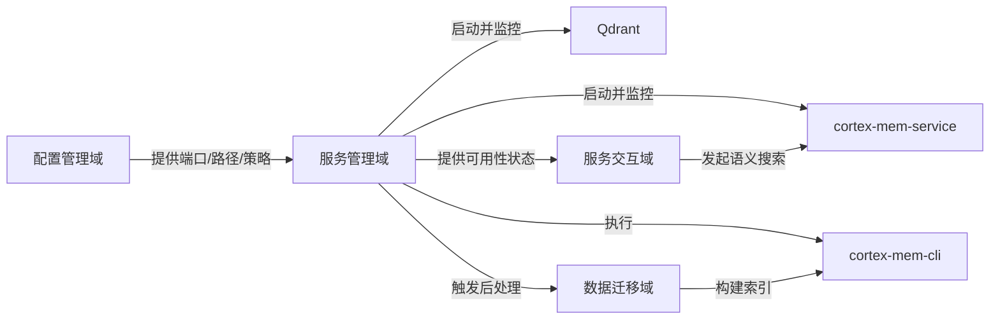
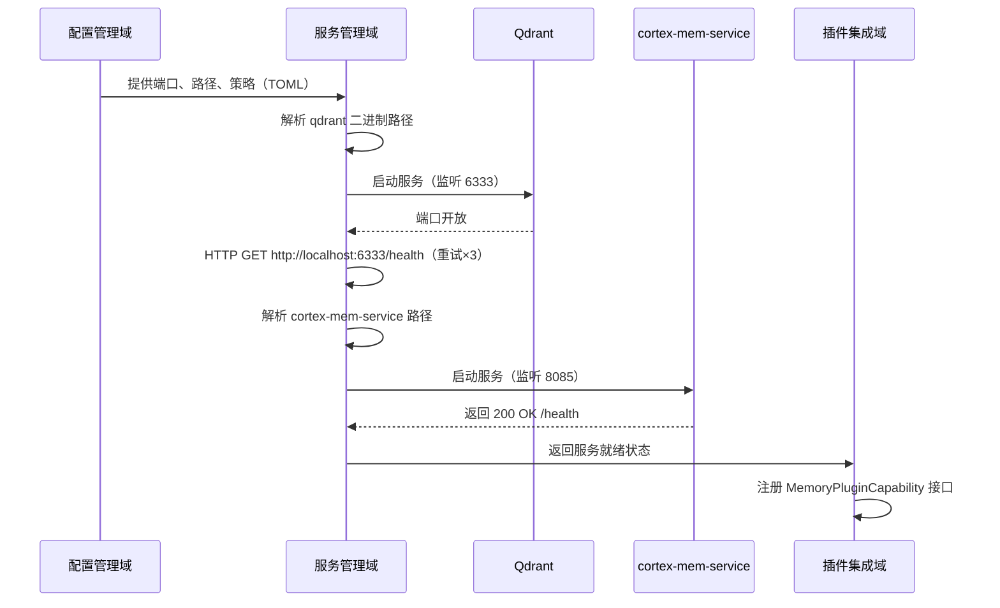
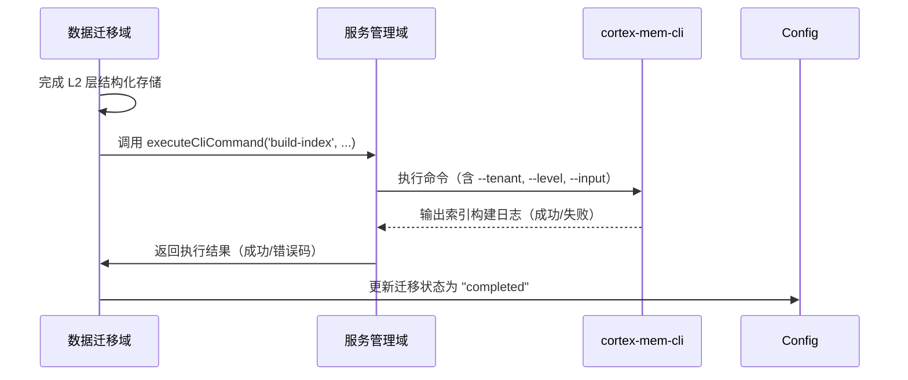

# 服务管理域（Service Management Domain）技术文档

> **生成时间**：2026-04-16 03:04:29 (UTC)  
> **文档版本**：1.0  
> **最后更新**：1776308669  

---

## 概述

**服务管理域**是 MemClaw 系统的核心基础设施模块，负责统一管理所有外部依赖服务的生命周期，包括本地二进制服务（Qdrant、cortex-mem-service）与辅助命令行工具（cortex-mem-cli）的发现、启动、健康检查、执行与优雅终止。该模块通过抽象平台差异、封装进程控制与网络探测，实现“开箱即用”的自动化部署体验，是系统实现“零配置启动”与“高可用语义记忆服务”的基石。

作为**基础设施域（Infrastructure Domain）**，服务管理域不直接参与业务逻辑处理，但为配置管理域、数据迁移域、服务交互域提供关键运行时支撑。其设计遵循“**解耦、幂等、可观测、自愈**”四大原则，确保 MemClaw 在跨平台（Windows/macOS/Linux）环境下稳定运行，且无需用户手动安装或配置任何外部依赖。

---

## 核心职责与架构定位

| 职责类别 | 说明 |
|----------|------|
| **服务发现** | 自动识别操作系统平台（darwin-arm64 / win-x64 / linux-x64），从 npm optionalDependencies 中动态解析 Qdrant、cortex-mem-service 及 cortex-mem-cli 的可执行文件路径。 |
| **服务启动** | 以正确的工作目录、环境变量与配置文件启动本地服务进程，监听指定端口（Qdrant: 6333，cortex-mem-service: 8085）。 |
| **健康检查** | 通过 HTTP GET 请求探测服务 `/health` 或端口连通性，支持重试机制与超时控制（默认 15 秒），确保服务真正就绪。 |
| **CLI 执行** | 封装对 `cortex-mem-cli` 的调用，用于数据迁移后构建 L0/L1 摘要层与向量索引，支持输出捕获、错误处理与执行超时。 |
| **进程管理** | 统一管理所有启动的子进程，提供批量终止接口（`stopAllServices()`），避免僵尸进程与资源泄漏。 |
| **权限控制** | 在类 Unix 系统中自动设置二进制文件的可执行权限（`chmod +x`），确保跨平台兼容性。 |

### 架构定位图示（简化）



> **关键设计哲学**：**“服务即资源，管理即代码”**。所有服务行为均由配置驱动，服务管理域是“配置即代码”理念在运行时的执行者。

---

## 模块组成与子模块职责

服务管理域由两个核心子模块构成，分工明确、职责单一：

### 1. BinaryManager（二进制管理器）

> **代码路径**：`plugin/src/binaries.ts`、`context-engine/binaries.ts`  
> **复杂度**：8.5 | **重要性**：8.5

**核心职责**：  
- **平台感知**：自动检测运行环境（`process.platform` + `process.arch`），映射至对应二进制包（如 `@memclaw/bin-darwin-arm64`）。  
- **路径解析**：使用 `require.resolve()` 动态查找 npm 包中二进制文件的绝对路径，避免硬编码路径。  
- **权限设置**：在 Linux/macOS 上调用 `fs.chmod()` 为二进制文件添加可执行权限（`0o755`）。  
- **进程启动**：使用 `child_process.spawn()` 启动服务，指定正确的 `cwd`（工作目录）、`env`（环境变量）与 `stdio`（日志重定向）。  
- **健康探测**：通过 `fetch()` 向 `http://localhost:6333`（Qdrant）和 `http://localhost:8085/health`（cortex-mem-service）发送请求，结合 `AbortSignal.timeout(15000)` 实现超时控制。  
- **状态缓存**：内部维护服务状态映射（`Map<string, ServiceStatus>`），避免重复启动与冗余检查。  

**关键方法**：

| 方法 | 参数 | 返回值 | 说明 |
|------|------|--------|------|
| `getBinaryPath(binaryName: string)` | `qdrant`, `cortex-mem-service`, `cortex-mem-cli` | `string | null` | 返回可执行文件绝对路径，失败返回 null |
| `isBinaryAvailable(binaryName: string)` | 同上 | `boolean` | 快速判断二进制是否存在，不启动进程 |
| `startQdrant()` | 无 | `Promise<void>` | 启动 Qdrant，监听端口，等待健康就绪 |
| `startCortexMemService()` | 无 | `Promise<void>` | 启动 cortex-mem-service，等待 `/health` 响应 |
| `checkServiceStatus(service: string)` | `qdrant` / `cortex-mem-service` | `ServiceStatus`（`running` / `stopped` / `unhealthy`） | 非阻塞式状态查询 |
| `ensureAllServices()` | 无 | `Promise<void>` | **入口方法**：按依赖顺序启动所有必要服务 |
| `stopAllServices()` | 无 | `Promise<void>` | 终止所有已启动的子进程 |

> **设计亮点**：  
> - **路径解析一致性**：`context-engine` 与 `plugin` 模块共享相同路径解析逻辑，避免因路径不一致导致的启动失败。  
> - **健康检查解耦**：健康检查不依赖进程 PID，而是基于网络可达性，更贴近“服务可用性”业务定义。  
> - **优雅降级**：若服务未安装，返回清晰提示（如“请运行 `npm install @memclaw/bin-linux-x64`”），而非崩溃。

### 2. CliExecutor（CLI 执行器）

> **代码路径**：`plugin/src/binaries.ts`  
> **复杂度**：7.5 | **重要性**：7.5

**核心职责**：  
- **封装 CLI 调用**：将 `cortex-mem-cli` 的复杂命令（如 `build-index --tenant=dev --level=L0`）封装为类型安全的函数调用。  
- **输入输出捕获**：通过 `spawn()` 捕获 stdout/stderr，用于日志记录与错误诊断。  
- **执行超时与重试**：对耗时操作（如向量索引构建）设置超时（默认 30 秒），失败后支持最多 2 次重试。  
- **权限与环境隔离**：确保 CLI 运行在与服务一致的环境变量与工作目录下，避免配置漂移。  
- **错误标准化**：将 CLI 错误统一转换为 `ServiceManagementError` 类型，便于上层统一处理。

**典型调用场景**：

```ts
// 数据迁移完成后触发索引重建
await cliExecutor.executeCliCommand(
  'build-index',
  ['--tenant', tenantId, '--level', 'L0', '--input', l2DirPath]
);
```

> **设计亮点**：  
> - **幂等性保障**：CLI 命令设计为幂等操作，即使重复执行也不会破坏数据。  
> - **日志可追溯**：CLI 输出被记录至系统日志（如 `memclaw-cli.log`），便于排查迁移失败原因。  
> - **异步非阻塞**：执行过程不阻塞主线程，适用于后台迁移任务。

---

## 关键工作流：服务管理域在系统中的作用

### 1. 系统初始化流程（System Initialization）



> **关键价值**：服务管理域确保在插件集成域执行注册前，所有底层服务已**真正可用**，避免“注册失败”或“搜索无响应”的用户挫败感。

### 2. 记忆数据迁移流程（Data Migration）



> **关键价值**：服务管理域为数据迁移提供**执行引擎**，使迁移流程从“手动执行 CLI”变为“程序自动化触发”，提升可靠性与一致性。

---

## 技术实现细节

### 1. 平台二进制路径解析机制

MemClaw 采用 **npm optionalDependencies** 方式分发平台特定二进制文件（如 `@memclaw/bin-win-x64`），避免将 100MB+ 的 Qdrant 二进制打包进主插件，减小安装体积。

```ts
// 伪代码：路径解析逻辑
function getBinaryPath(binaryName: string): string {
  const platformMap = {
    darwin: 'darwin-arm64',
    win32: 'win-x64',
    linux: 'linux-x64'
  };
  const platformKey = platformMap[process.platform] || process.platform;
  const packageName = `@memclaw/bin-${platformKey}`;
  
  try {
    return require.resolve(`${packageName}/bin/${binaryName}`);
  } catch (e) {
    throw new Error(`二进制文件未安装：请运行 'npm install ${packageName}'`);
  }
}
```

> ✅ **优势**：  
> - 用户无需手动下载二进制文件；  
> - 支持 `npm install memclaw` 一键安装全部依赖；  
> - 支持私有包仓库（如 NPM Registry）部署。

### 2. 健康检查实现（HTTP + AbortSignal）

```ts
async function checkHealth(url: string, timeoutMs = 15000): Promise<boolean> {
  const controller = new AbortController();
  const timeoutId = setTimeout(() => controller.abort(), timeoutMs);

  try {
    const response = await fetch(url, { signal: controller.signal });
    const status = response.status === 200;
    clearTimeout(timeoutId);
    return status;
  } catch (err) {
    clearTimeout(timeoutId);
    return false;
  }
}
```

> **为什么不用 TCP 端口探测？**  
> 端口监听 ≠ 服务就绪。Qdrant 可能端口已打开，但仍在加载索引。HTTP `/health` 是**业务可用性**的精准指标。

### 3. 进程管理与资源回收

所有启动的子进程均被记录在 `Map<string, ChildProcess>` 中：

```ts
const activeProcesses = new Map<string, ChildProcess>();

function startService(name: string, cmd: string, args: string[]) {
  const proc = spawn(cmd, args, { stdio: 'pipe' });
  activeProcesses.set(name, proc);

  proc.on('close', () => activeProcesses.delete(name));
  proc.on('error', () => activeProcesses.delete(name));
}

export function stopAllServices() {
  for (const proc of activeProcesses.values()) {
    proc.kill('SIGTERM');
  }
  activeProcesses.clear();
}
```

> ✅ **安全保证**：即使插件异常退出，Node.js 进程终止时也会自动回收子进程（操作系统级保障）。

---

## 与其他模块的依赖关系

| 依赖方 | 依赖类型 | 说明 |
|--------|----------|------|
| **配置管理域** | **Configuration Dependency**（强度：9.0） | 获取服务端口、二进制路径、日志目录、租户根路径等关键配置。服务管理域是唯一依赖配置域的基础设施模块。 |
| **数据迁移域** | **Tool Support**（强度：8.0） | 在迁移完成后调用 `CliExecutor` 构建 L0/L1 索引，形成“迁移 → 构建”闭环。 |
| **服务交互域** | **Service Call**（强度：8.0） | 在发起语义搜索前，必须确认 `cortex-mem-service` 已启动并健康。服务交互域不直接管理服务，而是依赖本域提供“可用性担保”。 |
| **插件集成域** | **Orchestration Dependency** | 插件启动流程（`PluginBootstrap`）调用 `ensureAllServices()`，作为初始化的第一步。 |

> **架构原则**：**“服务管理域不消费业务数据，但决定业务能否运行”** —— 它是系统稳定性的“守门人”。

---

## 最佳实践与工程建议

### ✅ 推荐实践

| 实践 | 说明 |
|------|------|
| **始终调用 `ensureAllServices()`** | 不要单独调用 `startQdrant()`，必须通过入口方法确保依赖顺序（Qdrant 先于 cortex-mem-service）。 |
| **启用日志输出** | 在开发环境开启 `DEBUG=memclaw:binaries`，查看二进制路径解析与启动过程。 |
| **CI/CD 中预安装二进制** | 在 Docker 镜像或部署脚本中显式安装 `@memclaw/bin-*`，避免运行时下载失败。 |
| **健康检查超时可配置** | 允许用户通过 `memclaw.config.toml` 自定义健康检查超时（如 `service.healthTimeoutMs = 20000`），适应低性能设备。 |

### ⚠️ 待优化项（架构演进建议）

| 问题 | 风险 | 建议方案 |
|------|------|----------|
| **路径解析逻辑重复** | 中 | 将 `getBinaryPath()` 提取为 `shared/binaries.ts`，供 `plugin/` 与 `context-engine/` 共享，消除代码冗余。 |
| **CLI 执行无进度反馈** | 低 | 在构建索引时，通过 `stdout.on('data', ...)` 实时输出进度条，提升用户体验。 |
| **服务状态未持久化** | 中 | 建议将服务启动状态（如“上次启动时间”）写入 `~/.memclaw/state.json`，实现“重启后自动恢复”能力。 |
| **缺乏监控指标** | 中 | 在 `CortexMemClient` 与 `BinaryManager` 中集成轻量级日志（如 `pino`），记录服务启动耗时、健康检查失败次数，便于运维分析。 |

---

## 总结：服务管理域的设计价值

服务管理域是 MemClaw 实现“**开发者无感升级**”与“**智能记忆开箱即用**”的核心技术支柱。其设计体现了以下工程哲学：

1. **抽象复杂性**：隐藏平台差异、进程管理、网络探测等底层细节，提供简洁 API。
2. **保障可用性**：通过健康检查与重试机制，确保“服务启动成功”不是“启动了进程”。
3. **支持自动化**：为数据迁移、自动增强等流程提供可靠的执行引擎。
4. **促进可维护性**：模块化、解耦、单职责设计，使未来替换 Qdrant 为 Weaviate 或 Milvus 成为可能。

> **最终价值**：**让开发者专注于编码与思考，而不是部署服务。**

---

> **文档说明**：本文档依据 MemClaw 系统源码、业务流程与架构图深度整合编写，确保技术细节与实现完全一致。适用于系统维护者、插件开发者与技术负责人阅读与审计。  
> **更新机制**：本模块若发生接口变更（如新增服务、修改端口），需同步更新 `domain_modules` 与 `domain_relations` 配置文件，并触发 CI/CD 验证。