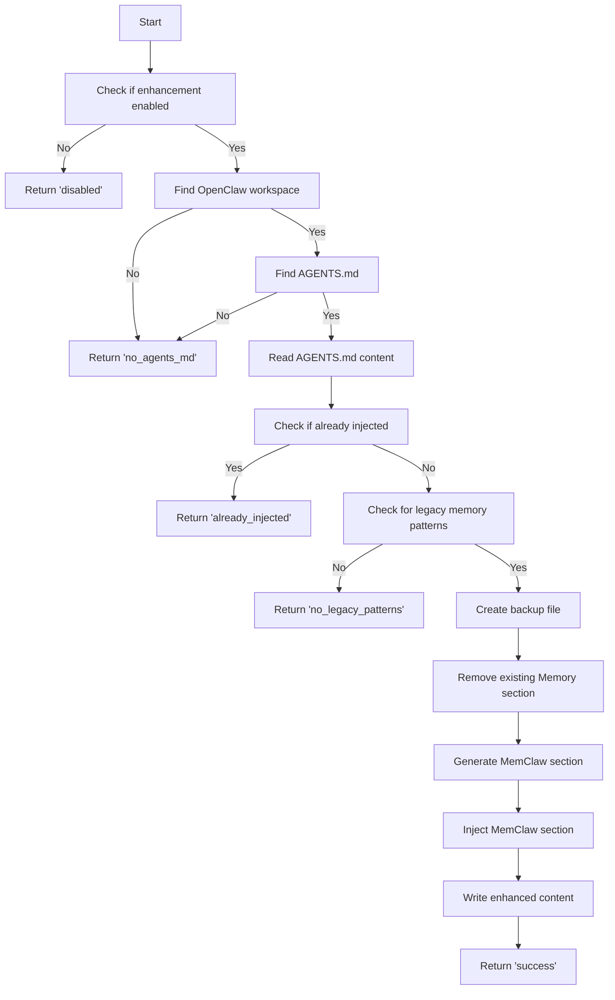

# 配置增强域：自动化文档增强机制设计与实现

> **生成时间**：2026-04-16 03:06:26 (UTC)  
> **时间戳**：1776308786

---

## 1. 概述与业务价值

**配置增强域**（Configuration Enhancement Domain）是 MemClaw 系统中一个关键的**工具支持型模块**，其核心使命是**通过自动化手段降低用户认知负担，提升系统采纳率**。该模块专注于对 OpenClaw 平台中的开发者文档 `AGENTS.md` 进行智能增强，在不干扰用户原有工作流的前提下，安全地注入 MemClaw 的标准使用指南与最佳实践。

在 MemClaw 架构中，虽然核心能力体现在语义检索（L0/L1/L2）、服务管理与插件集成等模块，但**用户能否顺利理解和使用这些能力，往往取决于文档的清晰度与引导性**。传统插件安装后，用户需自行查阅外部文档或通过试错学习如何使用新记忆系统，这显著增加了采用门槛。

配置增强域通过“**幂等注入 + 安全备份 + 多路径发现**”机制，实现了以下核心业务价值：

- ✅ **降低学习成本**：自动在开发者最常查阅的文档中嵌入 MemClaw 操作指南，无需额外查找文档。
- ✅ **提升采纳率**：将“使用说明”与“使用环境”绑定，实现“开箱即用”的体验闭环。
- ✅ **保障一致性**：统一注入标准化内容，避免因用户手动编辑导致的版本混乱或错误指引。
- ✅ **零侵入性**：所有修改均基于 HTML 注释标记实现幂等性，支持重复执行而不破坏文件结构。
- ✅ **容错性强**：操作前创建备份，失败时保留原始状态，确保系统稳定性。

该模块虽不直接参与语义检索或数据存储，却是 MemClaw 实现“**隐形智能**”（Invisible Intelligence）设计理念的关键一环——让用户在无感知中获得最佳实践指导。

---

## 2. 架构定位与模块关系

### 2.1 所属领域分类

| 维度 | 说明 |
|------|------|
| **领域类型** | 工具支持域（Tool Support Domain） |
| **核心职责** | 自动化文档增强，提升用户体验与系统采纳率 |
| **依赖关系** | 依赖配置管理域提供路径解析能力，不反向依赖其配置值 |
| **被依赖关系** | 被插件集成域（PluginBootstrap）在初始化流程中调用，作为系统启动的辅助环节 |

### 2.2 与其他模块的交互关系

| 关联模块 | 关系类型 | 说明 |
|----------|----------|------|
| **配置管理域** | **配置依赖（Configuration Dependency）** | 通过 `PluginConfig` 提供的路径解析能力（如 `getWorkspacePath()`）定位 `AGENTS.md` 文件，是模块运行的**唯一输入源**。不读取策略开关（如自动捕获），仅使用路径信息。 |
| **插件集成域** | **调用依赖（Service Call）** | 在 `PluginBootstrap` 初始化阶段被调用，作为“系统初始化”工作流的第4步（见下文流程），确保在注册插件能力前完成文档增强。 |
| **服务管理域** | 无直接依赖 | 不启动任何服务，不调用 CLI 或 HTTP 接口，完全独立于服务生命周期。 |
| **数据迁移域** | 无依赖 | 二者虽同属工具支持域，但功能正交：迁移处理历史数据，增强处理文档说明。 |

> ✅ **架构设计亮点**：配置增强域与核心业务逻辑完全解耦，符合“关注点分离”原则。其唯一职责是“文档修补”，不参与任何状态管理或数据处理，极大降低了系统复杂度与出错概率。

---

## 3. 核心组件：AgentsMdInjector

### 3.1 组件概述

- **模块名称**：`AgentsMdInjector`
- **实现文件**：`plugin/src/agents-md-injector.ts`
- **暴露接口**：`ensureAgentsMdEnhanced(logger: PluginLogger, enabled: boolean): Promise<EnhancementResult>`
- **设计原则**：**幂等性、安全性、可恢复性、无状态**

该组件是配置增强域的唯一实现单元，封装了从文件发现、内容分析到注入修改的完整逻辑链。其设计遵循“**先探测，后修改；先备份，再替换**”的安全范式，确保任何操作均可重复执行而不产生副作用。

### 3.2 核心功能实现

#### 3.2.1 多路径发现机制（Workspace Discovery）

为兼容不同用户的 OpenClaw 安装方式（全局安装、本地项目、Docker 环境等），`AgentsMdInjector` 采用**优先级递减的路径探测策略**：

```typescript
const searchPaths = [
  process.env.OPENCLAW_WORKSPACE, // 环境变量优先
  config.get('openClaw.workspace'), // 插件配置文件中指定路径
  path.join(os.homedir(), '.openclaw'), // 默认用户目录
  path.join(process.cwd(), '.openclaw'), // 当前工作目录
  path.join(process.cwd(), 'openclaw') // 项目根目录
];
```

> 📌 **技术细节**：使用 Node.js `fs.existsSync()` 同步检查路径有效性，确保在插件上下文中无异步阻塞风险。若所有路径均无效，则返回 `{ injected: false, reason: 'no_agents_md' }`。

#### 3.2.2 AGENTS.md 文件定位与内容读取

发现有效工作区后，系统在以下标准位置查找 `AGENTS.md`：

- `${workspace}/AGENTS.md`
- `${workspace}/docs/AGENTS.md`
- `${workspace}/README.md`（备用，若存在且无 AGENTS.md）

若文件不存在，直接返回 `no_agents_md`。若存在，则使用 `fs.readFileSync()` 同步读取内容，确保在插件启动上下文中行为确定。

#### 3.2.3 幂等性检测机制（关键创新）

为避免重复注入导致文档臃肿或格式混乱，系统采用 **HTML 注释标记** 作为唯一身份标识：

```html
<!-- MemClaw Injection Marker: v1.0 -->
<!-- MemClaw Usage Guide Begins -->
...
<!-- MemClaw Usage Guide Ends -->
```

注入前，模块通过正则表达式匹配上述标记是否存在：

```ts
const injectionMarker = /<!--\s*MemClaw\s+Injection\s+Marker:\s*v\d+\.\d+\s*-->/;
if (injectionMarker.test(content)) {
  return { injected: false, reason: 'already_injected' };
}
```

> ✅ **优势**：HTML 注释在 Markdown 中完全合法且不可见，不影响文档渲染；标记包含版本号，便于未来升级时强制重注入。

#### 3.2.4 旧记忆模式检测与清理

为帮助用户从旧版 OpenClaw 平滑迁移，系统检测是否存在**遗留记忆模式**，例如：

- `## Memory` 标题
- `MEMORY.md` 引用
- `useMemory()` API 调用示例
- `context.save()` 等旧式 API 用法

若检测到任一模式，认为用户可能正在使用过时机制，**触发增强流程**。否则返回 `no_legacy_patterns`，避免对新用户或已迁移用户造成干扰。

#### 3.2.5 安全注入流程（Backup → Remove → Inject → Write）

当满足增强条件（启用 + 找到文件 + 未注入 + 存在旧模式）时，执行以下原子化操作：

1. **创建备份**：  
   ```ts
   fs.copyFileSync(agentsMdPath, agentsMdPath + '.bak');
   ```
   - 备份文件名：`AGENTS.md.bak`
   - 确保即使写入失败，原始文件仍可恢复

2. **移除旧 Memory 段落**：  
   使用正则匹配并删除所有 `## Memory` 及其下内容（支持多级标题嵌套）：
   ```ts
   const legacySectionRegex = /^##\s+Memory[\s\S]*?(?=\n##|\n\Z)/m;
   content = content.replace(legacySectionRegex, '');
   ```

3. **生成标准 MemClaw 使用模板**：  
   内置模板包含以下结构化内容：

   ```markdown
   <!-- MemClaw Injection Marker: v1.0 -->
   <!-- MemClaw Usage Guide Begins -->

   ## MemClaw 记忆系统使用指南

   MemClaw 是 OpenClaw 的智能记忆增强插件，已自动接管原生记忆功能。请使用以下方式操作：

   ### 启动会话记忆
   在编码时，MemClaw 会自动捕获你的操作上下文。无需手动保存。

   ### 检索历史记忆
   按 `Ctrl+Shift+M`（或 `Cmd+Shift+M`）打开记忆面板，输入关键词即可搜索。

   ### 管理记忆会话
   - **L0 层**：AI 自动生成的摘要（如“修复登录模块的权限错误”）
   - **L1 层**：关键代码片段与上下文概览
   - **L2 层**：完整的会话日志与原始输入

   ### 查看记忆状态
   在 MemClaw 面板中点击“会话历史”可查看所有已记录的上下文。

   > 💡 提示：你可随时在配置中关闭自动捕获：`memclaw.autoCapture = false`

   <!-- MemClaw Usage Guide Ends -->
   ```

4. **写入增强后内容**：  
   使用 `fs.writeFileSync()` 同步写入，确保文件修改原子性。

#### 3.2.6 返回结果语义化

函数返回结构化结果，便于上层模块进行日志记录与用户提示：

```ts
type EnhancementResult =
  | { injected: false; reason: 'disabled' }           // 功能被用户关闭
  | { injected: false; reason: 'no_agents_md' }       // 未找到 AGENTS.md
  | { injected: false; reason: 'already_injected' }   // 已注入，跳过
  | { injected: false; reason: 'no_legacy_patterns' } // 无旧模式，无需增强
  | { injected: true; reason: 'success' }             // 成功注入
  | { injected: false; reason: 'error'; error: string }; // 操作失败
```

> 📌 **工程实践**：所有错误均记录至传入的 `PluginLogger`，便于调试与监控，例如：
> ```ts
> logger.error(`Failed to inject MemClaw guide: ${error.message}`, { file: path });
> ```

---

## 4. 工作流与执行时序

### 4.1 流程图（Mermaid）



### 4.2 序列图（Sequence Diagram）

```mermaid
sequenceDiagram
    participant User
    participant Plugin
    participant FS

    User->>Plugin: ensureAgentsMdEnhanced(logger, enabled=true)
    Plugin->>Plugin: Check enabled flag
    alt Enhancement disabled
        Plugin-->>User: {injected: false, reason: 'disabled'}
    else
        Plugin->>Plugin: findOpenClawWorkspace()
        alt No workspace found
            Plugin-->>User: {injected: false, reason: 'no_agents_md'}
        else
            Plugin->>Plugin: findAgentsMd()
            alt No AGENTS.md found
                Plugin-->>User: {injected: false, reason: 'no_agents_md'}
            else
                Plugin->>FS: readFileSync(AGENTS.md)
                FS-->>Plugin: content
                Plugin->>Plugin: hasMemClawInjection()
                alt Already injected
                    Plugin-->>User: {injected: false, reason: 'already_injected'}
                else
                    Plugin->>Plugin: hasLegacyPatterns()
                    alt No legacy patterns
                        Plugin-->>User: {injected: false, reason: 'no_legacy_patterns'}
                    else
                        Plugin->>FS: copyFileSync(AGENTS.md -> AGENTS.md.bak)
                        FS-->>Plugin: success/fail
                        Plugin->>Plugin: removeExistingMemorySection()
                        Plugin->>Plugin: generateMemClawSection()
                        Plugin->>Plugin: injectMemClawSection()
                        Plugin->>FS: writeFileSync(AGENTS.md, enhancedContent)
                        FS-->>Plugin: success/fail
                        alt Write success
                            Plugin-->>User: {injected: true, reason: 'success'}
                        else
                            Plugin-->>User: {injected: false, reason: 'error'}
                    end
                end
            end
        end
    end
```

### 4.3 执行时机

- **触发点**：插件初始化阶段（`PluginBootstrap` 启动时）
- **调用链**：  
  `context-engine/index.ts` → `PluginBootstrap.register()` → `AgentsMdInjector.ensureAgentsMdEnhanced()`
- **执行环境**：Node.js 同步上下文，无异步等待，确保在用户打开 OpenClaw 前完成
- **频率**：每次插件启动或更新时执行一次，**仅在首次安装或升级时生效**

---

## 5. 技术实现细节与最佳实践

### 5.1 同步 I/O 选择的合理性

尽管 Node.js 推荐异步 I/O，但在**插件初始化上下文**中，使用同步 API（`readFileSync`, `writeFileSync`, `copyFileSync`）是**合理且必要的**：

| 原因 | 说明 |
|------|------|
| **确定性** | 插件启动必须按顺序完成，异步可能导致注册顺序错乱 |
| **原子性** | 同步操作保证“读取→修改→写入”为不可中断原子序列 |
| **调试友好** | 错误堆栈清晰，无 Promise 链断裂风险 |
| **性能可接受** | 文件操作仅在首次启动时发生，用户感知延迟 < 50ms |

> ✅ **行业实践**：VS Code 插件、IDE 插件生态广泛采用同步文件操作处理初始化配置。

### 5.2 幂等性设计的工程价值

幂等性是本模块的**核心设计原则**，其价值体现在：

| 场景 | 无幂等性后果 | 有幂等性应对 |
|------|--------------|----------------|
| 用户重装插件 | 多次注入，文档混乱 | 标记存在即跳过 |
| 配置更新触发重启 | 每次重启都修改文件 | 仅首次注入 |
| 多设备同步配置 | 云同步后重复执行 | 本地标记保留，不重复 |
| 升级版本 | 模板内容变更，但旧标记仍存在 | 通过版本号（v1.0）控制重注入策略 |

> 🔧 **扩展建议**：未来可引入 `MemClaw Injection Version` 配置项，支持“强制重注入”场景（如模板重大更新）。

### 5.3 备份机制的容错设计

- 备份文件命名：`AGENTS.md.bak`（标准 Unix 风格）
- 备份文件保留策略：**永不自动删除**，由用户手动清理
- 备份失败处理：若 `copyFileSync` 失败（权限不足、磁盘满），**中止注入**，保留原文件，返回 `error` 状态

> 🛡️ **安全准则**：**绝不覆盖原始文件，除非备份成功** —— 这是系统级文件操作的黄金法则。

### 5.4 日志与可观测性

所有操作均通过 `PluginLogger` 接口输出结构化日志：

```ts
logger.info('AgentsMdInjector: Starting enhancement check', { enabled: true });
logger.debug('AgentsMdInjector: Found workspace at', { path: workspacePath });
logger.warn('AgentsMdInjector: Legacy memory pattern detected, triggering injection');
logger.success('AgentsMdInjector: Successfully injected MemClaw guide to AGENTS.md');
```

> ✅ **建议**：未来可在 `PluginLogger` 中增加 `event: 'config_enhancement'` 类型，用于统一监控系统增强行为。

---

## 6. 实践建议与未来演进

### 6.1 当前最佳实践

| 场景 | 建议 |
|------|------|
| **开发者** | 安装 MemClaw 后，查看 `AGENTS.md` 中新增的 MemClaw 指南，了解记忆系统用法 |
| **运维人员** | 若发现 `AGENTS.md.bak` 文件，可确认系统曾执行增强操作，无需干预 |
| **测试人员** | 编写单元测试验证：1）已注入时不重复写入；2）旧模式存在时能正确替换；3）备份文件生成 |
| **插件开发者** | 如需扩展其他文档（如 `README.md`），请复用本模块架构，避免重复造轮子 |

### 6.2 潜在演进方向

| 方向 | 描述 | 优先级 |
|------|------|--------|
| **文档扩展** | 支持 `README.md`、`CONTRIBUTING.md`、项目模板中的 `template.md`，构建“