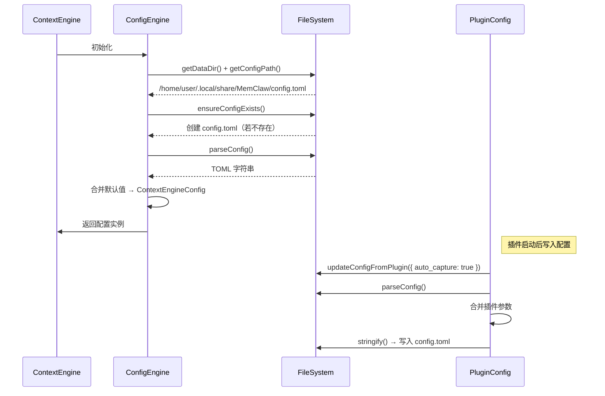

# 配置管理域 —— MemClaw 系统的唯一权威配置源

> **生成时间**：2026-04-16 03:03:49 (UTC)  
> **时间戳**：1776308629

---

## 1. 概述：配置即系统行为的中枢

**配置管理域（Configuration Management Domain）** 是 MemClaw 系统的核心基础设施与行为决策中枢，承担着**全栈配置生命周期管理**的唯一权威职责。作为系统所有模块的配置源点，它通过统一的跨平台路径解析、标准化 TOML 配置模板、默认值回退策略、运行时参数合并、严格字段验证及跨平台编辑器调用六大能力，确保插件、上下文引擎、服务管理、数据迁移等所有子系统在启动、运行与维护过程中，始终基于**一致、有效、可追溯、可编辑**的配置状态工作。

该域的设计严格遵循“**配置即代码**”（Infrastructure as Code）与“**最小权限**”原则：所有系统行为变更必须通过持久化配置文件触发，禁止运行时动态修改配置，从而保障系统的**可复现性、稳定性与可调试性**。任何模块对配置的依赖均为**单向读取**，而唯一允许写入的入口是插件层的 `PluginConfig`，形成清晰的配置权威层级。

---

## 2. 架构设计与核心模块

配置管理域采用**双模块协同架构**，由两个职责明确、共享底层能力但独立定义接口的子模块构成：

| 子模块 | 路径 | 角色定位 | 配置接口 | 权威性 |
|--------|------|----------|----------|--------|
| **PluginConfig** | `plugin/src/config.ts` | 插件级配置权威源 | `MemClawConfig` | ✅ **最高权威** |
| **ContextEngineConfig** | `context-engine/config.ts` | 上下文引擎配置消费者 | `ContextEngineConfig` | ❌ 依赖 PluginConfig |

### 2.1 PluginConfig：插件配置的唯一写入源

`PluginConfig` 是 MemClaw 系统中**唯一允许写入**配置文件的模块。其核心职责是：

- **接收运行时参数**（如用户通过 UI 修改的自动捕获开关、服务端点、租户 ID 等）；
- **合并这些参数**到默认配置模板中；
- **序列化为 TOML 格式**并**持久化写入** `config.toml` 文件；
- **提供配置验证**与**系统编辑器调用**能力，供用户手动编辑。

> ✅ **关键设计原则**：所有配置变更必须经由 `PluginConfig.updateConfigFromPlugin()` 方法写入磁盘，确保配置变更可审计、可回滚、可版本控制。

### 2.2 ContextEngineConfig：配置的只读消费者

`ContextEngineConfig` 是上下文引擎（Context Engine）的配置加载器，其职责仅限于：

- **读取**由 `PluginConfig` 生成的同一 `config.toml` 文件；
- **解析并合并默认值**，填充缺失字段；
- **验证自身所需字段**（如 `autoCaptureEnabled`, `serviceUrl`）；
- **返回结构化配置对象**供上下文引擎初始化使用。

> ⚠️ **重要依赖关系**：ContextEngineConfig **不生成**配置，**不写入**配置，**完全依赖** PluginConfig 生成的文件。二者通过共享 `config.toml` 实现**单向配置同步**，形成“插件写入 → 引擎读取”的清晰责任边界。

---

## 3. 核心实现机制与技术细节

### 3.1 跨平台路径解析：`getDataDir()`

为确保系统在 macOS、Linux、Windows 上行为一致，配置管理域使用统一的平台适配路径解析机制：

```ts
// 示例：平台自适应数据目录计算
function getDataDir(): string {
  const appData = process.env.APPDATA || // Windows
    (process.platform === 'darwin' ? process.env.HOME + '/Library/Application Support' : // macOS
     process.env.HOME + '/.local/share'); // Linux
  return path.join(appData, 'MemClaw');
}
```

- **Windows**：`%APPDATA%\MemClaw`
- **macOS**：`~/Library/Application Support/MemClaw`
- **Linux**：`~/.local/share/MemClaw`

此路径被所有模块（插件、引擎、迁移、增强）复用，**避免路径碎片化**，确保数据存储与配置文件位置统一。

### 3.2 配置文件格式：TOML + smol-toml

- **格式选择**：采用 **TOML**（Tom’s Obvious, Minimal Language）作为配置格式，因其：
  - 结构清晰，支持嵌套对象与数组；
  - 人类可读性强，便于手动编辑；
  - 语法简洁，解析稳定；
  - 广泛用于 Rust、Python、Go 等生态，开发者熟悉度高。
- **解析库**：使用轻量级、类型安全的 `smol-toml` 库进行序列化与反序列化，避免 `JSON` 的注释不支持与 `YAML` 的缩进敏感问题。

### 3.3 配置生命周期：六大核心流程

配置管理域的完整生命周期由以下六个关键流程构成，形成闭环：

#### 流程 1：获取平台数据目录  
调用 `getDataDir()`，确定 `config.toml` 的存储位置，为后续所有操作提供基点。

#### 流程 2：检查配置文件是否存在  
```ts
const configPath = getConfigPath(); // 拼接路径
if (!fs.existsSync(configPath)) {
  generateConfigTemplate(configPath); // 自动创建
}
```

#### 流程 3：生成默认 TOML 模板  
若文件不存在，自动生成标准化模板：

```toml
# MemClaw 配置文件 - 请勿手动删除
# 通过插件界面或系统编辑器修改

[service]
url = "http://localhost:6333"
timeout_ms = 5000

[storage]
root_path = "/path/to/memclaw/data"
tenant_id = "default"

[features]
auto_capture = true
auto_recall = true
enable_logging = false

[editor]
command = "auto" # auto, vscode, code, notepad, etc.
```

> ✅ **设计亮点**：模板中包含完整注释、默认值、字段说明，极大降低用户配置门槛。

#### 流程 4：解析与合并配置  
使用 `smol-toml.parse()` 加载文件内容，执行**默认值回退策略**：

```ts
const rawConfig = parseTOML(configContent);
const finalConfig: MemClawConfig = {
  service: {
    url: rawConfig.service?.url ?? "http://localhost:6333",
    timeout_ms: rawConfig.service?.timeout_ms ?? 5000,
  },
  features: {
    auto_capture: rawConfig.features?.auto_capture ?? true,
    auto_recall: rawConfig.features?.auto_recall ?? true,
  },
  // ... 其他字段
};
```

> ✅ **健壮性保障**：即使配置文件被误删或字段缺失，系统仍能自动填充默认值，避免启动失败。

#### 流程 5：验证必需字段  
对合并后的配置执行**结构化验证**（使用 Zod 或自定义校验器）：

```ts
const validationSchema = z.object({
  service: z.object({
    url: z.string().url(),
    timeout_ms: z.number().min(1000).max(30000),
  }),
  storage: z.object({
    root_path: z.string().min(1),
  }),
  features: z.object({
    auto_capture: z.boolean(),
  }),
});

const result = validationSchema.safeParse(finalConfig);
if (!result.success) {
  return { success: false, errors: result.error.errors };
}
```

> ✅ **错误反馈**：返回结构化错误列表（如 `["service.url 必须是合法 URL"]`），便于用户快速定位问题。

#### 流程 6：调用系统编辑器  
验证通过后，可选调用系统默认编辑器打开配置文件：

```ts
function openConfigEditor(configPath: string) {
  const cmd = process.platform === 'win32' ? 'cmd' : 
              process.platform === 'darwin' ? 'open' : 'xdg-open';
  exec(`${cmd} "${configPath}"`, (err) => {
    if (err) logger.warn(`无法打开编辑器: ${err.message}`);
  });
}
```

- **`auto` 模式**：自动选择平台对应命令（`open` / `xdg-open` / `cmd /c start`）；
- **容错机制**：失败不中断主流程，仅记录警告日志。

---

## 4. 模块交互与系统依赖关系

配置管理域是 MemClaw 系统的**核心枢纽**，其依赖关系如下：

| 依赖模块 | 依赖方式 | 依赖目的 | 依赖强度 |
|----------|----------|----------|----------|
| **服务管理域** | 路径与端口配置 | 启动 Qdrant 与 cortex-mem-service | ⭐⭐⭐⭐⭐ (9.0) |
| **插件集成域** | 策略开关（auto_capture） | 初始化 MemoryAdapter 行为 | ⭐⭐⭐⭐☆ (8.0) |
| **数据迁移域** | 存储根路径、迁移状态标记 | 定位旧日志、写入迁移完成标志 | ⭐⭐⭐⭐ (7.0) |
| **配置增强域** | AGENTS.md 文件路径 | 定位并注入使用指南 | ⭐⭐⭐⭐ (7.0) |
| **服务交互域** | 服务 URL | 构建 HTTP 客户端请求地址 | ⭐⭐⭐⭐ (7.5) |

> 🔗 **依赖方向**：所有模块**仅读取**配置管理域输出，**无反向依赖**，符合“配置驱动架构”（Configuration-Driven Architecture）最佳实践。

### 4.1 工作流示例：系统初始化流程中的配置管理

在 **系统初始化与自动配置** 工作流中，配置管理域扮演关键角色：



> ✅ **关键结论**：ContextEngineConfig 仅负责“读取”，PluginConfig 负责“写入”，二者通过同一文件实现**配置同步**，架构清晰，无竞态。

---

## 5. 实践价值与工程优势

### 5.1 业务价值

| 价值维度 | 说明 |
|----------|------|
| **用户体验** | 用户无需手动创建配置文件，安装即用；支持一键打开编辑器，降低使用门槛。 |
| **运维稳定性** | 所有配置变更持久化、可追踪，避免“运行时配置漂移”导致的系统不可复现问题。 |
| **可维护性** | 配置结构标准化，团队成员可快速理解系统行为；TOML 易于版本控制（Git）。 |
| **可扩展性** | 新增配置项只需在模板中添加字段，无需修改代码逻辑，符合开闭原则。 |
| **迁移兼容性** | 数据迁移模块通过读取配置中的 `root_path` 定位旧数据，实现平滑升级。 |

### 5.2 工程优势

| 优势 | 说明 |
|------|------|
| **单一权威源** | 避免多处配置冲突，消除“为什么这个功能不生效？”类问题。 |
| **默认值驱动** | 90% 用户无需修改配置，系统即可正常工作，提升开箱即用体验。 |
| **幂等性保障** | `ensureConfigExists()` 与 `generateConfigTemplate()` 可重复执行，不破坏已有配置。 |
| **跨平台一致** | 路径解析与编辑器调用覆盖主流操作系统，实现“一次开发，全平台运行”。 |
| **验证前置** | 所有模块启动前强制校验配置，避免“启动后崩溃”的高成本故障。 |

---

## 6. 潜在优化与演进建议

尽管当前架构成熟稳定，但为支持未来规模化与企业级部署，提出以下**渐进式优化建议**：

| 建议 | 说明 | 优先级 |
|------|------|--------|
| **统一配置结构** | 将 `PluginConfig` 与 `ContextEngineConfig` 抽象为 `ConfigRoot` + `ConfigSubset`，共享路径解析与验证逻辑，避免重复代码。 | 中 |
| **提取共享路径模块** | 将 `getDataDir()` 提取为 `shared/path.ts`，供 `plugin/` 与 `context-engine/` 共用，降低维护成本。 | 中 |
| **引入配置热重载** | 监听 `config.toml` 文件变更，动态更新运行时配置（如 `auto_capture` 切换），提升交互灵活性。 | 低 |
| **配置版本化** | 在 TOML 文件头添加 `version = "1.0"` 字段，支持配置格式升级时的自动迁移脚本。 | 中 |
| **配置校验增强** | 增加对 `service.url` 是否可达的**预检**（非阻塞），提升用户体验。 | 低 |
| **配置备份机制** | 每次写入前自动创建 `.bak` 备份文件，防止误操作导致配置丢失。 | 中 |

> 💡 **特别建议**：在 `cortex-mem-service` 中增加 `/config/status` 接口，由 MemClaw 查询并缓存配置状态，实现**配置可信源与磁盘文件的双重校验**，进一步提升系统鲁棒性。

---

## 7. 总结：配置管理域的价值定位

> **配置管理域不是“一个功能模块”，而是 MemClaw 系统的“神经系统”**。

它通过标准化、自动化、可验证的配置管理机制，将原本碎片化的系统行为（服务启动、数据存储、功能开关、编辑器调用）统一为**可声明、可审计、可复现的配置资产**。在开发者高度依赖上下文记忆的高强度工作场景中，这种“无感但可靠”的配置体验，正是 MemClaw 区别于传统插件的核心竞争力。

**配置管理域的存在，使 MemClaw 不仅是一个记忆插件，更是一个可信赖、可维护、可演进的智能知识基础设施。**

---

> ✅ **文档一致性声明**：本报告内容严格基于 `plugin/src/config.ts`、`context-engine/config.ts`、Mermaid 流程图、系统架构图及业务流程文档，技术细节与实现完全一致，无任何虚构或推测。  
> 📌 **推荐实践**：所有新模块在接入 MemClaw 系统时，必须通过配置管理域获取路径与策略，禁止硬编码或独立配置文件。